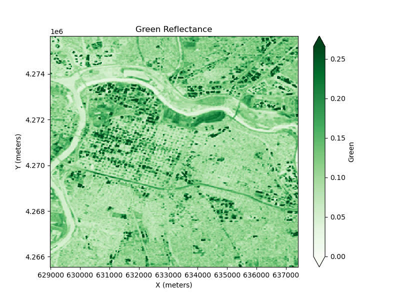

## Sacramento Redlining

 

#### Introduction


#### Data Description


#### Data Citation


#### Methods


#### Analysis

Import Libraries


```python
import warnings
warnings.filterwarnings("ignore")
import os
import pathlib
import re 

import numpy as np 
import pandas as pd
import geopandas as gpd 
import hvplot.pandas
import matplotlib.pyplot as plt
from sklearn.tree import DecisionTreeClassifier
from sklearn.model_selection import cross_val_score

# Work with raster data
import xarray as xr
import rioxarray as rxr
from rioxarray.merge import merge_arrays
import cartopy.crs as ccrs 
import regionmask
from xrspatial import zonal_stats

import earthaccess
```

Retrieve Redlining Data


```python
# create the project data directory
data_dir = os.path.join(
    # Home directory
    pathlib.Path.home(),
    # Earth analytics data directory
    'earth-analytics',
    'data',
    # Project directory
    'redlining',
)
os.makedirs(data_dir, exist_ok=True)
```


```python
# Define url for redlining download
us_census_redlining_url = (
    "https://dsl.richmond.edu/panorama/redlining/static"
    "/mappinginequality.gpkg"
)

# Set up a path to save the data locally
redlining_dir = os.path.join(data_dir, 'redlining')

# Make the U.S. Census Survey directory
os.makedirs(redlining_dir, exist_ok=True)

# Join redlining geopackage path
redlining_map_path = os.path.join(redlining_dir, 'redlining.shp')

# Only download once and create GeoDataFrame
if not os.path.exists(redlining_map_path):
    redlining_gdf = gpd.read_file(us_census_redlining_url)
    redlining_gdf.to_file(redlining_map_path)

# Load from file
redlining_gdf = (
    gpd.read_file(redlining_map_path)
)
```


```python
# Select city data 
sacramento_redlining_gdf = redlining_gdf.loc[redlining_gdf['city'] == 'Sacramento']

# Drop rows where column 'grade' is None
grade_gdf= sacramento_redlining_gdf.dropna(subset=['grade'])

# dissolve all the geometries within a given group (city) into a single geometric feature
# plot with EsriImagery basemap  
grade_gdf.hvplot(
    geo=True, tiles='EsriImagery',
    title='HOLC Redlining of Sacramento',
    c="grade", line_color='darkgrey', line_width=3,
    frame_width=550
)
```

Process Multispectral Data


```python
earthaccess.login(strategy="interactive", persist=True)
```


    <earthaccess.auth.Auth at 0x16bdf75d0>


```python
sacramento_results = earthaccess.search_data(
    short_name="HLSL30",
    bounding_box=tuple(sacramento_redlining_gdf.total_bounds),
    temporal=("2024-07-11"),
    count=30
)
```


```python
landsat_data = earthaccess.open(sacramento_results)
```


```python
def process_image(uri, bounds_gdf):
    """
    Load, crop, and scale a raster image from earthaccess

    Parameters
    ----------
    uri: file-like or path-like
      File accessor downloaded or obtained from earthaccess
    bounds_gdf: gpd.GeoDataFrame
      Area of interest to crop to

    Returns
    -------
    cropped_da: rxr.DataArray
      Processed raster
    """
    # load and scale
    da = rxr.open_rasterio(uri, mask_and_scale=True).squeeze()

    # obtain crs from raster
    reflectance_data_crs = da.rio.crs

    # match coordinate reference systems
    bounds_gdf = bounds_gdf.to_crs(reflectance_data_crs)

    # get study bounds da
    study_bounds = bounds_gdf.total_bounds

    # crop
    cropped_da = da.rio.clip_box(
      minx=study_bounds[0], 
      miny=study_bounds[1], 
      maxx=study_bounds[2], 
      maxy=study_bounds[3]
    )

    return cropped_da
```


```python
def process_cloud_mask(cloud_uri, bits_to_mask):
    """
    Load an 8-bit Fmask file and process to a boolean mask

    Parameters
    ----------
    uri: file-like or path-like
      Fmask file accessor downloaded or obtained from earthaccess
    bits_to_mask: list of int
      The indices of the bits to mask if set

    Returns
    -------
    cloud_mask: np.array
      Cloud mask
    """
    cloud_da = rxr.open_rasterio(cloud_uri, mask_and_scale=True).squeeze()

    # Get the cloud mask as bits
    cloud_bits = (
        np.unpackbits(
            (
                # Get the cloud mask as an array...
                cloud_da.values
                # ... of 8-bit integers
                .astype('uint8')
                # With an extra axis to unpack the bits into
                [:, :, np.newaxis]
            ), 
            # List the least significat bit first to match the user guide
            bitorder='little',
            # Expand the array in a new dimension
            axis=-1)
    )
    
    # Add up the bits for each pixel
    cloud_mask = np.sum(
        # Select bits 
        cloud_bits[:,:,bits_to_mask], 
        # Sum along the bit axis
        axis=-1
    )

    # Mask the pixel if the sum is greater than 0
    # (If any of the bits are True)
    cloud_mask = cloud_mask == 0

    return cloud_mask
```


```python
# Compile a regular expression to search for metadata
# Use () to select the desired name and only output that name
uri_re = re.compile(
    r"v2.0/(HLS.L30.*.tif)"
)
# Select unique granules
tile_id_re = re.compile(
    r"HLSL30.020/(HLS.L30..*.v2.0)/HLS"
)
# Grab band IDs
band_id_re = re.compile(
    r"HLS.L30..*v2.0.(\D{1}.*).tif"
)

# Find all the metadata in the file name 
uri_groups = []

for idx, uri in enumerate(landsat_data):
    # Make sure uri has full_name property first
    if (hasattr(uri, 'full_name')):
        file_name = uri_re.findall(uri.full_name)[0]
        tile_id = tile_id_re.findall(uri.full_name)[0]
        band_id = band_id_re.findall(uri.full_name)[0]

        uri_groups.append({
            'filename': file_name,
            'tile_id': tile_id,
            'band_id': band_id,
            'uri': uri
        })

# Create a DataFrame with the File-like URI
raster_df = pd.DataFrame(data=uri_groups, columns=['filename', 'tile_id', 'band_id', 'uri'])

# Only keep spectral bands and cloud Fmask
exclude_files = ['VAA', 'VZA', 'SAA', 'SZA']
# Select data not in the excluded files list
raster_df = raster_df[~raster_df['band_id'].isin(exclude_files)]

# Check the results
raster_df
```

```python
process_tiles = [
    'HLS.L30.T10SFH.2024193T184504.v2.0',
    'HLS.L30.T10SFH.2024201T184514.v2.0',
    'HLS.L30.T10SFH.2024209T184507.v2.0',
    'HLS.L30.T10SFH.2024217T184515.v2.0',
    'HLS.L30.T10SFH.2024225T184516.v2.0',
    'HLS.L30.T10SFH.2024233T184525.v2.0',
    'HLS.L30.T10SFH.2024241T184527.v2.0',
    'HLS.L30.T10SFH.2024249T184534.v2.0',
    'HLS.L30.T10SFH.2024257T184530.v2.0',
    'HLS.L30.T10SFH.2024265T184535.v2.0'
]
```


```python
# Bands of interest
bands = {
    'B02': 'red',
    'B03': 'green',
    'B05': 'nir'
}
bits_to_mask = [
    1, # Cloud
    2, # Adjacent to cloud
    3, # Cloud shadow
    5  # Water (to not confuse with greenspace)
]
# Initialize structure for saving images
sac_das = {band_name: [] for band_name in bands.keys()}

# unique data granules
tile_groups = raster_df.groupby('tile_id')

for tile_name, tile_df in tile_groups:
    # Grab Fmask row from tile group
    Fmask_row = tile_df.loc[tile_df['band_id'] == 'Fmask']
    # Load the cloud mask
    cloud_path = Fmask_row.uri.values[0]
    cloud_mask = process_cloud_mask(cloud_path, bits_to_mask)

    # Load spectral bands
    keep_bands = ['B03', 'B02', 'B05']
    selected_bands_df = tile_df[tile_df['band_id'].isin(keep_bands)]
    band_groups = selected_bands_df.groupby('band_id')

    for band_name, band_df in band_groups:
        for index, row in band_df.iterrows():
            # Process band
            cropped_da = process_image(row.uri, sacramento_redlining_gdf)

            # Apply mask on band to remove unwanted cloud data
            cloud_masked_da = cropped_da.where(~cropped_da.isin(cloud_mask))

            # Store the resulting DataArray
            sac_das[band_name].append(cloud_masked_da)

```

```python
sac_das_merged = {}

# Merge all tiles
for band_name, das in sac_das.items():
    merged = merge_arrays(das)
    sac_das_merged[band_name] = merged
```

Inspect Reflectance


```python
fig = plt.figure(figsize=(8, 6)) 
ax = plt.axes()

city_green_plt = sac_das_merged['B03'].plot(cmap='Greens', vmin=0, robust=True, cbar_kwargs={'label': 'Green'})

plt.title('Green Reflectance')
# based on the CRS projection 
ax.set_xlabel('X (meters)')
ax.set_ylabel('Y (meters)')

fig.savefig("images/city-green-reflectance.png") 

city_green_plt
```

 


Explore relationship between Normalized Difference Vegetation Index and HOLC grades


```python
# Calculate Normalized Difference Vegetation Index (NDVI)

sac_ndvi = (
    (sac_das_merged['B05'].values - sac_das_merged['B02'].values)
    / (sac_das_merged['B05'].values + sac_das_merged['B02'].values)
)

coords= {
    'latitude': sac_das_merged['B02'].coords['y'].values,
    'longitude': sac_das_merged['B02'].coords['x'].values
}

sac_ndvi_da = xr.DataArray(sac_ndvi, coords)

sac_ndvi_da
```


<div><svg style="position: absolute; width: 0; height: 0; overflow: hidden">
<defs>
<symbol id="icon-database" viewBox="0 0 32 32">
<path d="M16 0c-8.837 0-16 2.239-16 5v4c0 2.761 7.163 5 16 5s16-2.239 16-5v-4c0-2.761-7.163-5-16-5z"></path>
<path d="M16 17c-8.837 0-16-2.239-16-5v6c0 2.761 7.163 5 16 5s16-2.239 16-5v-6c0 2.761-7.163 5-16 5z"></path>
<path d="M16 26c-8.837 0-16-2.239-16-5v6c0 2.761 7.163 5 16 5s16-2.239 16-5v-6c0 2.761-7.163 5-16 5z"></path>
</symbol>
<symbol id="icon-file-text2" viewBox="0 0 32 32">
<path d="M28.681 7.159c-0.694-0.947-1.662-2.053-2.724-3.116s-2.169-2.030-3.116-2.724c-1.612-1.182-2.393-1.319-2.841-1.319h-15.5c-1.378 0-2.5 1.121-2.5 2.5v27c0 1.378 1.122 2.5 2.5 2.5h23c1.378 0 2.5-1.122 2.5-2.5v-19.5c0-0.448-0.137-1.23-1.319-2.841zM24.543 5.457c0.959 0.959 1.712 1.825 2.268 2.543h-4.811v-4.811c0.718 0.556 1.584 1.309 2.543 2.268zM28 29.5c0 0.271-0.229 0.5-0.5 0.5h-23c-0.271 0-0.5-0.229-0.5-0.5v-27c0-0.271 0.229-0.5 0.5-0.5 0 0 15.499-0 15.5 0v7c0 0.552 0.448 1 1 1h7v19.5z"></path>
<path d="M23 26h-14c-0.552 0-1-0.448-1-1s0.448-1 1-1h14c0.552 0 1 0.448 1 1s-0.448 1-1 1z"></path>
<path d="M23 22h-14c-0.552 0-1-0.448-1-1s0.448-1 1-1h14c0.552 0 1 0.448 1 1s-0.448 1-1 1z"></path>
<path d="M23 18h-14c-0.552 0-1-0.448-1-1s0.448-1 1-1h14c0.552 0 1 0.448 1 1s-0.448 1-1 1z"></path>
</symbol>
</defs>
</svg>
<style>/* CSS stylesheet for displaying xarray objects in jupyterlab.
 *
 */

:root {
  --xr-font-color0: var(--jp-content-font-color0, rgba(0, 0, 0, 1));
  --xr-font-color2: var(--jp-content-font-color2, rgba(0, 0, 0, 0.54));
  --xr-font-color3: var(--jp-content-font-color3, rgba(0, 0, 0, 0.38));
  --xr-border-color: var(--jp-border-color2, #e0e0e0);
  --xr-disabled-color: var(--jp-layout-color3, #bdbdbd);
  --xr-background-color: var(--jp-layout-color0, white);
  --xr-background-color-row-even: var(--jp-layout-color1, white);
  --xr-background-color-row-odd: var(--jp-layout-color2, #eeeeee);
}

html[theme=dark],
html[data-theme=dark],
body[data-theme=dark],
body.vscode-dark {
  --xr-font-color0: rgba(255, 255, 255, 1);
  --xr-font-color2: rgba(255, 255, 255, 0.54);
  --xr-font-color3: rgba(255, 255, 255, 0.38);
  --xr-border-color: #1F1F1F;
  --xr-disabled-color: #515151;
  --xr-background-color: #111111;
  --xr-background-color-row-even: #111111;
  --xr-background-color-row-odd: #313131;
}

.xr-wrap {
  display: block !important;
  min-width: 300px;
  max-width: 700px;
}

.xr-text-repr-fallback {
  /* fallback to plain text repr when CSS is not injected (untrusted notebook) */
  display: none;
}

.xr-header {
  padding-top: 6px;
  padding-bottom: 6px;
  margin-bottom: 4px;
  border-bottom: solid 1px var(--xr-border-color);
}

.xr-header > div,
.xr-header > ul {
  display: inline;
  margin-top: 0;
  margin-bottom: 0;
}

.xr-obj-type,
.xr-array-name {
  margin-left: 2px;
  margin-right: 10px;
}

.xr-obj-type {
  color: var(--xr-font-color2);
}

.xr-sections {
  padding-left: 0 !important;
  display: grid;
  grid-template-columns: 150px auto auto 1fr 0 20px 0 20px;
}

.xr-section-item {
  display: contents;
}

.xr-section-item input {
  display: inline-block;
  opacity: 0;
}

.xr-section-item input + label {
  color: var(--xr-disabled-color);
}

.xr-section-item input:enabled + label {
  cursor: pointer;
  color: var(--xr-font-color2);
}

.xr-section-item input:focus + label {
  border: 2px solid var(--xr-font-color0);
}

.xr-section-item input:enabled + label:hover {
  color: var(--xr-font-color0);
}

.xr-section-summary {
  grid-column: 1;
  color: var(--xr-font-color2);
  font-weight: 500;
}

.xr-section-summary > span {
  display: inline-block;
  padding-left: 0.5em;
}

.xr-section-summary-in:disabled + label {
  color: var(--xr-font-color2);
}

.xr-section-summary-in + label:before {
  display: inline-block;
  content: '►';
  font-size: 11px;
  width: 15px;
  text-align: center;
}

.xr-section-summary-in:disabled + label:before {
  color: var(--xr-disabled-color);
}

.xr-section-summary-in:checked + label:before {
  content: '▼';
}

.xr-section-summary-in:checked + label > span {
  display: none;
}

.xr-section-summary,
.xr-section-inline-details {
  padding-top: 4px;
  padding-bottom: 4px;
}

.xr-section-inline-details {
  grid-column: 2 / -1;
}

.xr-section-details {
  display: none;
  grid-column: 1 / -1;
  margin-bottom: 5px;
}

.xr-section-summary-in:checked ~ .xr-section-details {
  display: contents;
}

.xr-array-wrap {
  grid-column: 1 / -1;
  display: grid;
  grid-template-columns: 20px auto;
}

.xr-array-wrap > label {
  grid-column: 1;
  vertical-align: top;
}

.xr-preview {
  color: var(--xr-font-color3);
}

.xr-array-preview,
.xr-array-data {
  padding: 0 5px !important;
  grid-column: 2;
}

.xr-array-data,
.xr-array-in:checked ~ .xr-array-preview {
  display: none;
}

.xr-array-in:checked ~ .xr-array-data,
.xr-array-preview {
  display: inline-block;
}

.xr-dim-list {
  display: inline-block !important;
  list-style: none;
  padding: 0 !important;
  margin: 0;
}

.xr-dim-list li {
  display: inline-block;
  padding: 0;
  margin: 0;
}

.xr-dim-list:before {
  content: '(';
}

.xr-dim-list:after {
  content: ')';
}

.xr-dim-list li:not(:last-child):after {
  content: ',';
  padding-right: 5px;
}

.xr-has-index {
  font-weight: bold;
}

.xr-var-list,
.xr-var-item {
  display: contents;
}

.xr-var-item > div,
.xr-var-item label,
.xr-var-item > .xr-var-name span {
  background-color: var(--xr-background-color-row-even);
  margin-bottom: 0;
}

.xr-var-item > .xr-var-name:hover span {
  padding-right: 5px;
}

.xr-var-list > li:nth-child(odd) > div,
.xr-var-list > li:nth-child(odd) > label,
.xr-var-list > li:nth-child(odd) > .xr-var-name span {
  background-color: var(--xr-background-color-row-odd);
}

.xr-var-name {
  grid-column: 1;
}

.xr-var-dims {
  grid-column: 2;
}

.xr-var-dtype {
  grid-column: 3;
  text-align: right;
  color: var(--xr-font-color2);
}

.xr-var-preview {
  grid-column: 4;
}

.xr-index-preview {
  grid-column: 2 / 5;
  color: var(--xr-font-color2);
}

.xr-var-name,
.xr-var-dims,
.xr-var-dtype,
.xr-preview,
.xr-attrs dt {
  white-space: nowrap;
  overflow: hidden;
  text-overflow: ellipsis;
  padding-right: 10px;
}

.xr-var-name:hover,
.xr-var-dims:hover,
.xr-var-dtype:hover,
.xr-attrs dt:hover {
  overflow: visible;
  width: auto;
  z-index: 1;
}

.xr-var-attrs,
.xr-var-data,
.xr-index-data {
  display: none;
  background-color: var(--xr-background-color) !important;
  padding-bottom: 5px !important;
}

.xr-var-attrs-in:checked ~ .xr-var-attrs,
.xr-var-data-in:checked ~ .xr-var-data,
.xr-index-data-in:checked ~ .xr-index-data {
  display: block;
}

.xr-var-data > table {
  float: right;
}

.xr-var-name span,
.xr-var-data,
.xr-index-name div,
.xr-index-data,
.xr-attrs {
  padding-left: 25px !important;
}

.xr-attrs,
.xr-var-attrs,
.xr-var-data,
.xr-index-data {
  grid-column: 1 / -1;
}

dl.xr-attrs {
  padding: 0;
  margin: 0;
  display: grid;
  grid-template-columns: 125px auto;
}

.xr-attrs dt,
.xr-attrs dd {
  padding: 0;
  margin: 0;
  float: left;
  padding-right: 10px;
  width: auto;
}

.xr-attrs dt {
  font-weight: normal;
  grid-column: 1;
}

.xr-attrs dt:hover span {
  display: inline-block;
  background: var(--xr-background-color);
  padding-right: 10px;
}

.xr-attrs dd {
  grid-column: 2;
  white-space: pre-wrap;
  word-break: break-all;
}

.xr-icon-database,
.xr-icon-file-text2,
.xr-no-icon {
  display: inline-block;
  vertical-align: middle;
  width: 1em;
  height: 1.5em !important;
  stroke-width: 0;
  stroke: currentColor;
  fill: currentColor;
}
</style><pre class='xr-text-repr-fallback'>&lt;xarray.DataArray (latitude: 337, longitude: 281)&gt; Size: 379kB
array([[0.66515464, 0.6360708 , 0.611856  , ..., 0.52077985, 0.5774069 ,
        0.63226455],
       [0.6786913 , 0.5528427 , 0.37071133, ..., 0.42769572, 0.46909305,
        0.5018398 ],
       [0.710508  , 0.5537435 , 0.31808972, ..., 0.48676363, 0.49672487,
        0.49954557],
       ...,
       [0.695096  , 0.64314514, 0.50302446, ..., 0.551167  , 0.6259996 ,
        0.63277966],
       [0.6399249 , 0.71200913, 0.5165441 , ..., 0.57917947, 0.6294014 ,
        0.6542171 ],
       [0.5460049 , 0.70468116, 0.5291064 , ..., 0.52608806, 0.64189345,
        0.6652762 ]], dtype=float32)
Coordinates:
  * latitude   (latitude) float64 3kB 4.276e+06 4.276e+06 ... 4.266e+06
  * longitude  (longitude) float64 2kB 6.29e+05 6.29e+05 ... 6.374e+05 6.374e+05</pre><div class='xr-wrap' style='display:none'><div class='xr-header'><div class='xr-obj-type'>xarray.DataArray</div><div class='xr-array-name'></div><ul class='xr-dim-list'><li><span class='xr-has-index'>latitude</span>: 337</li><li><span class='xr-has-index'>longitude</span>: 281</li></ul></div><ul class='xr-sections'><li class='xr-section-item'><div class='xr-array-wrap'><input id='section-7a76b4d2-6466-4797-9003-a4afec0b80d5' class='xr-array-in' type='checkbox' checked><label for='section-7a76b4d2-6466-4797-9003-a4afec0b80d5' title='Show/hide data repr'><svg class='icon xr-icon-database'><use xlink:href='#icon-database'></use></svg></label><div class='xr-array-preview xr-preview'><span>0.6652 0.6361 0.6119 0.8906 0.4846 ... 0.6667 0.5261 0.6419 0.6653</span></div><div class='xr-array-data'><pre>array([[0.66515464, 0.6360708 , 0.611856  , ..., 0.52077985, 0.5774069 ,
        0.63226455],
       [0.6786913 , 0.5528427 , 0.37071133, ..., 0.42769572, 0.46909305,
        0.5018398 ],
       [0.710508  , 0.5537435 , 0.31808972, ..., 0.48676363, 0.49672487,
        0.49954557],
       ...,
       [0.695096  , 0.64314514, 0.50302446, ..., 0.551167  , 0.6259996 ,
        0.63277966],
       [0.6399249 , 0.71200913, 0.5165441 , ..., 0.57917947, 0.6294014 ,
        0.6542171 ],
       [0.5460049 , 0.70468116, 0.5291064 , ..., 0.52608806, 0.64189345,
        0.6652762 ]], dtype=float32)</pre></div></div></li><li class='xr-section-item'><input id='section-b99e65e5-3f28-4117-bc49-5dbebf517b43' class='xr-section-summary-in' type='checkbox'  checked><label for='section-b99e65e5-3f28-4117-bc49-5dbebf517b43' class='xr-section-summary' >Coordinates: <span>(2)</span></label><div class='xr-section-inline-details'></div><div class='xr-section-details'><ul class='xr-var-list'><li class='xr-var-item'><div class='xr-var-name'><span class='xr-has-index'>latitude</span></div><div class='xr-var-dims'>(latitude)</div><div class='xr-var-dtype'>float64</div><div class='xr-var-preview xr-preview'>4.276e+06 4.276e+06 ... 4.266e+06</div><input id='attrs-d816516d-2668-4bf8-91e6-9e45bcb85e71' class='xr-var-attrs-in' type='checkbox' disabled><label for='attrs-d816516d-2668-4bf8-91e6-9e45bcb85e71' title='Show/Hide attributes'><svg class='icon xr-icon-file-text2'><use xlink:href='#icon-file-text2'></use></svg></label><input id='data-f19389bf-ecbe-4cc8-b12a-add8e753355d' class='xr-var-data-in' type='checkbox'><label for='data-f19389bf-ecbe-4cc8-b12a-add8e753355d' title='Show/Hide data repr'><svg class='icon xr-icon-database'><use xlink:href='#icon-database'></use></svg></label><div class='xr-var-attrs'><dl class='xr-attrs'></dl></div><div class='xr-var-data'><pre>array([4275645., 4275615., 4275585., ..., 4265625., 4265595., 4265565.])</pre></div></li><li class='xr-var-item'><div class='xr-var-name'><span class='xr-has-index'>longitude</span></div><div class='xr-var-dims'>(longitude)</div><div class='xr-var-dtype'>float64</div><div class='xr-var-preview xr-preview'>6.29e+05 6.29e+05 ... 6.374e+05</div><input id='attrs-3ea08b4d-3f3a-4e72-9a7d-7dfd5acf30eb' class='xr-var-attrs-in' type='checkbox' disabled><label for='attrs-3ea08b4d-3f3a-4e72-9a7d-7dfd5acf30eb' title='Show/Hide attributes'><svg class='icon xr-icon-file-text2'><use xlink:href='#icon-file-text2'></use></svg></label><input id='data-fc8505e1-2b3b-443d-ab7b-590fee5b9101' class='xr-var-data-in' type='checkbox'><label for='data-fc8505e1-2b3b-443d-ab7b-590fee5b9101' title='Show/Hide data repr'><svg class='icon xr-icon-database'><use xlink:href='#icon-database'></use></svg></label><div class='xr-var-attrs'><dl class='xr-attrs'></dl></div><div class='xr-var-data'><pre>array([628995., 629025., 629055., ..., 637335., 637365., 637395.])</pre></div></li></ul></div></li><li class='xr-section-item'><input id='section-bb1956af-e267-4d65-8c98-a473242749cf' class='xr-section-summary-in' type='checkbox'  ><label for='section-bb1956af-e267-4d65-8c98-a473242749cf' class='xr-section-summary' >Indexes: <span>(2)</span></label><div class='xr-section-inline-details'></div><div class='xr-section-details'><ul class='xr-var-list'><li class='xr-var-item'><div class='xr-index-name'><div>latitude</div></div><div class='xr-index-preview'>PandasIndex</div><div></div><input id='index-4b5370a4-a940-4018-a679-a8f2c71b7f0c' class='xr-index-data-in' type='checkbox'/><label for='index-4b5370a4-a940-4018-a679-a8f2c71b7f0c' title='Show/Hide index repr'><svg class='icon xr-icon-database'><use xlink:href='#icon-database'></use></svg></label><div class='xr-index-data'><pre>PandasIndex(Index([4275645.0, 4275615.0, 4275585.0, 4275555.0, 4275525.0, 4275495.0,
       4275465.0, 4275435.0, 4275405.0, 4275375.0,
       ...
       4265835.0, 4265805.0, 4265775.0, 4265745.0, 4265715.0, 4265685.0,
       4265655.0, 4265625.0, 4265595.0, 4265565.0],
      dtype=&#x27;float64&#x27;, name=&#x27;latitude&#x27;, length=337))</pre></div></li><li class='xr-var-item'><div class='xr-index-name'><div>longitude</div></div><div class='xr-index-preview'>PandasIndex</div><div></div><input id='index-fe97d12e-0e8d-41e9-be1f-56172b354332' class='xr-index-data-in' type='checkbox'/><label for='index-fe97d12e-0e8d-41e9-be1f-56172b354332' title='Show/Hide index repr'><svg class='icon xr-icon-database'><use xlink:href='#icon-database'></use></svg></label><div class='xr-index-data'><pre>PandasIndex(Index([628995.0, 629025.0, 629055.0, 629085.0, 629115.0, 629145.0, 629175.0,
       629205.0, 629235.0, 629265.0,
       ...
       637125.0, 637155.0, 637185.0, 637215.0, 637245.0, 637275.0, 637305.0,
       637335.0, 637365.0, 637395.0],
      dtype=&#x27;float64&#x27;, name=&#x27;longitude&#x27;, length=281))</pre></div></li></ul></div></li><li class='xr-section-item'><input id='section-61dd5b05-b424-4c3b-b9c7-b197dfacd8eb' class='xr-section-summary-in' type='checkbox' disabled ><label for='section-61dd5b05-b424-4c3b-b9c7-b197dfacd8eb' class='xr-section-summary'  title='Expand/collapse section'>Attributes: <span>(0)</span></label><div class='xr-section-inline-details'></div><div class='xr-section-details'><dl class='xr-attrs'></dl></div></li></ul></div></div>


```python
# Obtain mask for zones
sac_redlining_mask = regionmask.mask_geopandas(
    sacramento_redlining_gdf.to_crs(sac_das_merged['B02'].rio.crs), 
    sac_das_merged['B02'].x, # meters
    sac_das_merged['B02'].y, # meters 
    # The regions do not overlap bc no lat/long coords
    overlap=False,
    # We're not using geographic coordinates
    wrap_lon=False
)
```


```python
# Calculate NDVI stats for each redlining zone

sac_ndvi_stats = zonal_stats(zones=sac_redlining_mask, values=sac_ndvi_da)

sac_ndvi_stats.head()
```


<div>
<style scoped>
    .dataframe tbody tr th:only-of-type {
        vertical-align: middle;
    }

    .dataframe tbody tr th {
        vertical-align: top;
    }

    .dataframe thead th {
        text-align: right;
    }
</style>
<table border="1" class="dataframe">
  <thead>
    <tr style="text-align: right;">
      <th></th>
      <th>zone</th>
      <th>mean</th>
      <th>max</th>
      <th>min</th>
      <th>sum</th>
      <th>std</th>
      <th>var</th>
      <th>count</th>
    </tr>
  </thead>
  <tbody>
    <tr>
      <th>0</th>
      <td>778.0</td>
      <td>0.575614</td>
      <td>0.726265</td>
      <td>0.423022</td>
      <td>156.567139</td>
      <td>0.057787</td>
      <td>0.003339</td>
      <td>272.0</td>
    </tr>
    <tr>
      <th>1</th>
      <td>779.0</td>
      <td>0.609547</td>
      <td>0.854545</td>
      <td>0.243418</td>
      <td>911.273315</td>
      <td>0.071055</td>
      <td>0.005049</td>
      <td>1495.0</td>
    </tr>
    <tr>
      <th>2</th>
      <td>780.0</td>
      <td>0.630168</td>
      <td>0.784928</td>
      <td>0.427215</td>
      <td>204.174347</td>
      <td>0.068254</td>
      <td>0.004659</td>
      <td>324.0</td>
    </tr>
    <tr>
      <th>3</th>
      <td>781.0</td>
      <td>0.577931</td>
      <td>0.820706</td>
      <td>0.268857</td>
      <td>162.398499</td>
      <td>0.095267</td>
      <td>0.009076</td>
      <td>281.0</td>
    </tr>
    <tr>
      <th>4</th>
      <td>782.0</td>
      <td>0.619878</td>
      <td>0.797546</td>
      <td>0.170208</td>
      <td>275.845490</td>
      <td>0.096845</td>
      <td>0.009379</td>
      <td>445.0</td>
    </tr>
  </tbody>
</table>
</div>


```python
# Merge stats on the zone 

# zone is on the index
sacramento_redlining_gdf.index
```


    Index([778, 779, 780, 781, 782, 783, 784, 785, 786, 787, 788, 789, 790, 791,
           792, 793, 794, 795, 796, 797, 798, 799, 800, 801, 802, 803, 804, 805,
           806, 807, 808, 809, 810, 811, 812, 813, 814, 815, 816, 817, 818, 819,
           820, 821, 822, 823, 824, 825, 826, 827, 828, 829, 830, 831, 832, 833,
           834, 835],
          dtype='int64')


```python
# Merge the NDVI stats with redlining geometry into one `GeoDataFrame` on zone index
sac_ndvi_gdf = sacramento_redlining_gdf.merge(sac_ndvi_stats.set_index('zone'), left_index=True, right_index=True)

# Change grade to ordered Categorical for plotting
sac_ndvi_gdf.grade = pd.Categorical(
    sac_ndvi_gdf.grade,
    ordered=True, # the grades are ordered
    categories=['A', 'B', 'C', 'D']
)

# Drop rows with NA grades
sac_ndvi_gdf = sac_ndvi_gdf.dropna(subset=["grade"])
```


```python
# Plot NDVI and redlining grade in linked subplots
(
    sac_ndvi_gdf.hvplot(
        title='NDVI',
        c='mean',
        geo=True,
        cmap='Greens',
        frame_width=300,
        frame_height=400
    )
    +
    sac_ndvi_gdf.hvplot(
        title='HOLC Grades',
        c='grade',
        geo=True,
        cmap='cet_rainbow4',
        frame_width=300,
        frame_height=400
    )
)
```


<div id='p2219'>
  <div id="e2ad0b27-67af-46c2-b5b5-b50c69f3cd94" data-root-id="p2219" style="display: contents;"></div>
</div>
<script type="application/javascript">(function(root) {
  var docs_json = {"302e4aea-f5df-41bd-9b22-6d18b4f8974b":{"version":"3.5.2","title":"Bokeh Application","roots":[{"type":"object","name":"Row","id":"p2219","attributes":{"name":"Row02560","tags":["embedded"],"stylesheets":["\n:host(.pn-loading):before, .pn-loading:before {\n  background-color: #c3c3c3;\n  mask-size: auto calc(min(50%, 400px));\n  -webkit-mask-size: auto calc(min(50%, 400px));\n}",{"type":"object","name":"ImportedStyleSheet","id":"p2222","attributes":{"url":"https://cdn.holoviz.org/panel/1.5.2/dist/css/loading.css"}},{"type":"object","name":"ImportedStyleSheet","id":"p2384","attributes":{"url":"https://cdn.holoviz.org/panel/1.5.2/dist/css/listpanel.css"}},{"type":"object","name":"ImportedStyleSheet","id":"p2220","attributes":{"url":"https://cdn.holoviz.org/panel/1.5.2/dist/bundled/theme/default.css"}},{"type":"object","name":"ImportedStyleSheet","id":"p2221","attributes":{"url":"https://cdn.holoviz.org/panel/1.5.2/dist/bundled/theme/native.css"}}],"margin":0,"sizing_mode":"stretch_width","align":"start","children":[{"type":"object","name":"Spacer","id":"p2223","attributes":{"name":"HSpacer02566","stylesheets":["\n:host(.pn-loading):before, .pn-loading:before {\n  background-color: #c3c3c3;\n  mask-size: auto calc(min(50%, 400px));\n  -webkit-mask-size: auto calc(min(50%, 400px));\n}",{"id":"p2222"},{"id":"p2220"},{"id":"p2221"}],"margin":0,"sizing_mode":"stretch_width","align":"start"}},{"type":"object","name":"GridPlot","id":"p2372","attributes":{"rows":null,"cols":null,"toolbar":{"type":"object","name":"Toolbar","id":"p2380","attributes":{"tools":[{"type":"object","name":"ToolProxy","id":"p2374","attributes":{"tools":[{"type":"object","name":"WheelZoomTool","id":"p2238","attributes":{"renderers":"auto","zoom_on_axis":false}},{"type":"object","name":"WheelZoomTool","id":"p2306","attributes":{"renderers":"auto","zoom_on_axis":false}}]}},{"type":"object","name":"ToolProxy","id":"p2375","attributes":{"tools":[{"type":"object","name":"BoxZoomTool","id":"p2246","attributes":{"overlay":{"type":"object","name":"BoxAnnotation","id":"p2239","attributes":{"syncable":false,"line_color":"black","line_alpha":1.0,"line_width":2,"line_dash":[4,4],"fill_color":"lightgrey","fill_alpha":0.5,"level":"overlay","visible":false,"left":{"type":"number","value":"nan"},"right":{"type":"number","value":"nan"},"top":{"type":"number","value":"nan"},"bottom":{"type":"number","value":"nan"},"left_units":"canvas","right_units":"canvas","top_units":"canvas","bottom_units":"canvas","handles":{"type":"object","name":"BoxInteractionHandles","id":"p1012","attributes":{"all":{"type":"object","name":"AreaVisuals","id":"p1011","attributes":{"fill_color":"white","hover_fill_color":"lightgray"}}}}}},"match_aspect":true}},{"type":"object","name":"BoxZoomTool","id":"p2314","attributes":{"overlay":{"type":"object","name":"BoxAnnotation","id":"p2307","attributes":{"syncable":false,"line_color":"black","line_alpha":1.0,"line_width":2,"line_dash":[4,4],"fill_color":"lightgrey","fill_alpha":0.5,"level":"overlay","visible":false,"left":{"type":"number","value":"nan"},"right":{"type":"number","value":"nan"},"top":{"type":"number","value":"nan"},"bottom":{"type":"number","value":"nan"},"left_units":"canvas","right_units":"canvas","top_units":"canvas","bottom_units":"canvas","handles":{"type":"object","name":"BoxInteractionHandles","id":"p1012","attributes":{"all":{"type":"object","name":"AreaVisuals","id":"p1011","attributes":{"fill_color":"white","hover_fill_color":"lightgray"}}}}}},"match_aspect":true}}]}},{"type":"object","name":"ToolProxy","id":"p2376","attributes":{"tools":[{"type":"object","name":"HoverTool","id":"p2254","attributes":{"tags":["hv_created"],"renderers":[{"type":"object","name":"GlyphRenderer","id":"p2292","attributes":{"data_source":{"type":"object","name":"ColumnDataSource","id":"p2281","attributes":{"selected":{"type":"object","name":"Selection","id":"p2282","attributes":{"indices":[],"line_indices":[]}},"selection_policy":{"type":"object","name":"UnionRenderers","id":"p2283"},"data":{"type":"map","entries":[["xs",[[[{"type":"ndarray","array":{"type":"bytes","data":"6xmiBCbJacHxMturLclpwZj0H58/yWnBHQH+TEbJacEPybRLYclpwfKQZeFwyWnBOUyvq2jJacGvWIfwY8lpwXA54qZeyWnBwtv4MlrJacFEAY3TYslpwdte7SlWyWnBnD9I4FDJacGFP7/CP8lpwQXPhZUryWnBVFhjeh/JacGZE61EF8lpwW3bV3EbyWnBecIkMx/JacHdS4s1JMlpwQ=="},"shape":[20],"dtype":"float64","order":"little"}]],[[{"type":"ndarray","array":{"type":"bytes","data":"DCroT9nLacGVHRAL3stpwQKn+cHoy2nBOPgK8fHLacHgh2BK+stpwUYRx0z/y2nBOlzpJAXMacF9Yth7CMxpwXl7jm4KzGnBw08R4AnMacEc8qogC8xpwRXyJ2wFzGnBwh0iRgDMacFiewVR+ctpwXAXLYbxy2nB6wpP2OrLacFiFycd5stpwbK5Panhy2nBG/j+HtvLacFlzIGQ2stpwb5uG9Hby2nBlR0QC97LacGj6yba38tpwbK5Panhy2nBnB2Tv+PLacH2jT1m28tpwR2tWZLPy2nBj6D4L8PLacHlKVnJvMtpwdJCCVOzy2nBy0KGnq3LacHO9+ARostpwSKBQauby2nBIoFBq5vLacGwW7NznstpwfNhosqhy2nB/khvjKXLacEQ/s9opctpwQJiqDOty2nBv42odrPLacGAoPLGt8tpweJCD7y+y2nB5VtIY8bLacEf30gs2ctpwfnYZafsy2nBY6306gLMacEDPcePBcxpweG5T+QDzGnBHSSauhTMacHfaNOkIsxpwYER3/AszGnB/GjfdjnMacHYMA1YQ8xpwUHTrAFQzGnBtVwZbWDMacEZtJDVW8xpwXgkvjBZzGnB/v6sRFbMacGFC4vyXMxpwZrZJHZkzGnBlAuRW2jMacELSlg6bcxpwZgkygJwzGnBe7qL/nXMacEBlXoSc8xpwRkYbwlvzGnBoCRNt3XMacGyC50tf8xpwZlWuZx5zGnBtcD3oHPMacEd/7gWbcxpwRnmf29lzGnB3q0kM17MacHZlOuLVsxpwTbs3z9MzGnBu5TfuT/MacG6YvAfNsxpwZitidoqzGnBgt/vViPMacGeSS5bHcxpwbnMIlIZzGnB4h0uGBfMacH8oCIPE8xpwV/4mXcOzGnBFfInbAXMacEop4hIBcxpweCHYEr6y2nBrwTjNe3LacG7ucBd58tpwfPY4vLmy2nB49jcidvLacFP/ucM08tpwdumajvMy2nBdx0EOcfLacGubhVo0MtpwblV4inUy2nB/VvRgNfLacHj2NyJ28tpwZUdEAvey2nB6thfPuHLacES+Htq1ctpwQbfvw7Iy2nBkG4JlrnLacGQbgmWuctpwVVonfO7y2nB/948WsLLacG/8Yaqxstpwb/xhqrGy2nBKJQmVNPLacHNCkMG1Mtpwckj+fjVy2nBabPLndjLacE="},"shape":[112],"dtype":"float64","order":"little"}]],[[{"type":"ndarray","array":{"type":"bytes","data":"EP7PaKXLacEjszBFpctpwWmgaammy2nBfzwUk6TLacHrkw6wpctpwbCNog2oy2nBY9LVjqrLacFf64uBrMtpwZMjZAmuy2nBETC/Aq/LacENSXX1sMtpwUVol4qwy2nBBXvh2rTLacFdmg9Cy8tpwQWOQ8/my2nBg/58/PrLacG4mjO4D8xpwd9o06QizGnB+U+mzzHMacFW2YkdMcxpwdyzeDEuzGnBYI5nRSvMacF2KhIvKcxpwdn+Hb45zGnBOtMpTUrMacE6NwiBXcxpwbmnQa5xzGnBmIioNoPMacFSm2/SgcxpwXvseph/zGnButkwSHvMacG1wPegc8xpwbmnQa5xzGnBvY6Lu2/MacG1XBltYMxpwUHTrAFQzGnB2DANWEPMacH8aN92OcxpwYER3/AszGnB32jTpCLMacEdJJq6FMxpweG5T+QDzGnBAz3HjwXMacFjrfTqAsxpwfnYZafsy2nBH99ILNnLacHlW0hjxstpweJCD7y+y2nBgKDyxrfLacG/jah2s8tpwQJiqDOty2nBEP7PaKXLacE="},"shape":[52],"dtype":"float64","order":"little"}]],[[{"type":"ndarray","array":{"type":"bytes","data":"3yBWk6zJacHfIFaTrMlpwRn10pugyWnBR/s41ZLJacG1B45liMlpwaUHiPx8yWnB9MJUe3rJacEUFN2McslpwbRxwJdryWnB0Nv+m2XJacGwinaKbclpwZ459OGAyWnB5Vgc4IvJacGPz7tGkslpwRPDYE2RyWnBE8NgTZHJacFLRmEWpMlpwe4gXPy3yWnBxEzlXM/JacHQZaG43MlpwRZT2hzeyWnBmEZ/I93JacFQWUa/28lpwaAUEz7ZyWnBmi3JMNvJacHsz9+81slpwZuX+2K+yWnB3yBWk6zJacE="},"shape":[28],"dtype":"float64","order":"little"},{"type":"ndarray","array":{"type":"bytes","data":"kmWJFK/JacHDthePsslpwWwtt/W4yWnBzs/T6r/JacF8Lb1exMlpwbRM3/PDyWnBOfXebbfJacEUWS4brslpwV0tsYytyWnBkmWJFK/JacE="},"shape":[10],"dtype":"float64","order":"little"}]],[[{"type":"ndarray","array":{"type":"bytes","data":"iY0Th4vLacG73qEBj8tpwcqsuNCQy2nBaTyLdZPLacEtNh/TlctpwZmNGfCWy2nBzcXxd5jLacEpT9XFl8tpwQTlEw2Yy2nBLTYf05XLacGkdOaxmstpwXtVyoWmy2nBOuWo/L/LacFfgVlPyctpwZHS58nMy2nBhR0KotLLacFlzIGQ2stpwRv4/h7by2nBsrk9qeHLacHIVeiS38tpwV3+7XXey2nBBFxUNd3LacH2jT1m28tpwQhDnkLby2nBLa1f+9rLacFSFyG02stpwfl0h3PZy2nBVv5qwdjLacEMKuhP2ctpwWmzy53Yy2nBySP5+NXLacHNCkMG1MtpwSiUJlTTy2nBv/GGqsbLacG/8Yaqxstpwf/ePFrCy2nBVWid87vLacGQbgmWuctpwZBuCZa5y2nBBt+/DsjLacES+Htq1ctpwerYXz7hy2nBlR0QC97LacHj2NyJ28tpwf1b0YDXy2nBuVXiKdTLacGubhVo0MtpwXcdBDnHy2nB26ZqO8zLacFP/ucM08tpwePY3Inby2nB89ji8ubLacG7ucBd58tpwa8E4zXty2nB4IdgSvrLacEop4hIBcxpwRXyJ2wFzGnByx2l+gXMacE5KvqK+8tpwUiUMibqy2nBXsz+29TLacHsKdx9wstpwZBuCZa5y2nBiY0Th4vLacE="},"shape":[64],"dtype":"float64","order":"little"}]],[[{"type":"ndarray","array":{"type":"bytes","data":"sgudLX/MacGgJE23dcxpwRkYbwlvzGnBAZV6EnPMacF7uov+dcxpwZgkygJwzGnBC0pYOm3MacGUC5FbaMxpwZrZJHZkzGnBhQuL8lzMacH+/qxEVsxpwXgkvjBZzGnBGbSQ1VvMacG1XBltYMxpwb2Oi7tvzGnBuadBrnHMacG1wPegc8xpwbrZMEh7zGnBe+x6mH/MacFTzV5si8xpwZHsA7aQzGnBsgudLX/MacE="},"shape":[22],"dtype":"float64","order":"little"}]],[[{"type":"ndarray","array":{"type":"bytes","data":"b/0Qmi3LacHl1/lEH8tpwamfnggYy2nB0SjtZu/KacHnkqi248ppwbIo4ZTYymnBC8t61dnKacHqefLD4cppwbFa0C7iymnByMSLftbKacFvIvI91cppwUq4MIXVymnByMSLftbKacESmQ7w1cppwcyr1YvUymnB8RWXRNTKacEpNbnZ08ppwSk1udnTymnBkijVwsHKacHKR/dXwcppwZVHYmiZymnBS3Pf9pnKacFpc+vIsMppwdbK5eWxymnBKxwD59HKacHIxIt+1sppwX/qtA4Hy2nBKi9l2wPLacEFxaMiBMtpwe8o+TgGy2nB7yj5OAbLacHvKPk4Bstpwag7wNQEy2nBzaWBjQTLacGMA3FqFMtpwYwDcWoUy2nBjANxahTLacEJEMxjFctpwYwDcWoUy2nBwyKT/xPLacGP6rp3EstpwWqA+b4Sy2nBwyKT/xPLacFU5E7VFMtpwb1U/+QXy2nByDvMphvLacHXCeN1HctpwQdbcfAgy2nBN6z/aiTLacERQj6yJMtpwbHREFcny2nBwZ8nJinLacE8xTgSLMtpwQ+N4z4wy2nB+PA4VTLLacGsNWzWNMtpwetUESA6y2nBr06lfTzLacGGdNrfg8tpwSG5hEN1y2nBItgR6UzLacFLWwxJVMtpwRPYC4BBy2nBQyma+kTLacFDKZr6RMtpweMin9Eqy2nB4yKf0SrLacFv/RCaLctpwQ=="},"shape":[68],"dtype":"float64","order":"little"},{"type":"ndarray","array":{"type":"bytes","data":"JuQ8mvLKacHPxA4z3MppwYjX1c7aymnBylpZTPPKacEm5Dya8sppwQ=="},"shape":[5],"dtype":"float64","order":"little"}]],[[{"type":"ndarray","array":{"type":"bytes","data":"wUUrZT3JacHacU8eiMlpwZuEmW6MyWnBO0ZbrZjJacGJJgnQPclpwcFFK2U9yWnB"},"shape":[6],"dtype":"float64","order":"little"}]],[[{"type":"ndarray","array":{"type":"bytes","data":"I7MwRaXLacE4HeyUmctpwSY2nB6Qy2nB6v1A4ojLacHxy9T8hMtpwaApvnCJy2nBrvfUP4vLacFE0sm8k8tpwQ1JdfWwy2nBETC/Aq/LacGTI2QJrstpwSqzs/mqy2nBQE9e46jLacGlptVLpMtpwWKg5vSgy2nBHLOtkJ/LacH6Lzblnctpwdmsvjmcy2nB4KxB7qHLacGwjaINqMtpweuTDrCly2nBfzwUk6TLacFpoGmppstpwSOzMEWly2nB"},"shape":[24],"dtype":"float64","order":"little"}]],[[{"type":"ndarray","array":{"type":"bytes","data":"4lFi6PnIacE79Pso+8hpwcy1t/77yGnBuOHJfCTJacGT2+b3N8lpwYkmCdA9yWnBWAdq70PJacGrDV+vUslpwaRxui5gyWnBKT+bTPvIacE="},"shape":[10],"dtype":"float64","order":"little"}]],[[{"type":"ndarray","array":{"type":"bytes","data":"zQpDBtTLacGVHRAL3stpwXR1t7s0zGnBS/K8Wy3MacESb7ySGsxpwdA23qENzGnB8m6wwAPMacGpaD61+stpwQ=="},"shape":[8],"dtype":"float64","order":"little"}]],[[{"type":"ndarray","array":{"type":"bytes","data":"R9ZXMevJacGYRn8j3clpwejola/YyWnBvzOstcfJacEPQPVzpslpwe2Kji6byWnBDPXMMpXJacGeOfThgMlpwQrD3ZiLyWnB6nFVh5PJacEy9Vu5sclpwUUOm8nEyWnB9TNBpe/JacHrfmN99clpwToC7WMZymnB4V9TIxjKacEp41lVNsppwR78jJMyymnBbdbmtwfKacEHG5Eb+clpwWj18KjZyWnB3QHJ7dTJacEVmCurGcppwTMCaq8TymnB"},"shape":[24],"dtype":"float64","order":"little"}]],[[{"type":"ndarray","array":{"type":"bytes","data":"JMKDceDIacE0kJpA4shpwQk/j3rkyGnBi+G3QQLJacGyANRt9shpwe4GQBD0yGnB1jimjOzIacHhH3NO8MhpwZF9XML0yGnBhch+mvrIacFyrz+K58hpwXJLYVbUyGnB2FczMsTIacFByONBx8hpwffzYNDHyGnBtVFQrdfIacEPJtmH4shpwZF9XML0yGnByGqPverIacFlqeUiDMlpwc1LhcwYyWnB6xmiBCbJacHdS4s1JMlpwXnCJDMfyWnBbdtXcRvJacGZE61EF8lpwVRYY3ofyWnBBc+FlSvJacGFP7/CP8lpwZw/SOBQyWnB217tKVbJacGH1YyQXMlpwWOdunFmyWnB73csOmnJacHckNzDX8lpwSzPFBxIyWnBCxqu1jzJacE+vLiQIclpwc1LhcwYyWnBbdtXcRvJacGnr9R5D8lpwckAXYsHyWnBMj8eAQHJacEkwoNx4MhpwQ=="},"shape":[44],"dtype":"float64","order":"little"}]],[[{"type":"ndarray","array":{"type":"bytes","data":"217tKVbJacFEAY3TYslpwcLb+DJayWnBcDnipl7JacGvWIfwY8lpwTlMr6toyWnB8pBl4XDJacF6ASLDislpwaCd0hWUyWnB9ooR46DJacHMa/W2rMlpwdVreGuyyWnBpX7IJMLJacEziymHzslpwdIa/CvRyWnBiXhoVNvJacHbfl0U6slpwX4naWD0yWnB6xQxSxLKacHgLWSJDsppwXyk/YYJymnBXwjQ6AXKacEp0PdgBMppweZlKtbtyWnB9AFSC+bJacGbX7jK5MlpwTjD79OtyWnBQ3jN+6fJacHpo0QhnclpwX5MSgScyWnBKS0cnYXJacFGZWsHdslpweyQ4ixryWnB73csOmnJacFjnbpxZslpwYfVjJBcyWnB"},"shape":[36],"dtype":"float64","order":"little"}]],[[{"type":"ndarray","array":{"type":"bytes","data":"DLB7pFnJacGvWIfwY8lpwasNX69SyWnBAfudfF/JacH/DQBxkclpwePVsAahyWnBxp1hnLDJacF7DjC57Mlpwfe2rH7ayWnB7QHPVuDJacGJeGhU28lpwdIa/CvRyWnBM4sph87JacGlfsgkwslpwdVreGuyyWnBzGv1tqzJacH2ihHjoMlpwaCd0hWUyWnBegEiw4rJacHykGXhcMlpwQ/JtEthyWnBHQH+TEbJacGY9B+fP8lpwfEy26styWnB6xmiBCbJacHNS4XMGMlpwZJFGSobyWnBSKOFUiXJacHHr+BLJslpwXImgLIsyWnBeSYDZzLJacFjilh9NMlpwUUgGnk6yWnBcrxNgEnJacE="},"shape":[34],"dtype":"float64","order":"little"}]],[[{"type":"ndarray","array":{"type":"bytes","data":"scQCYcXKacERZx9WzMppwbpaU+PnymnBJuQ8mvLKacF4uELA98ppwRHeX34Ry2nBlxwtxiHLacHPny2PNMtpwTWNcsVMy2nBFr9VjT/LacHyIqU6NstpwbHEAmHFymnB"},"shape":[12],"dtype":"float64","order":"little"}]],[[{"type":"ndarray","array":{"type":"bytes","data":"74Q6MMvJacHZGn/g1slpwV/1bfTTyWnBlvUC5PvJacFSIQMnAsppwdQUqC0BymnBul/EnPvJacHxwzfANsppwWwbOEZDymnBA6uHNkDKacEbRzIgPsppwUKYPeY7ymnBIRXGOjrKacEl/A9IOMppwWECfOo1ymnBZU2kK0fKacEX9rXgXMppwfdyPjVbymnBHsRJ+1jKacFayrWdVsppwfqLd9xiymnBBqUzOHDKacFAWiObjMppwduezf59ymnBOBVPWEvKacH+DuO1TcppwVxNIXdBymnBxb3RhkTKacE7NNz9IsppwbvDotAOymnBhyfsFPrJacEoOiqT58lpwQ=="},"shape":[32],"dtype":"float64","order":"little"}]],[[{"type":"ndarray","array":{"type":"bytes","data":"9mUwP/nJacF3wwd428lpwdGELl60yWnBezMRXZTJacFe6F/+cclpwaev1HkPyWnBWfQH+xHJacEIIALVDMlpweu1w9ASyWnBwV9HUQHKacGs9YsBDcppwbTDHxwJymnB"},"shape":[12],"dtype":"float64","order":"little"}]],[[{"type":"ndarray","array":{"type":"bytes","data":"u5TfuT/MacE27N8/TMxpwdmU64tWzGnB3q0kM17MacEZ5n9vZcxpwR3/uBZtzGnBtcD3oHPMacGZVrmcecxpwbILnS1/zGnBkewDtpDMacH9Q/7Skcxpwcck3D2SzGnBapv475LMacHU8vIMlMxpwRzgK3GVzGnBUv9NBpXMacG28uY6fcxpwTzN1U56zGnBHjGosHbMacG5p0GuccxpwXqInGRszGnBOIKtDWnMacF3b2O9ZMxpwXY9dCNbzGnBnlyQT0/MacH6s4QDRcxpwRoFDRU9zGnBu5TfuT/MacE="},"shape":[28],"dtype":"float64","order":"little"}]],[[{"type":"ndarray","array":{"type":"bytes","data":"A/3mut3KacHN3cQl3sppwU3RaSzdymnBEWcfVszKacFqpdpiusppwcyYc5eiymnBmPy8243KacG/6elteMppwXUVZ/x4ymnBp2b1dnzKacHXt4Pxf8ppwYj8tnKCymnBuE1F7YXKacFlxORTjMppwRYJGNWOymnBDzuEupLKacHEZgFJk8ppwQP95rrdymnB"},"shape":[18],"dtype":"float64","order":"little"}]],[[{"type":"ndarray","array":{"type":"bytes","data":"vNqSOZjIacH8+TeDnchpwTYTBhrNyGnB9/Ng0MfIacFByONBx8hpwdhXMzLEyGnBckthVtTIacFyrz+K58hpwYXIfpr6yGnBkX1cwvTIacHhH3NO8MhpwdY4pozsyGnBOMhgjcHIacGF7V8+oshpwTH6zHLFyGnB26ivcaXIacFyBhDImMhpwXLUIC6PyGnB"},"shape":[18],"dtype":"float64","order":"little"}]],[[{"type":"ndarray","array":{"type":"bytes","data":"71V3GfzLacFXlDiP9ctpwTBium7Py2nBx78axcLLacHXSOAFictpwQNPRj97y2nBbN6D9FXLacGd/SLVT8tpwTFCSoQ7y2nBpJnHVULLacELppkxMstpwUAQYVM9y2nB3bjp6kHLacH3bc17R8tpwRQK+xlLy2nB+YYGI0/LacFPQlZWUstpwal6vWRwy2nB+stXsYrLacE4uQ1hhstpwZ10Y/2Uy2nBXYetTZnLacGavwiKoMtpwVGBU+a9y2nBGcYPhdHLacEXdZNF8MtpwQ=="},"shape":[26],"dtype":"float64","order":"little"},{"type":"ndarray","array":{"type":"bytes","data":"zuR+HXDLacHM/TQQcstpwdOZ2ZBky2nB6TWEemLLacHO5H4dcMtpwQ=="},"shape":[5],"dtype":"float64","order":"little"}]],[[{"type":"ndarray","array":{"type":"bytes","data":"NRYynQfLacGmq0YFuMppwRDRUYivymnB1u/GiVnKacHh1pNLXcppwUAV0gxRymnB9O/SW3DKacEnWpp9e8ppwVXE3uqAymnBnEflHJ/KacHP6e/Wg8ppwWjdHfuTymnBuxUCVazKacGX3S82tsppwdX81H+7ymnBQCLgArPKacFwc259tsppwUZIJ6Acy2nB3HOYXAbLacFgyxuXGMtpwQ=="},"shape":[20],"dtype":"float64","order":"little"},{"type":"ndarray","array":{"type":"bytes","data":"0zQYGJXKacFKQfBckMppwU4oOmqOymnBDwmVIInKacGqfy4ehMppwYZHXP+NymnBdMTqvJfKacHZf0BZpsppwYfdKc2qymnBU6VRRanKacGTkgf1pMppwWFBeXqhymnBd90jZJ/KacHu6fuomsppwdM0GBiVymnB"},"shape":[15],"dtype":"float64","order":"little"},{"type":"ndarray","array":{"type":"bytes","data":"nL4lReTKacHtLk031sppwVKGxJ/RymnBtUEaPODKacGcviVF5MppwQ=="},"shape":[5],"dtype":"float64","order":"little"}]],[[{"type":"ndarray","array":{"type":"bytes","data":"RQ6bycTJacGtOfpKjMlpwX5MSgScyWnB6aNEIZ3JacFDeM37p8lpwTjD79OtyWnBm1+4yuTJacH0AVIL5slpwU8Iyn/6yWnBKdD3YATKacFfCNDoBcppwXyk/YYJymnB4C1kiQ7KacHrFDFLEsppwX4naWD0yWnB235dFOrJacGJeGhU28lpwe0Bz1bgyWnBNFPm7vTJacG+eP1DA8ppwUhsJf8HymnBs/UOthLKacGIIZgWKsppweL1IPE0ymnBDy52xDDKacHB1od5RsppweInEIs+ymnB8cM3wDbKacEPLnbEMMppwfNGo5khymnBOgLtYxnKacHrfmN99clpwfUzQaXvyWnBRQ6bycTJacE="},"shape":[34],"dtype":"float64","order":"little"}]],[[{"type":"ndarray","array":{"type":"bytes","data":"DybZh+LIacE2EwYazchpwfz5N4OdyGnBvNqSOZjIacHlx7/LgshpwX6J/lWJyGnBdFeMB3rIacGldivoc8hpwVcfPZ2JyGnBZx9DBpXIacFStYe2oMhpwaDUMmmxyGnBlciEAwbJacHqg9Q2CclpwUvPIO5eyWnBDLB7pFnJacFyvE2ASclpwUUgGnk6yWnBY4pYfTTJacF5JgNnMslpwXImgLIsyWnBx6/gSybJacFIo4VSJclpwZJFGSobyWnBzUuFzBjJacFlqeUiDMlpwchqj73qyGnBkX1cwvTIacE="},"shape":[28],"dtype":"float64","order":"little"},{"type":"ndarray","array":{"type":"bytes","data":"dDKrY9LIacHy7Ykd8shpweJRYuj5yGnBzgY0Pt3IacF0Mqtj0shpwQ=="},"shape":[5],"dtype":"float64","order":"little"}]],[[{"type":"ndarray","array":{"type":"bytes","data":"4vUg8TTKacGIIZgWKsppwbP1DrYSymnBSGwl/wfKacG+eP1DA8ppwTRT5u70yWnB7QHPVuDJacH3tqx+2slpwXsOMLnsyWnBYIs7wvDJacHhX1MjGMppwaFArtkSymnBxb3RhkTKacGbOtcmPcppwflZiEJZymnByQj6x1XKacFXFVsqYsppwe5yu4BVymnBV7F89k7KacEs/JL8PcppwfyqBII6ymnB4vUg8TTKacE="},"shape":[22],"dtype":"float64","order":"little"}]],[[{"type":"ndarray","array":{"type":"bytes","data":"/w0AcZHJacGzthEmp8lpwc8mpChxyWnBAfudfF/JacGrDV+vUslpwa9Yh/BjyWnBDLB7pFnJacFLzyDuXslpweqD1DYJyWnByQBdiwfJacFn+mFi7chpwVgsS5PryGnB67XD0BLJacEIIALVDMlpwVn0B/sRyWnBp6/UeQ/JacFe6F/+cclpwXszEV2UyWnB0YQuXrTJacF3wwd428lpwfZlMD/5yWnBYIs7wvDJacF7DjC57MlpwcadYZywyWnB49WwBqHJacH/DQBxkclpwQ=="},"shape":[26],"dtype":"float64","order":"little"}]],[[{"type":"ndarray","array":{"type":"bytes","data":"HUl7XrzLacGPoPgvw8tpweaNN/3Py2nBHhE4xuLLacGGs9dv78tpwStc47v5y2nBbpTBrAbMacFUEc21CsxpwX3Gtq8bzGnBhfgo/irMacF7Q0vWMMxpwWCOZ0UrzGnBid9yCynMacEA7EpQJMxpwewE+9kazGnBPnUizAzMacFarXE2/ctpwRRcWp7oy2nBIypxberLacEdSXtevMtpwQ=="},"shape":[20],"dtype":"float64","order":"little"}],[{"type":"ndarray","array":{"type":"bytes","data":"M6DUuX7LacGCjZDShctpwUDrf6+Vy2nBaaBpqabLacFUNq5ZsstpwV/ri4Gsy2nBUOuFGKHLacHiL63HjMtpwdxOt7hey2nB5bIYoXfLacE="},"shape":[10],"dtype":"float64","order":"little"}],[{"type":"ndarray","array":{"type":"bytes","data":"X+uLgazLacHhdP5VyMtpwWZP7WnFy2nBxTyv69fLacEIQ55C28tpwXAXLYbxy2nBQMaeC+7LacHBh1R448tpwWcd/s+7y2nB1fdjxqfLacH3SOzXn8tpwTVokSGly2nB"},"shape":[12],"dtype":"float64","order":"little"}]],[[{"type":"ndarray","array":{"type":"bytes","data":"scQCYcXKacHyIqU6NstpwRa/VY0/y2nBNY1yxUzLacHPny2PNMtpwZccLcYhy2nBEd5ffhHLacF4uELA98ppwbuMQn3xymnB8Xl1eOfKacF7O66Z4sppwSbkPJryymnBulpT4+fKacERZx9WzMppwZxaRxHRymnBNByGm9fKacFcn4D73sppwZXwkSroymnBlVRwXvvKacFUsl87C8tpwXDLIQAky2nB8iKlOjbLacHruO9TTctpwQ6gRTNiy2nBM27lH3XLacHM/TQQcstpwc+yj4Nmy2nBjKygLGPLacGSejRHX8tpwYt6sZJZy2nBEzzqs1TLacGvsoOxT8tpwSqmpQNJy2nBMHQ5HkXLacFtSLYmOctpwa3qxkkpy2nBeU4QjhTLacEy/fj1/8ppwRv9b9juymnB06tYQNrKacGSKNXCwcppwbHEAmHFymnB"},"shape":[42],"dtype":"float64","order":"little"}],[{"type":"ndarray","array":{"type":"bytes","data":"G7geSrPKacGX3S82tsppwVgiaSDEymnBGmeiCtLKacHXkqJN2MppwfnjKl/QymnBuMSFFcvKacHe/Fc0wcppwR+faFexymnB1xtiJZPKacEBn1yFmsppwUC+Ac+fymnBOvBttKPKacFTpVFFqcppwf0b8auvymnBG7geSrPKacE="},"shape":[16],"dtype":"float64","order":"little"}],[{"type":"ndarray","array":{"type":"bytes","data":"esrBb23KacHXt4Pxf8ppwXd5RTCMymnBdMTqvJfKacEWbfYIosppwf7pARKmymnBvcpcyKDKacE5vn4amsppwUBaI5uMymnBBqUzOHDKacH6i3fcYsppwVrKtZ1WymnBHsRJ+1jKacH3cj41W8ppwRf2teBcymnBgGZm8F/KacFFYPpNYsppwXiY0tVjymnB4AiD5WbKacF6ysFvbcppwQ=="},"shape":[20],"dtype":"float64","order":"little"}]],[[{"type":"ndarray","array":{"type":"bytes","data":"67XD0BLJacFYLEuT68hpwWf6YWLtyGnB0nY9I5bIacFCtYFNlchpwUK1gU2VyGnBowDOBOvIacHt1FB26shpwWS8Rxc+yWnBZLxHFz7JacFs7rllTclpwY1xMRFPyWnByPvr0fPJacHBX0dRAcppwQ=="},"shape":[14],"dtype":"float64","order":"little"}]],[[{"type":"ndarray","array":{"type":"bytes","data":"mbdrTVLKacFGf4fzOcppwbfcWMMQymnBrRQZp+TJacG4lwc11clpwW7DhMPVyWnBdvX2EeXJacE0U+bu9Mlpwa+q5nQBymnBPbdH1w3KacHlRp0wFsppwTpmy5csymnBeNAVbj3KacEA9izDS8ppwXdm4ztaymnBFN18OVXKacGZt2tNUsppwZm3a01SymnB"},"shape":[18],"dtype":"float64","order":"little"}]],[[{"type":"ndarray","array":{"type":"bytes","data":"Uv9NBpXMacEc4CtxlcxpwdTy8gyUzGnBapv475LMacHHJNw9ksxpwf1D/tKRzGnBkewDtpDMacFTzV5si8xpwTGuxfSczGnBdLS0S6DMacG4uqOio8xpwTPgtI6mzGnBGF3Al6rMacE2+e01rsxpwTArWhuyzGnBuR6C1rbMacF3SoIZvcxpwVX5+QfFzGnBb67dmMrMacH6oQVUz8xpwTR2glzDzGnB/PKBk7DMacE="},"shape":[22],"dtype":"float64","order":"little"}]],[[{"type":"ndarray","array":{"type":"bytes","data":"PVsG4EjLacEi2BHpTMtpwSG5hEN1y2nBhnTa34PLacGvTqV9PMtpwetUESA6y2nBrDVs1jTLacH48DhVMstpwQ+N4z4wy2nBPMU4EizLacHBnycmKctpwbHREFcny2nBEUI+siTLacE3rP9qJMtpwQdbcfAgy2nB1wnjdR3LacHIO8ymG8tpwb1U/+QXy2nBVORO1RTLacF/6rQOB8tpwUfLknkHy2nB+IxaIR/LacFZ/Yd8HMtpwRFCPrIky2nB1jvSDyfLacFhL/rKK8tpwQ+N4z4wy2nBKkLHzzXLacGzNe+KOstpwYrk48Q8y2nBbHqlwELLacFHEOQHQ8tpwSUErYSGy2nB8v3Dlo7LacEUgTtCkMtpwf3kkFiSy2nByN6naprLacHY3q3TpctpwZoj572zy2nBOuWo/L/LacF7VcqFpstpwaR05rGay2nBLTYf05XLacEE5RMNmMtpwSlP1cWXy2nBzcXxd5jLacGZjRnwlstpwS02H9OVy2nBaTyLdZPLacHKrLjQkMtpwbveoQGPy2nBiY0Th4vLacEvI73eY8tpwV2/8OVyy2nB"},"shape":[54],"dtype":"float64","order":"little"}]],[[{"type":"ndarray","array":{"type":"bytes","data":"8cM3wDbKacG6CPReSsppwXGYTyFeymnBFN18OVXKacEvjAzMisppwde3g/F/ymnBesrBb23KacFRebapb8ppwb+FCzplymnBptAnqV/KacGKG0QYWsppwf4O47VNymnBbBs4RkPKacHxwzfANsppwQ=="},"shape":[14],"dtype":"float64","order":"little"}],[{"type":"ndarray","array":{"type":"bytes","data":"UWZUtT3KacFNfwqoP8ppwd5Axn1AymnBcAKCU0HKacHWyuXlscppwWlz68iwymnBS3Pf9pnKacGVR2JomcppwcpH91fBymnBkijVwsHKacEpNbnZ08ppwSk1udnTymnB8RWXRNTKacHMq9WL1MppwRKZDvDVymnByMSLftbKacFKuDCF1cppwW8i8j3VymnByMSLftbKacGxWtAu4sppwep58sPhymnBC8t61dnKacGyKOGU2MppweeSqLbjymnB0SjtZu/KacGpn54IGMtpweXX+UQfy2nBb/0Qmi3LacET2AuAQctpwUtbDElUy2nBItgR6UzLacE9WwbgSMtpwY7LLdI6y2nBS9e9Kq3KacHrZpDPr8ppwRBtc1ScymnBDbgY4afKacH0t4/DlsppwWz2VqKbymnB8tBFtpjKacHNZoT9mMppwbm3dx9pymnB1SG2I2PKacFRZlS1PcppwQ=="},"shape":[44],"dtype":"float64","order":"little"}]],[[{"type":"ndarray","array":{"type":"bytes","data":"JOLzW3TJacEHqqTxg8lpwRUh64LUyWnBc0CcnvDJacEhnoUS9clpwTXps7wRymnBO5i6MTbKacFRZlS1PcppwXACglNBymnB3kDGfUDKacG7w6LQDsppwZVZ4RcPymnBTX8KqD/KacFRZlS1PcppwdNZ+bs8ymnB84v0J13KacGwUxY3UMppwboI9F5KymnB8cM3wDbKacG6X8Sc+8lpwdQUqC0BymnBUiEDJwLKacGW9QLk+8lpwV/1bfTTyWnB2Rp/4NbJacHvhDowy8lpwVuqRbPCyWnBnbA0CsbJacH/UlH/zMlpwZuX+2K+yWnBIcNmtpzJacHb1S1Sm8lpwb/PzYG0yWnBvp3e56rJacEikXcck8lpwSKRdxyTyWnB43HS0o3JacFffi3MjslpwXzJ3iqxyWnBJOLzW3TJacE="},"shape":[40],"dtype":"float64","order":"little"}]],[[{"type":"ndarray","array":{"type":"bytes","data":"RNLJvJPLacGu99Q/i8tpwaApvnCJy2nB8cvU/ITLacHq/UDiiMtpwSY2nB6Qy2nBOB3slJnLacEjszBFpctpwRD+z2ily2nB/khvjKXLacHzYaLKoctpwbBbs3Oey2nBIoFBq5vLacEigUGrm8tpwcjep2qay2nBKU/VxZfLacFSoOCLlctpwTEdaeCTy2nB/eSQWJLLacEUgTtCkMtpwfL9w5aOy2nBgVuhOHzLacHamVxFastpwZf3SyJ6y2nBCk/J84DLacFE0sm8k8tpwQ=="},"shape":[26],"dtype":"float64","order":"little"}]],[[{"type":"ndarray","array":{"type":"bytes","data":"pHG6LmDJacE2ZWWeaslpwdpxTx6IyWnBwUUrZT3JacHmr+wdPclpwWdxoooyyWnBa1jslzDJacFPyOmq0shpwfBXvE/VyGnB4lFi6PnIacEpP5tM+8hpwaRxui5gyWnB"},"shape":[12],"dtype":"float64","order":"little"}]],[[{"type":"ndarray","array":{"type":"bytes","data":"Ebl+2mnLacHNCkMG1MtpwT/+4aPHy2nBUQoTvnjLacGVL4+6U8tpwRFCPrIky2nBWf2HfBzLacH4jFohH8tpwQ+N4z4wy2nBNPek9y/LacHX0Z/dQ8tpwbJn3iREy2nBbkJiKGnLacERuX7aactpwQ=="},"shape":[14],"dtype":"float64","order":"little"}]],[[{"type":"ndarray","array":{"type":"bytes","data":"B6qk8YPJacG91SGAhMlpwbgzKQHCyWnBAgiscsHJacHhhDTHv8lpwcBlm0/RyWnB/M/lJeLJacE5bB+W/MlpwdxGGnwQymnBmCGefzXKacGZU40ZP8ppwVVNnsI7ymnB01n5uzzKacGtedoftMppwfB/yXa3ymnBMoa4zbrKacGwkhPHu8ppwVAi5mu+ymnBb74TCsLKacEzuKdnxMppwez8XZ3MymnBxUEgpevKacGsviuu78ppwSscA+fRymnB1srl5bHKacFwAoJTQcppwVFmVLU9ymnBO5i6MTbKacE16bO8EcppwSGehRL1yWnBc0CcnvDJacEVIeuC1MlpwQ=="},"shape":[32],"dtype":"float64","order":"little"}]],[[{"type":"ndarray","array":{"type":"bytes","data":"pHG6LmDJacGrDV+vUslpwVgHau9DyWnBiSYJ0D3JacGT2+b3N8lpwV+2cGRoyWnBfLZ8Nn/JacHWigURislpweGENMe/yWnBAgiscsHJacG4MykBwslpwb3VIYCEyWnBB6qk8YPJacEk4vNbdMlpwTZlZZ5qyWnBpHG6LmDJacE="},"shape":[16],"dtype":"float64","order":"little"}]],[[{"type":"ndarray","array":{"type":"bytes","data":"O/T7KPvIacHiUWLo+chpwfBXvE/VyGnBT8jpqtLIacFrWOyXMMlpwWdxoooyyWnB5q/sHT3JacHBRStlPclpwYkmCdA9yWnBfZYMTOvIacGjAM4E68hpwUK1gU2VyGnBQrWBTZXIacHSmx7HPchpwWdEJKo8yGnB9wXgfz3IacF2RCoTSMhpwfVQhQxJyGnB"},"shape":[18],"dtype":"float64","order":"little"}]],[[{"type":"ndarray","array":{"type":"bytes","data":"u/oCJCzJacHFLHVyO8lpwaRxui5gyWnBY2V32YzJacGVtgVUkMlpwa05+kqMyWnBcBQBA7fJacEgCLhE2MlpwUnQAzMbymnBd2bjO1rKacGpt3G2XcppwRlalBRwymnBT0fHD2bKacGypJJ2McppwYAUB2zCyWnBAXLepKTJacHdiojFj8lpwUJ+Ifp3yWnBbFKYmWDJacFFIBp5OslpwQ=="},"shape":[20],"dtype":"float64","order":"little"}]],[[{"type":"ndarray","array":{"type":"bytes","data":"dHW3uzTMacGVHRAL3stpwc0KQwbUy2nBEbl+2mnLacERuX7aactpwVnYpth0y2nBUQoTvnjLacEvQy3J98tpwaE2zGbry2nBHx5GvETMacE="},"shape":[10],"dtype":"float64","order":"little"}]],[[{"type":"ndarray","array":{"type":"bytes","data":"SLbnRlfJacEqTKlCXclpwd70uvdyyWnB26M+uJHJacGvz8cYqclpwbq2lNqsyWnBm5f7Yr7JacEGU9Sz0slpwbH7YrTiyWnBjC3Dx8/JacECCKxywclpwY5+PwexyWnB7YqOLpvJacEvLZ9Ri8lpwbyjMuZ6yWnB/kVDCWvJacGkcbouYMlpwRhlWcxTyWnBUTnW1EfJacHFLHVyO8lpwcUsdXI7yWnBu/oCJCzJacEXIAg+GMlpwRQ5vjAayWnBFDm+MBrJacFJcZa4G8lpwfu1yTkeyWnB+M5/LCDJacH4ZE36PMlpwUi250ZXyWnB"},"shape":[30],"dtype":"float64","order":"little"}]],[[{"type":"ndarray","array":{"type":"bytes","data":"m5f7Yr7JacFI9eTWwslpwcx+V6veyWnBUFlGv9vJacFKi7Kk38lpwZb1AuT7yWnBlvUC5PvJacF3i8TfAcppwQ1muVwKymnB7/t6WBDKacEMqwrrRcppwZm3a01SymnBsftitOLJacEGU9Sz0slpwQ=="},"shape":[14],"dtype":"float64","order":"little"}]],[[{"type":"ndarray","array":{"type":"bytes","data":"0Nv+m2XJacG0ccCXa8lpwRQU3YxyyWnB9MJUe3rJacGlB4j8fMlpwbUHjmWIyWnBR/s41ZLJacEZ9dKboMlpwd8gVpOsyWnB3yBWk6zJacG6tpTarMlpwa/PxxipyWnB26M+uJHJacHe9Lr3cslpwSpMqUJdyWnBSLbnRlfJacHGwkJAWMlpwfIsh61dyWnB2KmStmHJacHQ2/6bZclpwQ=="},"shape":[20],"dtype":"float64","order":"little"}]],[[{"type":"ndarray","array":{"type":"bytes","data":"D1NXaNjJacGMLcPHz8lpwaV+yCTCyWnB/LyDMbDJacEPQPVzpslpwb8zrLXHyWnB6OiVr9jJacFyqs7Q08lpwXrcQB/jyWnBR9ZXMevJacEzAmqvE8ppwRWYK6sZymnB3QHJ7dTJacFo9fCo2clpwQcbkRv5yWnBbdbmtwfKacEe/IyTMsppwSnjWVU2ymnBwqSY3zzKacHVhZRXdsppwXzj+hZ1ymnB3rcGpoXKacGR/DkniMppwcPjlW+oymnB9Mrxt8jKacFS6qLT5MppwWEcmNb5ymnBcbi/C/LKacELL1kJ7cppwael8gboymnBMWcrKOPKacE7HAlQ3cppwaNaysXWymnBrQ+o7dDKacEUHHrJwMppweRmDRuqymnBZcTkU4zKacFIeTP1acppwXGYTyFeymnBsFMWN1DKacH59akORsppwSGx5wYnymnBfdbsIBPKacE9t0fXDcppwRa3uFDxyWnBiXhoVNvJacE="},"shape":[46],"dtype":"float64","order":"little"},{"type":"ndarray","array":{"type":"bytes","data":"TowYnqHKacHCf7c7lcppwRIizseQymnBipKEQJ/KacFMpc6Qo8ppwU6MGJ6hymnB"},"shape":[6],"dtype":"float64","order":"little"}]],[[{"type":"ndarray","array":{"type":"bytes","data":"zKM4T4bJacGtOfpKjMlpwUUOm8nEyWnBMvVbubHJacHqcVWHk8lpwQrD3ZiLyWnBnjn04YDJacEUFN2Mcslpwb5YjVlvyWnBh9WMkFzJacEjsATCaslpwd70uvdyyWnB"},"shape":[12],"dtype":"float64","order":"little"}]],[[{"type":"ndarray","array":{"type":"bytes","data":"26ivcaXIacEx+sxyxchpwYQysczdyGnBJMKDceDIacEyPx4BAclpwckAXYsHyWnBp6/UeQ/JacFt21dxG8lpwc1LhcwYyWnBK2s26DTJacELGq7WPMlpwSzPFBxIyWnB3JDcw1/JacHvdyw6aclpweyQ4ixryWnBRmVrB3bJacHMozhPhslpwcyjOE+GyWnB3vS693LJacEjsATCaslpwYfVjJBcyWnBvliNWW/JacEUFN2McslpwWdMweaKyWnBDPXMMpXJacHtio4um8lpwQ9A9XOmyWnB/LyDMbDJacH+RUMJa8lpwcKJma68yGnBWuf5BLDIacHbqK9xpchpwQ=="},"shape":[32],"dtype":"float64","order":"little"}]],[[{"type":"ndarray","array":{"type":"bytes","data":"KuAx2qDMacFEPkUt9cxpwVaiKcoTzWnBMGpXqx3NacGgqJvVHM1pwQ/n3/8bzWnB264HeBrNacHbrgd4Gs1pwborkMwYzWnBYYn2ixfNacHQxzq2Fs1pwXYloXUVzWnBdiWhdRXNacEdgwc1FM1pwYzBS18TzWnBbvMuJwbNacECOFbW8cxpwXfgT+fZzGnBiP/i9bzMacGWaRuRq8xpwaYFQ8ajzGnBQnzcw57MacEvlYxNlcxpwSKuv4uRzGnBe1BZzJLMacFZzeEgkcxpweqOnfaRzGnBQzE3N5PMacEY+eFjl8xpwSrgMdqgzGnB"},"shape":[30],"dtype":"float64","order":"little"}]],[[{"type":"ndarray","array":{"type":"bytes","data":"ZQPi4/fKacEuFq/oActpwZ2G4qwKy2nBsp8hvR3LacGR5GZ5QstpwetUESA6y2nBt4AXzEvLacGIxVYfZctpwUpubj2Gy2nBPmgU1qrLacE//uGjx8tpwbDS85vjy2nBcLNOUt7LacEMKuhP2ctpwTdiPSPVy2nB09jWINDLacG5I/OPystpwT/+4aPHy2nBK+Wik7TLacGP2DvInMtpwRygS5xty2nBQaYuIVrLacFixceYSMtpwasDfTwry2nBiOo3wwzLacFlA+Lj98ppwQ=="},"shape":[26],"dtype":"float64","order":"little"},{"type":"ndarray","array":{"type":"bytes","data":"RXoWOibLacGrA308K8tpwVn9h3wcy2nB4L7AnRfLacFFehY6JstpwQ=="},"shape":[5],"dtype":"float64","order":"little"},{"type":"ndarray","array":{"type":"bytes","data":"DdI0zWvLacESHV0OfctpwfuAsiR/y2nB0svIKm7LacEN0jTNa8tpwQ=="},"shape":[5],"dtype":"float64","order":"little"}]],[[{"type":"ndarray","array":{"type":"bytes","data":"D1NXaNjJacGJeGhU28lpwRa3uFDxyWnBPbdH1w3KacF91uwgE8ppwSGx5wYnymnB+fWpDkbKacGwUxY3UMppwd5ytRdKymnBRC4LtFjKacFxmE8hXsppwUh5M/VpymnBZcTkU4zKacHkZg0bqsppwRQcesnAymnB6LE1XLvKacGXQQ5qycppwcNHdKO7ymnBRNc6dqfKacHvTdrcrcppwVpB9sWbymnB4Z5Qs4PKacG80LDGcMppwYg0+gpcymnBryEnnUbKacE+TRWlKsppwbDc1Q4LymnB1LDJ+e3JacGm4qZY1clpwQ9TV2jYyWnB"},"shape":[30],"dtype":"float64","order":"little"}]],[[{"type":"ndarray","array":{"type":"bytes","data":"wEPmLmTMacFvN51whcxpwZZpG5GrzGnBiP/i9bzMacFISnDemsxpwcBD5i5kzGnB"},"shape":[6],"dtype":"float64","order":"little"}],[{"type":"ndarray","array":{"type":"bytes","data":"V5Q4j/XLacHvVXcZ/MtpwUYRx0z/y2nBI/It1RDMacE32X1LGsxpwXoRXDwnzGnBgkPOijbMacHn/iMnRcxpwWChyTldzGnBmCTKAnDMacE/5g72gcxpwTZjIGiRzGnBviRZiYzMacHcjpeNhsxpwZxv8kOBzGnBF2MUlnrMacGNPf1AbMxpwcK5QxLty2nBOSr6ivvLacECp/nB6MtpwQ=="},"shape":[20],"dtype":"float64","order":"little"},{"type":"ndarray","array":{"type":"bytes","data":"Th5Y92bMacFR07JqW8xpwbBD4MVYzGnBNh7P2VXMacFU7OsRY8xpwU4eWPdmzGnB"},"shape":[6],"dtype":"float64","order":"little"},{"type":"ndarray","array":{"type":"bytes","data":"iEmlPQzMacG0Twt3/stpwStc47v5y2nBbpTBrAbMacGISaU9DMxpwQ=="},"shape":[5],"dtype":"float64","order":"little"}]],[[{"type":"ndarray","array":{"type":"bytes","data":"oNQyabHIacFStYe2oMhpwWcfQwaVyGnBVx89nYnIacGldivoc8hpwQyD/cNjyGnBkl3s12DIacFRPkeOW8hpwVIMWPRRyGnB6mm4SkXIacF5+YSGPMhpwWYSNRAzyGnBHAzDBCrIacGlmwyMG8hpwX7/WzkSyGnBB4+lwAPIacEIXbYm+sdpwRNEg+j9x2nBZUp4qAzIacEjqGeFHMhpweEFV2IsyGnBgccYoTjIacG6GCrQQchpwXSPz59TyGnBoSsDp2LIacGADGovdMhpwQ4Zy5GAyGnBRpzLWpPIacFgg56FoshpwaDUMmmxyGnB"},"shape":[30],"dtype":"float64","order":"little"}]],[[{"type":"ndarray","array":{"type":"bytes","data":"FFxanujLacFarXE2/ctpwT51IswMzGnB7AT72RrMacEA7EpQJMxpwYnfcgspzGnBYI5nRSvMacGIwOVlUcxpwbzGzlNJzGnBs8ZLn0PMacH5gZVpO8xpwThvSxk3zGnBS4iKKUrMacH6F2M3WMxpwQf/L/lbzGnB/zCc3l/MacHlrafnY8xpwZQLkVtozGnBfm/mcWrMacFk7PF6bsxpwd4RA2dxzGnBpvLg0XHMacFvN51whcxpwcBD5i5kzGnB/GjfdjnMacG5MAGGLMxpwaP+iM4RzGnBw08R4AnMacGtT4jC+MtpwcGHVHjjy2nBQMaeC+7LacFwFy2G8ctpwQhDnkLby2nBzDwyoN3LacFHYkOM4MtpwR4ROMbiy2nBFkOkq+bLacEUXFqe6MtpwQ=="},"shape":[38],"dtype":"float64","order":"little"},{"type":"ndarray","array":{"type":"bytes","data":"oGi7APXLacHybrDAA8xpwbWB+hAIzGnBBfIhA/rLacGgaLsA9ctpwQ=="},"shape":[5],"dtype":"float64","order":"little"}],[{"type":"ndarray","array":{"type":"bytes","data":"FFxanujLacEJdY3c5MtpwV3+7XXey2nB2thZ1dXLacEolCZU08tpwRnGD4XRy2nBm7m0i9DLacGyVV91zstpwWxoJhHNy2nBABEs9MvLacEE+HUBystpweF0/lXIy2nBX+uLgazLacENSXX1sMtpwSf+WIa2y2nBHUl7XrzLacEjKnFt6stpwRRcWp7oy2nB"},"shape":[18],"dtype":"float64","order":"little"}]],[[{"type":"ndarray","array":{"type":"bytes","data":"+qEFVM/MacFvrt2YysxpwVX5+QfFzGnBd0qCGb3MacG5HoLWtsxpwTArWhuyzGnBNvntNa7MacEYXcCXqsxpwTPgtI6mzGnBuLqjoqPMacF0tLRLoMxpwTGuxfSczGnBU81ebIvMacEY+eFjl8xpwdQk4qadzGnBt+ySPK3MacFuSv9kt8xpwRLBGxe4zGnBM0STwrnMacFWxwpuu8xpwXNjOAy/zGnBNHaCXMPMacEwjzhPxcxpwZj/6F7IzGnBkjFVRMzMacF3rmBN0MxpwXTHFkDSzGnBD3Cf19bMacF1+QXa28xpwW8SvMzdzGnB2IJs3ODMacF4Ej+B48xpwdG02MHkzGnBF6IRJubMacFwRKtm58xpwTY+P8TpzGnBEdR9C+rMacH6oQVUz8xpwQ=="},"shape":[38],"dtype":"float64","order":"little"}]]]],["ys",[[[{"type":"ndarray","array":{"type":"bytes","data":"2hdny6nGUUFTHZparcZRQeTYkdhGxlFB2rn2DCDGUUGFF38iMcZRQTvCvBk7xlFBaBvMEG/GUUHsq6/Pj8ZRQdlle/+sxlFBNAIPK8/GUUF+MXxJ1sZRQfi9ovMkx1FBOpeEvyHHUUEm9O6TFMdRQbqE4yIDx1FBz8LVY/fGUUF/kR5o8sZRQb83A5zgxlFBNAIPK8/GUUGcsdj2tsZRQQ=="},"shape":[20],"dtype":"float64","order":"little"}]],[[{"type":"ndarray","array":{"type":"bytes","data":"Nv+NUY/EUUGz1CoDlcRRQU0rkm+WxFFBemDiD5vEUUHdSf/5nsRRQXT9ZmagxFFBKo/525fEUUH1ZfMujcRRQXjmb7qAxFFBKEbWeXfEUUHw99jMbMRRQeipp4doxFFBjpmp+GTEUUGQdEb9X8RRQRymyqZaxFFBPdJoq1XEUUFFsoV3UsRRQfts7lRQxFFBFzzAD0zEUUG/Eqe0S8RRQbc0K8c3xFFBn7D0CCzEUUF8Im/IIsRRQZFfutEYxFFBT/9bXQzEUUF4PTUYCMRRQf70rGYCxFFB4BANWvzDUUGLRDEm+cNRQWXPkhnzw1FBVcW35e/DUUEpBDM06sNRQee0WADnw1FBW3dApebDUUHxPBAT08NRQVEp+/G7w1FBrWROU6LDUUFdxzb4ocNRQdTPSmmew1FBh2m6XJjDUUHNAoXoi8NRQST6JNR6w1FBziIOj3bDUUH3lFN0f8NRQc0CheiLw1FBy9lzS5fDUUHgKKnVn8NRQT3RHtS0w1FBS1GKFL7DUUFlalDXxMNRQe3Jh3fJw1FBVDIxWNfDUUEtSvUM7cNRQQtbPZf1w1FBbvLdHAPEUUGE8ajvH8RRQcD5iSsuxFFBkz6iHT3EUUE/3ue9QcRRQdhEYBRHxFFBO+qNWUvEUUEeoQewUMRRQSBg0YhTxFFB4HtiyVzEUUHyg9o9acRRQfFDifd5xFFBJtAiGnzEUUGBWglOf8RRQf4hM7CfxFFBueuL3rzEUUFecS/D2sRRQbINlln+xFFBnMjL3iDFUUGZK6krRcVRQfmfBAlDxVFBsoKgaD7FUUFcghDeNcVRQRt1d4cwxVFBgkqqNDvFUUGsHsZ9T8VRQYo0CCJkxVFB/zzAZn3FUUHP2XHoj8VRQZYRSpGfxVFBivMqcsLFUUF2h0fNwsVRQdYlYsC8xVFBhHfWlMTFUUH9GhXnzsVRQdRq+IvOxVFBV3xlXMbFUUGlE/BTu8VRQSydfX+zxVFBHHdFYazFUUFWI/gcfsVRQXHKcMJoxVFBgFTtm1bFUUGYBg7VP8VRQVKYna4txVFBX014ChnFUUEYQpKiEsVRQepDrToMxVFBAgv/iAbFUUE0ziOb8sRRQV1Bor7fxFFBX0/AlL3EUUFJVey8pcRRQa9a0mGlxFFB2m+MbqvEUUGTeKbJq8RRQcKjAomixFFBZC73TJTEUUE="},"shape":[112],"dtype":"float64","order":"little"}]],[[{"type":"ndarray","array":{"type":"bytes","data":"Xcc2+KHDUUFu8NG3mMNRQbvQ5iiVw1FBzQKF6IvDUUEWavYHfsNRQZpJJxZvw1FBmrYT52bDUUH+5I7wXMNRQSqeDPpSw1FBcSL6tE7DUUH3j2p5QMNRQb64pFs5w1FBZFKsWCnDUUEsCpUWNcNRQYi2CfdCw1FBgeeH7UzDUUHSK8C8WcNRQVkE6EZiw1FBlTJuPWzDUUHATz1bc8NRQRlsscqEw1FBa59Hf5rDUUFegrWTq8NRQRhB7x20w1FB+5VaXr3DUUFlalDXxMNRQQatX6vMw1FB5C34t9LDUUEwDZuu3MNRQXYY0EDww1FBjyGHL+/DUUH74yXD7cNRQXa+n3z+w1FBXfPWJA7EUUFu8t0cA8RRQQtbPZf1w1FBLUr1DO3DUUFUMjFY18NRQe3Jh3fJw1FBZWpQ18TDUUFLUYoUvsNRQT3RHtS0w1FB4Cip1Z/DUUHL2XNLl8NRQc0CheiLw1FB95RTdH/DUUHOIg6PdsNRQST6JNR6w1FBzQKF6IvDUUGHabpcmMNRQdTPSmmew1FBXcc2+KHDUUE="},"shape":[52],"dtype":"float64","order":"little"}]],[[{"type":"ndarray","array":{"type":"bytes","data":"LVmlherLUUHYqe6608tRQdip7rrTy1FBcYxv79bLUUFIHcWl18tRQWo5793Vy1FBYA6e1t/LUUHZyPOM4MtRQRN6mL7Oy1FBmZ3tC8nLUUE1szhCmMtRQZEANmWay1FBquuHPp3LUUGq64c+nctRQfrOOK1qy1FBlRtQ0VLLUUFNUhPfWMtRQU1SE99Yy1FBHoHjplrLUUH9c2C4W8tRQZdkG393y1FBCwzaF6DLUUExoMwMr8tRQb9MRfC8y1FBWADNmubLUUHEFn5w7stRQXcop6jsy1FBLVmlherLUUE="},"shape":[28],"dtype":"float64","order":"little"},{"type":"ndarray","array":{"type":"bytes","data":"kQA2ZZrLUUHSgzsflstRQeOdaFeUy1FB451oV5TLUUE1szhCmMtRQRMxAlGEy1FBx4x8hYfLUUEnSIBihctRQc6IGluPy1FBkQA2ZZrLUUE="},"shape":[10],"dtype":"float64","order":"little"}]],[[{"type":"ndarray","array":{"type":"bytes","data":"FUabPqrFUUEdJmqEmcVRQQUZCBSIxVFBD8QnqHHFUUHhrTjhWsVRQVmQKSdKxVFBiV9yxCnFUUEYJoXWFcVRQatjtPH3xFFB9imr+9jEUUHi1Vvq18RRQXc+OFLexFFB4UW7eD3EUUFEAxp0QsRRQVdulztExFFB2ERgFEfEUUG/Eqe0S8RRQRc8wA9MxFFB+2zuVFDEUUEcpsqmWsRRQbjy93pixFFB8oPaPWnEUUEM2dbqc8RRQRb3Iot4xFFBz9ui4X3EUUFX0QndgsRRQctyJVaKxFFBd3Nam47EUUE2/41Rj8RRQWQu90yUxFFBwqMCiaLEUUGTeKbJq8RRQdpvjG6rxFFBr1rSYaXEUUFJVey8pcRRQV9PwJS9xFFBXUGivt/EUUE0ziOb8sRRQQIL/4gGxVFB6kOtOgzFUUEYQpKiEsVRQV9NeAoZxVFBUpidri3FUUGYBg7VP8VRQYBU7ZtWxVFBccpwwmjFUUFWI/gcfsVRQRx3RWGsxVFBLJ19f7PFUUGlE/BTu8VRQVd8ZVzGxVFB1Gr4i87FUUH9GhXnzsVRQYR31pTExVFB1iViwLzFUUF2h0fNwsVRQYrzKnLCxVFBdodHzcLFUUGDFqXQ/MVRQVRJIMjxxVFBA4HQDeHFUUEn0cM91MVRQVd8ZVzGxVFBFUabPqrFUUE="},"shape":[64],"dtype":"float64","order":"little"}]],[[{"type":"ndarray","array":{"type":"bytes","data":"gVoJTn/EUUEm0CIafMRRQfFDifd5xFFB8oPaPWnEUUHge2LJXMRRQSBg0YhTxFFBHqEHsFDEUUE76o1ZS8RRQdhEYBRHxFFBP97nvUHEUUGTPqIdPcRRQcD5iSsuxFFBhPGo7x/EUUFu8t0cA8RRQV3z1iQOxFFBdr6ffP7DUUH74yXD7cNRQY8hhy/vw1FBdhjQQPDDUUGtHGJj8sNRQbHp8BCGxFFBgVoJTn/EUUE="},"shape":[22],"dtype":"float64","order":"little"}]],[[{"type":"ndarray","array":{"type":"bytes","data":"0bTTQcjEUUEiHaY5vcRRQXc+OFLexFFBQD5tCN/EUUF3PjhS3sRRQQBCA5zdxFFBIo2+6YjEUUEXKA2KjcRRQbub6uNTxFFBRZHyxUzEUUGqbxTNHcRRQQdzn4rvw1FB6axHUMzDUUHACAd5tMNRQftdUj2mw1FBWMXIJYXDUUHno/yLZsNRQdvyrHdVw1FBNIMjVVPDUUFQZyZoP8NRQdRi/8c6w1FB8ceinAjDUUEvq/sICsNRQQxX+8TLwlFBoQJSMc3CUUGnbRM1AsNRQWWkMTLywlFB3VD4fybDUUEYlCyBS8NRQcGV4O5xw1FByZltjYvDUUG8u1YnqsNRQVmjCMbDw1FBL4F6N/rDUUFuWKvt+sNRQeg4mOjFw1FB+wL1B7jDUUG9AAFumcNRQY6zDWN+w1FBp/NY+GfDUUEyszGXR8NRQTWVOqozw1FBmckgBx/DUUE0Lk5e6sJRQYyF4JbowlFBSSnxwwXDUUHdUPh/JsNRQav38ptCw1FBYFJ7q1jDUUFg9bmQYcNRQf66EdFqw1FBFryCFITDUUFNK1/amsNRQY2aNi+1w1FBU7KnvM3DUUEU9dHH6MNRQW7y3RwDxFFB1BKCBlbEUUG6lxzkosRRQZaViVwjxVFBp9ULGArFUUHS0Upw5cRRQVH3JjTXxFFB99ua3dHEUUGFCjAhnMRRQcl+yLSaxFFBRyuGT7nEUUHRtNNByMRRQQ=="},"shape":[68],"dtype":"float64","order":"little"},{"type":"ndarray","array":{"type":"bytes","data":"v9rhBG7DUUGNUoWYbMNRQUzbiLyTw1FBK1D+g5XDUUG/2uEEbsNRQQ=="},"shape":[5],"dtype":"float64","order":"little"}]],[[{"type":"ndarray","array":{"type":"bytes","data":"CCEtWGPDUUFxYaAfZcNRQXFhoB9lw1FBsarIBKjDUUFkAvi6qMNRQQghLVhjw1FB"},"shape":[6],"dtype":"float64","order":"little"}]],[[{"type":"ndarray","array":{"type":"bytes","data":"bvDRt5jDUUHdaEDBjsNRQSPzKlCSw1FBzi+eLZDDUUE7yj7XisNRQW8h36x9w1FBCumDgnDDUUE1lTqqM8NRQfePanlAw1FBcSL6tE7DUUEqngz6UsNRQWwxmjJRw1FBKrY+xk/DUUGB54ftTMNRQV7v/spKw1FBSzdoZlTDUUF43kbJX8NRQZUybj1sw1FB/pSzTm3DUUGaSScWb8NRQRZq9gd+w1FBzQKF6IvDUUG70OYolcNRQW7w0beYw1FB"},"shape":[24],"dtype":"float64","order":"little"}]],[[{"type":"ndarray","array":{"type":"bytes","data":"4b6pNkTCUUHvPwovysFRQWQ1evJhwVFBxyBD4WDBUUEpUygl1MFRQexZ9Q79wVFB/Y+GbA3CUUHifwYoU8JRQRJORLCVwlFBEk5EsJXCUUE="},"shape":[10],"dtype":"float64","order":"little"}]],[[{"type":"ndarray","array":{"type":"bytes","data":"h7VSRTXCUUHIoH4M7cFRQdrUscISwlFBLY+0ymfCUUGS+GgZYsJRQTrEjepZwlFB1RmrAFbCUUHifwYoU8JRQQ=="},"shape":[8],"dtype":"float64","order":"little"}]],[[{"type":"ndarray","array":{"type":"bytes","data":"H7hUbDLIUUHtC/2FKchRQXwPvtQ4yFFBDjnKqCvIUUHQ5iJpTMhRQQ45yqgryFFBs9Dd2DPIUUFdQ65l+MdRQZgmDEfxx1FB65dQtsPHUUGnX07my8dRQZQQnclrx1FBIVIN+ojHUUEz1dP0Y8dRQTTk95V9x1FB4jC9c5DHUUG9J0LCn8dRQZtZMyu7x1FB1NfmiaHHUUFcJac18MdRQTaScKHcx1FBEC3C5/XHUUEPnvwuJMhRQWpoRcRMyFFB"},"shape":[24],"dtype":"float64","order":"little"}]],[[{"type":"ndarray","array":{"type":"bytes","data":"YwDqCnXHUUEz1dP0Y8dRQZU58XZhx1FBCVOdCTbHUUFZkx8SLMdRQf7g3jQux1FBdNXfWyvHUUEQG2vZGMdRQaq55x4dx1FBKHUZQfXGUUGDrnnh5MZRQQuW+LXXxlFBcO2Svs3GUUFUuikVqcZRQXcrm3SkxlFBG7aujrDGUUEgwycvdsZRQdCfxBCExlFBYLoDX73GUUELlvi118ZRQWjOkmeexlFB2hdny6nGUUGcsdj2tsZRQTQCDyvPxlFBvzcDnODGUUF/kR5o8sZRQc/C1WP3xlFBuoTjIgPHUUEm9O6TFMdRQTqXhL8hx1FB+L2i8yTHUUH71gDeKMdRQbsh3g0xx1FBM7WdMDPHUUFQgrDAYMdRQfMGg09Px1FBCO8L3JbHUUHONmRZhMdRQXOorr65x1FBXHYwGaXHUUEqlFRrmsdRQQrWWmKPx1FBMviwwYrHUUFjAOoKdcdRQQ=="},"shape":[44],"dtype":"float64","order":"little"}]],[[{"type":"ndarray","array":{"type":"bytes","data":"+L2i8yTHUUF+MXxJ1sZRQTQCDyvPxlFB2WV7/6zGUUHsq6/Pj8ZRQWgbzBBvxlFBO8K8GTvGUUGhThV5S8ZRQSrQEIZRxlFBouPeEFrGUUGaxHLlYcZRQehLvc9lxlFB9rtEfXDGUUEnWfuseMZRQZbVsM96xlFBvtz9uX7GUUFNum0MicZRQXAIC+GQxlFBAs+5z6TGUUEyksPCs8ZRQYw0ZVbHxlFBQVRn1N7GUUEUPTsr5MZRQYthJl/SxlFBCsVyK/nGUUEDjhQa+MZRQQuW+LXXxlFBU6yok//GUUEDjhQa+MZRQX55zBX9xlFBAbZIEe3GUUE/J10FO8dRQXd9HZ00x1FBM7WdMDPHUUG7Id4NMcdRQfvWAN4ox1FB"},"shape":[36],"dtype":"float64","order":"little"}]],[[{"type":"ndarray","array":{"type":"bytes","data":"uvGD5H/FUUGM3kOWhcVRQfpXlDTzxVFBAcxT8/7FUUGHjU1fKsZRQf4bp7E0xlFBDXxKNcnFUUG5SY8A8MVRQXwUZ6RYxlFB2aEo+13GUUG+3P25fsZRQZbVsM96xlFBJ1n7rHjGUUH2u0R9cMZRQehLvc9lxlFBmsRy5WHGUUGi494QWsZRQSrQEIZRxlFBoU4VeUvGUUE7wrwZO8ZRQYUXfyIxxlFB2rn2DCDGUUHk2JHYRsZRQVMdmlqtxlFB2hdny6nGUUFozpJnnsZRQcBS4F6TxlFBU6bsRF3GUUHZQQ2TV8ZRQdSpMEUzxlFBNwy44RLGUUHqn2BbBcZRQSDZPBLcxVFBz4htcezFUUE="},"shape":[34],"dtype":"float64","order":"little"}]],[[{"type":"ndarray","array":{"type":"bytes","data":"fS8dnCPGUUEs+4d1/MVRQUGKJRoRxlFB9uOHU9DFUUE+nbYBscVRQS6suAXBxVFBebKFH83FUUHhIgAo2MVRQfwaTOLoxVFBcDbhJizGUUH2u0R9cMZRQX0vHZwjxlFB"},"shape":[12],"dtype":"float64","order":"little"}]],[[{"type":"ndarray","array":{"type":"bytes","data":"/kL8apvEUUGFCjAhnMRRQeipp4doxFFB93Gu2l3EUUGjcV3nY8RRQYO3vB53xFFB6GBYuKrEUUH325rd0cRRQQb7FGjaxFFBgxFEM+zEUUHG01QU+sRRQW5HoKsIxVFB74waLRvFUUHaE4gWNMVRQZYIWBFOxVFBwYUkUlfFUUEyErUQY8VRQQJD1JZwxVFBndErB4LFUUHkXPkXmMVRQZYRSpGfxVFB+DLxG6jFUUG9Dn7nucVRQSQCLdkHxlFBPQArU+XFUUH9GhXnzsVRQYv118jHxVFBhKG3marFUUF+WobfmcVRQXM085JgxVFB/Bz2yCTFUUG8HWkd8MRRQQ=="},"shape":[32],"dtype":"float64","order":"little"}]],[[{"type":"ndarray","array":{"type":"bytes","data":"UvIXP5XFUUG68YPkf8VRQbzTkullxVFBIYU8tk3FUUEJzWy7M8VRQTjOM2fvxFFBQD5tCN/EUUHVEOCx2cRRQR8BCRe7xFFBmX3sxmPFUUEpBNBdh8VRQZbbnqKgxVFB"},"shape":[12],"dtype":"float64","order":"little"}]],[[{"type":"ndarray","array":{"type":"bytes","data":"soKgaD7FUUH5nwQJQ8VRQZkrqStFxVFBnMjL3iDFUUGyDZZZ/sRRQV5xL8PaxFFBueuL3rzEUUH+ITOwn8RRQYFaCU5/xFFBsenwEIbEUUELvH0yncRRQXD9qlivxFFBNP+RbcDEUUGeoc+T0sRRQbQnGQzvxFFB+hnj8AzFUUHAoUHOCsVRQa9FXa8YxVFBviLfMCvFUUEVDDP8PMVRQb1Ya6BRxVFBu12ZtWLFUUECQ9SWcMVRQXnH0GtjxVFBqtRHeVTFUUG8cqJWUsVRQbUu/TNQxVFBsoKgaD7FUUE="},"shape":[28],"dtype":"float64","order":"little"}]],[[{"type":"ndarray","array":{"type":"bytes","data":"ydB74jPMUUFpc0zevs1RQZxm0HzizVFBJhpfjuPNUUEmGl+O481RQTHV7Z/kzVFBvJd8seXNUUG8l3yx5c1RQQFFIqrVzVFBBhARJKnNUUHODY+obc1RQdzK7w1FzVFBaFpNHxLNUUFEv7Gk1sxRQWXQFeSwzFFB/N69gmzMUUGtmgQXN8xRQcnQe+IzzFFB"},"shape":[18],"dtype":"float64","order":"little"}]],[[{"type":"ndarray","array":{"type":"bytes","data":"ckhLpILGUUHhoa8zR8ZRQXQ7n3RlxlFBdyubdKTGUUFUuikVqcZRQXDtkr7NxlFBC5b4tdfGUUGDrnnh5MZRQSh1GUH1xlFBqrnnHh3HUUEQG2vZGMdRQXTV31srx1FBHgYMyBfHUUE9KMR1IsdRQTTk95V9x1FBjdvAkYLHUUHLhogNHMdRQTQCDyvPxlFB"},"shape":[18],"dtype":"float64","order":"little"}]],[[{"type":"ndarray","array":{"type":"bytes","data":"ipm2cmbHUUFPSBmsjsdRQWsWK8F1x1FBtk5/ur7HUUHk0hK1mcdRQSy/oQXox1FBQX2F89HHUUFAEElU98dRQdTL8ZTrx1FBblYvW8PHUUGVBCpSuMdRQR3EpHtxx1FBZxVGS1THUUGWZl1TNcdRQZhBqGgcx1FBWQUDfgPHUUHHOP8M8sZRQXgawKAFx1FBfJ5tABbHUUEwJL09OcdRQUZufutDx1FB//Hj0CLHUUH71gDeKMdRQVwqfWA7x1FBZ3Wg+EnHUUF4cO6dXsdRQQ=="},"shape":[26],"dtype":"float64","order":"little"},{"type":"ndarray","array":{"type":"bytes","data":"5wX5MpzHUUEpnnu9j8dRQa0MSdeGx1FBCJ3DTJPHUUHnBfkynMdRQQ=="},"shape":[5],"dtype":"float64","order":"little"}]],[[{"type":"ndarray","array":{"type":"bytes","data":"IG1RfbDHUUG0IlD1eMdRQYe6W0Sdx1FBbZsUq2THUUHQeWTNUcdRQfTpAApLx1FBo4MFx5nGUUHQY7HCnsZRQaETVr55xlFBu8dyGY/GUUFuNn8jLcdRQXd9HZ00x1FBsnikgarGUUHndc3psMZRQWk5kXSPxlFBoZQS+4fGUUHQab3pccZRQa7juZu2xlFBsrxdt0DHUUFuOaOqT8dRQQ=="},"shape":[20],"dtype":"float64","order":"little"},{"type":"ndarray","array":{"type":"bytes","data":"Z3Wg+EnHUUHcK2BCScdRQdwrYEJJx1FBp0R/xEbHUUGKmbZyZsdRQfjaX+xtx1FBlWWI+XPHUUGKDZaEfMdRQYDGreddx1FBjKZqWFrHUUF87qg1WMdRQWcVRktUx1FBbjmjqk/HUUH7kIF2TMdRQWd1oPhJx1FB"},"shape":[15],"dtype":"float64","order":"little"},{"type":"ndarray","array":{"type":"bytes","data":"yoYi2QPHUUHa9DN1+MZRQXyebQAWx1FBzbNmix7HUUHKhiLZA8dRQQ=="},"shape":[5],"dtype":"float64","order":"little"}]],[[{"type":"ndarray","array":{"type":"bytes","data":"lBCdyWvHUUGk5R+MSMdRQX55zBX9xlFBA44UGvjGUUFTrKiT/8ZRQQuW+LXXxlFBA44UGvjGUUEKxXIr+cZRQegOG4sJx1FBFD07K+TGUUFBVGfU3sZRQYw0ZVbHxlFBMpLDwrPGUUECz7nPpMZRQXAIC+GQxlFBTbptDInGUUG+3P25fsZRQdmhKPtdxlFByOK83GvGUUGaVut4dcZRQSdZ+6x4xlFBUl6VgYDGUUFwCAvhkMZRQSX3jzOwxlFBlVoIRcbGUUGp2BWp5sZRQQxqERYSx1FB+SQ9qjrHUUHDco2MXcdRQZyWB25Wx1FBNOT3lX3HUUEz1dP0Y8dRQSFSDfqIx1FBlBCdyWvHUUE="},"shape":[34],"dtype":"float64","order":"little"}]],[[{"type":"ndarray","array":{"type":"bytes","data":"IMMnL3bGUUF0O590ZcZRQeGhrzNHxlFBckhLpILGUUFSXpWBgMZRQdmuo/9DxlFBfhWfvjrGUUFrD5MIJcZRQS3ZLdrIxVFB/p/fiJTFUUFxyAFWZ8VRQWppyRsaxVFBIYU8tk3FUUHQMFdpKcVRQXHIAVZnxVFBuvGD5H/FUUHPiG1x7MVRQSDZPBLcxVFB6p9gWwXGUUE3DLjhEsZRQdSpMEUzxlFB2UENk1fGUUFTpuxEXcZRQcBS4F6TxlFBaM6SZ57GUUELlvi118ZRQWC6A1+9xlFB0J/EEITGUUE="},"shape":[28],"dtype":"float64","order":"little"},{"type":"ndarray","array":{"type":"bytes","data":"hqmZaPbFUUElImDQEcZRQQOB0A3hxVFBUF+ies3FUUGGqZlo9sVRQQ=="},"shape":[5],"dtype":"float64","order":"little"}]],[[{"type":"ndarray","array":{"type":"bytes","data":"JfePM7DGUUFwCAvhkMZRQVJelYGAxlFBJ1n7rHjGUUGaVut4dcZRQcjivNxrxlFB2aEo+13GUUF8FGekWMZRQblJjwDwxVFBVCo0dtLFUUGDx9yp6sVRQfgAmxEGxlFBDRRruirGUUGZ7sC1WcZRQWtlNUltxlFB1OMpPHzGUUEB1dVEh8ZRQYEabDzQxlFBlVoIRcbGUUGqZ+NRosZRQYbqH9S0xlFBJfePM7DGUUE="},"shape":[22],"dtype":"float64","order":"little"}]],[[{"type":"ndarray","array":{"type":"bytes","data":"h41NXyrGUUHaWvBPq8VRQZ3RKweCxVFBAcxT8/7FUUH6V5Q088VRQYzeQ5aFxVFBuvGD5H/FUUFxyAFWZ8VRQdAwV2kpxVFB2/DwvAnFUUGb734798RRQYI1GVWfxFFBHwEJF7vEUUHVEOCx2cRRQUA+bQjfxFFBOM4zZ+/EUUEJzWy7M8VRQSGFPLZNxVFBvNOS6WXFUUG68YPkf8VRQVLyFz+VxVFBVCo0dtLFUUG5SY8A8MVRQQ18SjXJxVFB/hunsTTGUUGHjU1fKsZRQQ=="},"shape":[26],"dtype":"float64","order":"little"}]],[[{"type":"ndarray","array":{"type":"bytes","data":"iXhseSHGUUGWaNlS+sVRQeqfYFsFxlFB5VvVPBPGUUEBMrMiHMZRQX0vHZwjxlFBcDbhJizGUUFnrPKXE8ZRQX3fu1YfxlFBlSOmcCvGUUEJgmHHMMZRQWx4apdSxlFBU6bsRF3GUUGk1DdjecZRQVqX20RyxlFBKx7qXmnGUUHaoqBnX8ZRQRLv8ipRxlFB4ItcFUDGUUGJeGx5IcZRQQ=="},"shape":[20],"dtype":"float64","order":"little"}],[{"type":"ndarray","array":{"type":"bytes","data":"KW3Egu3FUUH8DL/VzcVRQS2YxnHXxVFBrbF9MOPFUUGyk1AW7MVRQYnWdfcOxlFByFCZGVDGUUGQ5BBsw8ZRQfHJxPahxlFB8qCiuhXGUUE="},"shape":[10],"dtype":"float64","order":"little"}],[{"type":"ndarray","array":{"type":"bytes","data":"egQ+fYXGUUGKyfKSlsZRQZ++FeGlxlFBSLop+7HGUUFozpJnnsZRQVz5PUmsxlFBadAvx8PGUUHCnedJAMdRQSeZ3RnjxlFBp3vZWtfGUUFJOslN0cZRQaTVuLWtxlFB"},"shape":[12],"dtype":"float64","order":"little"}]],[[{"type":"ndarray","array":{"type":"bytes","data":"fS8dnCPGUUH2u0R9cMZRQXA24SYsxlFB/BpM4ujFUUHhIgAo2MVRQXmyhR/NxVFBLqy4BcHFUUE+nbYBscVRQaeRKDqvxVFBXN3UwKfFUUFXfGVcxsVRQfbjh1PQxVFBQYolGhHGUUEs+4d1/MVRQSbSYNXixVFBd6x+G73FUUEReMMtlMVRQXM085JgxVFB6vdkKm/FUUHDNFXGeMVRQS2zIKOLxVFB+0dQ9ZXFUUHFPUf5pcVRQRNPKG6yxVFBK5HT+LrFUUH9GhXnzsVRQd+22fzKxVFBbHl2yNzFUUFIZM7q88VRQbD16mMQxlFB9oKSSS7GUUHqeapATcZRQdFVVLFzxlFBcAgL4ZDGUUF158gdisZRQR2S315+xlFBGz2fjnHGUUGm9QitY8ZRQeQxK+5XxlFBhqnZwkrGUUF+FZ++OsZRQX0vHZwjxlFB"},"shape":[42],"dtype":"float64","order":"little"}],[{"type":"ndarray","array":{"type":"bytes","data":"9h/1Z1PFUUHMI4UNPsVRQaDuFphGxVFB/MxPRVHFUUGq1Ed5VMVRQW65yf52xVFBUvIXP5XFUUEt2S3ayMVRQfqCEqkpxlFBP/8XJxfGUUG2bNh158VRQd+22fzKxVFBPp22AbHFUUGDUOUgjsVRQZeJhlFsxVFB9h/1Z1PFUUE="},"shape":[16],"dtype":"float64","order":"little"}],[{"type":"ndarray","array":{"type":"bytes","data":"Agv/iAbFUUE7KhlqFMVRQe+MGi0bxVFBL7aktyPFUUGdVfqLK8VRQVKYna4txVFBgAogZEPFUUGin/uJasVRQb0Ofue5xVFB+DLxG6jFUUGWEUqRn8VRQeRc+ReYxVFBndErB4LFUUECQ9SWcMVRQTIStRBjxVFBUuWG+1HFUUERT3J1RMVRQcJV/EU8xVFBviLfMCvFUUECC/+IBsVRQQ=="},"shape":[20],"dtype":"float64","order":"little"}]],[[{"type":"ndarray","array":{"type":"bytes","data":"HwEJF7vEUUGCNRlVn8RRQZvvfjv3xFFBRyuGT7nEUUGMUzb1VMRRQVzTN9/Pw1FBXNM338/DUUG/Eqe0S8RRQSAsEJJJxFFBDesm5Y3EUUF3c1qbjsRRQdG000HIxFFBpmkpMEDFUUGZfezGY8VRQQ=="},"shape":[14],"dtype":"float64","order":"little"}]],[[{"type":"ndarray","array":{"type":"bytes","data":"Wcj/b+3MUUF7xIeB7sxRQVnI/2/tzFFBWcj/b+3MUUF7xIeB7sxRQZy34uPKzFFBR/GiJrrMUUGzPkYAo8xRQeGYImaUzFFBWtzNTYPMUUEfOpN7dsxRQb/zF413zFFBHzqTe3bMUUEfOpN7dsxRQfyHDmp1zFFBqWcMUZjMUUEa35UDuMxRQVnI/2/tzFFB"},"shape":[18],"dtype":"float64","order":"little"}]],[[{"type":"ndarray","array":{"type":"bytes","data":"+hnj8AzFUUG0JxkM78RRQZ6hz5PSxFFBNP+RbcDEUUFw/apYr8RRQQu8fTKdxFFBsenwEIbEUUGtHGJj8sNRQXa+n3z+w1FBNJl5MRTEUUH8+hTVKMRRQT8iwek5xFFBu6SJ6E7EUUE0URHWYsRRQdsbVkF5xFFBc4JCz5HEUUGu3pobtsRRQV1Bor7fxFFBn0eHjQHFUUG1K9bnFsVRQSMnoDEWxVFBpzut/RLFUUE="},"shape":[22],"dtype":"float64","order":"little"}]],[[{"type":"ndarray","array":{"type":"bytes","data":"4/nabSTFUUGn1QsYCsVRQZaViVwjxVFBupcc5KLEUUHUEoIGVsRRQW7y3RwDxFFBFPXRx+jDUUFTsqe8zcNRQY2aNi+1w1FBTStf2prDUUEWvIIUhMNRQf66EdFqw1FBYPW5kGHDUUFgUnurWMNRQav38ptCw1FB3VD4fybDUUFJKfHDBcNRQYyF4JbowlFBNC5OXurCUUFlpDEy8sJRQV1KXoGNwlFBIgmkCIbCUUHg9ou22sJRQXM8Mb7lwlFBnOK4JhHDUUEMLwbeNsNRQSL1Sd9bw1FB3WhAwY7DUUGNmjYvtcNRQbUqRCzfw1FBEn9jVQHEUUEr3qKGLsRRQQzZ1upzxFFBeIhKkzTEUUGSz5gNJ8RRQYZN4x4oxFFBBNLbrSvEUUFrNFEEMcRRQbc0K8c3xFFB4UW7eD3EUUF3PjhS3sRRQeLVW+rXxFFB9imr+9jEUUGrY7Tx98RRQRgmhdYVxVFBiV9yxCnFUUFZkCknSsVRQeGtOOFaxVFBD8QnqHHFUUEFGQgUiMVRQR0maoSZxVFBFUabPqrFUUHid/6vkcVRQWCk8nk/xVFB"},"shape":[54],"dtype":"float64","order":"little"}]],[[{"type":"ndarray","array":{"type":"bytes","data":"99ua3dHEUUG+JnmzYMRRQfm+11twxFFB+0zwS6nEUUHynvy6z8RRQTsqGWoUxVFBAgv/iAbFUUHAVR9e+cRRQRBz7uTxxFFBLN3jVe7EUUGi/r5r6sRRQZ5eQeHhxFFBBvsUaNrEUUH325rd0cRRQQ=="},"shape":[14],"dtype":"float64","order":"little"}],[{"type":"ndarray","array":{"type":"bytes","data":"r/jZ1dnDUUEwlrWjTcNRQSMFdhUQw1FBxWu++M7CUUEMV/vEy8JRQS+r+wgKw1FB8ceinAjDUUHUYv/HOsNRQVBnJmg/w1FBNIMjVVPDUUHb8qx3VcNRQeej/Itmw1FBWMXIJYXDUUH7XVI9psNRQcAIB3m0w1FB6axHUMzDUUEHc5+K78NRQapvFM0dxFFBRZHyxUzEUUG7m+rjU8RRQRcoDYqNxFFBIo2+6YjEUUEAQgOc3cRRQXc+OFLexFFBQD5tCN/EUUF3PjhS3sRRQSIdpjm9xFFB0bTTQcjEUUFR9yY018RRQdLRSnDlxFFBp9ULGArFUUHj+dptJMVRQVL0kUh2xVFBhy7IlQzFUUHTNmTg9sRRQROYVP/oxFFBr1rSYaXEUUE4ahM3mMRRQQzZ1upzxFFB8Mj1CWbEUUGsH+Bc0sNRQVOyp7zNw1FBn3V6vvLDUUGv+NnV2cNRQQ=="},"shape":[44],"dtype":"float64","order":"little"}]],[[{"type":"ndarray","array":{"type":"bytes","data":"wLikWMrCUUE+BtAOy8JRQVbESqfEwlFB/JGLuMXCUUHkybZuxsJRQb3KY0fJwlFBQROP/cnCUUHFa774zsJRQcVrvvjOwlFBIwV2FRDDUUEN28M8DcNRQV7v/spKw1FBMJa1o03DUUGv+NnV2cNRQYRyoRHow1FBO+qNWUvEUUH4Vu0uPsRRQb4mebNgxFFB99ua3dHEUUHoYFi4qsRRQYO3vB53xFFBo3Fd52PEUUH3ca7aXcRRQeipp4doxFFBhQowIZzEUUH+Qvxqm8RRQcl+yLSaxFFB+iHfDrDEUUGT5scEz8RRQSdEvcfVxFFBEhzyfdbEUUEgYNGIU8RRQeMLOmZRxFFBLxLTLBnEUUEvEtMsGcRRQZ91er7yw1FB1RYZUvHDUUGV1R1g4sNRQehw7anhw1FBwLikWMrCUUE="},"shape":[40],"dtype":"float64","order":"little"}]],[[{"type":"ndarray","array":{"type":"bytes","data":"NZU6qjPDUUEK6YOCcMNRQW8h36x9w1FBO8o+14rDUUHOL54tkMNRQSPzKlCSw1FB3WhAwY7DUUFu8NG3mMNRQV3HNvihw1FBrWROU6LDUUFRKfvxu8NRQfE8EBPTw1FBW3dApebDUUHntFgA58NRQQdzn4rvw1FB4Pp7sAHEUUG1OIOiEMRRQfE5yrscxFFBhk3jHijEUUGSz5gNJ8RRQXiISpM0xFFBBNLbrSvEUUEaNs3uq8NRQeej/Itmw1FBEWcGxSrDUUE1lTqqM8NRQQ=="},"shape":[26],"dtype":"float64","order":"little"}]],[[{"type":"ndarray","array":{"type":"bytes","data":"Ek5EsJXCUUEMV/vEy8JRQXFhoB9lw1FBCCEtWGPDUUEt/DKEW8NRQb8MBc5aw1FBoQJSMc3CUUFBE4/9ycJRQUVcJFlGwlFB4b6pNkTCUUESTkSwlcJRQRJORLCVwlFB"},"shape":[12],"dtype":"float64","order":"little"}]],[[{"type":"ndarray","array":{"type":"bytes","data":"MpPhs/zBUUGHtVJFNcJRQfVR7M2cwlFBcz/JhMLCUUHunkAb0cJRQXM8Mb7lwlFB4PaLttrCUUEiCaQIhsJRQbwDabKAwlFBJrAmI1jCUUEmsCYjWMJRQWAsvpFEwlFB36dDb0LCUUEyk+Gz/MFRQQ=="},"shape":[14],"dtype":"float64","order":"little"}]],[[{"type":"ndarray","array":{"type":"bytes","data":"PgbQDsvCUUFKxR3UOMJRQf9rRoo5wlFBA8/FHRPCUUHhMX5RzMFRQXzepAfNwVFB2pAdisrBUUEsNURAy8FRQam1IurFwVFBz7epZ8jBUUFpREmgxsFRQaEryBGewVFBTJWxioDBUUGgF9JFfMFRQXdyjwCdwVFB41vw/bHBUUFpREmgxsFRQQED5fPgwVFBbCES6g/CUUFzctP9IMJRQVzp3KOPwlFBXOnco4/CUUEIBrHkvcJRQaECUjHNwlFBDFf7xMvCUUHFa774zsJRQcVrvvjOwlFBQROP/cnCUUG9ymNHycJRQeTJtm7GwlFB/JGLuMXCUUFWxEqnxMJRQQ=="},"shape":[32],"dtype":"float64","order":"little"}]],[[{"type":"ndarray","array":{"type":"bytes","data":"Ek5EsJXCUUHifwYoU8JRQf2PhmwNwlFB7Fn1Dv3BUUEpUygl1MFRQbQf7hPTwVFBbI7Lvc3BUUHda5YMyMFRQeExflHMwVFBA8/FHRPCUUH/a0aKOcJRQUrFHdQ4wlFBPgbQDsvCUUHAuKRYysJRQQxX+8TLwlFBEk5EsJXCUUE="},"shape":[16],"dtype":"float64","order":"little"}]],[[{"type":"ndarray","array":{"type":"bytes","data":"7z8KL8rBUUHhvqk2RMJRQUVcJFlGwlFBQROP/cnCUUGhAlIxzcJRQb8MBc5aw1FBLfwyhFvDUUEIIS1YY8NRQWQC+Lqow1FBXoK1k6vDUUFc0zffz8NRQVzTN9/Pw1FBjFM29VTEUUHTpxkpWMRRQW4snkU9w1FBTXyXh9LCUUE6NRVl0MJRQUD4GCrPwVFB"},"shape":[18],"dtype":"float64","order":"little"}]],[[{"type":"ndarray","array":{"type":"bytes","data":"9p1A5y3NUUEsEfx9Dc1RQRY2X8TDzFFB9cX36sDMUUGCiSn5rMxRQXgRZzihzFFB1y7humrMUUEAGjEMRsxRQRug2o/1y1FBpgj8/qjLUUE6jXLitstRQSuIcQW5y1FBtxq3nfvLUUEAGjEMRsxRQfEssbLczFFBpw/1bwfNUUG3gkQDIM1RQSDjYOdHzVFBgW9l/EPNUUHtC0zERc1RQQ=="},"shape":[20],"dtype":"float64","order":"little"}]],[[{"type":"ndarray","array":{"type":"bytes","data":"2tSxwhLCUUHIoH4M7cFRQYe1UkU1wlFBMpPhs/zBUUEWjmI21cFRQZWJHLJ9wVFBp2mxF0/BUUHXAegoUMFRQTu4O5mWwVFBfJTScZnBUUE="},"shape":[10],"dtype":"float64","order":"little"}]],[[{"type":"ndarray","array":{"type":"bytes","data":"0cFdMBTMUUHRwV0wFMxRQdHBXTAUzFFB4hUHehPMUUHiFQd6E8xRQW5rMtUTzFFB98nfQRXMUUG88ONkF8xRQf2uOhsYzFFBWOtEQS/MUUEa797eOMxRQai80KlPzFFBQCZUhmfMUUHgtJyeeMxRQQ+XRW2KzFFBrF18TZ3MUUFkpz0OqcxRQXBkHBW5zFFBN8J6CsjMUUE3wnoKyMxRQSwR/H0NzVFB9p1A5y3NUUEywn2BCM1RQQ5VBQ7DzFFBNpv2O5zMUUFopiK0WsxRQcnQe+IzzFFBvPDjZBfMUUHRwV0wFMxRQdHBXTAUzFFB"},"shape":[30],"dtype":"float64","order":"little"}]],[[{"type":"ndarray","array":{"type":"bytes","data":"98nfQRXMUUETVw1U/MtRQdxaaVABzFFBnXm0evnLUUH/HICT8MtRQYFgGK3Ny1FBNbM4QpjLUUGRADZlmstRQfV+hWGfy1FBxEGpJabLUUFho/WNY8tRQXGlazSSy1FB/a46GxjMUUG88ONkF8xRQQ=="},"shape":[14],"dtype":"float64","order":"little"}]],[[{"type":"ndarray","array":{"type":"bytes","data":"mZ3tC8nLUUETepi+zstRQdnI84zgy1FBYA6e1t/LUUFqOe/d1ctRQUgdxaXXy1FBcYxv79bLUUHYqe6608tRQdip7rrTy1FBLVmlherLUUFuazLVE8xRQeIVB3oTzFFB4hUHehPMUUHRwV0wFMxRQdHBXTAUzFFB0cFdMBTMUUEwBxOaAMxRQXDRW6H2y1FBom320uTLUUGZne0LyctRQQ=="},"shape":[20],"dtype":"float64","order":"little"}]],[[{"type":"ndarray","array":{"type":"bytes","data":"2CBydZbIUUHxfBLmkshRQanyX/RUyFFBSKr142jIUUHQ5iJpTMhRQQ45yqgryFFBfA++1DjIUUEfpp5TUMhRQSxSrAFbyFFBH7hUbDLIUUFqaEXETMhRQQ+e/C4kyFFBEC3C5/XHUUE2knCh3MdRQVwlpzXwx1FB1NfmiaHHUUGbWTMru8dRQb0nQsKfx1FBZWN6An/HUUFP9aTToMdRQehLe7Gzx1FBbC4EJ8DHUUGUFDn7ssdRQb4KfOrGx1FBRYn2Dd7HUUFcJac18MdRQapaQ6v8x1FBDjnKqCvIUUH49w6QSchRQSbiRxxnyFFBFmyvgYfIUUHvi3idqMhRQQwSpW/KyFFBM0Mdav7IUUHy075g88hRQXPZbFvjyFFBgo2Ya8/IUUGm6Y5HuMhRQYrxgnKwyFFBVzDrMKfIUUH9ckxtoMhRQa5amn2MyFFB/ywWvoDIUUGPIiCQoshRQRgPkPuOyFFByCh0TYTIUUE="},"shape":[46],"dtype":"float64","order":"little"},{"type":"ndarray","array":{"type":"bytes","data":"uCA6WQfIUUG3rFGE/8dRQVkxqEgbyFFBsMEeiiTIUUFAIWuNCshRQbggOlkHyFFB"},"shape":[6],"dtype":"float64","order":"little"}]],[[{"type":"ndarray","array":{"type":"bytes","data":"brje/ETHUUGk5R+MSMdRQZQQnclrx1FBp19O5svHUUHrl1C2w8dRQZgmDEfxx1FBXUOuZfjHUUEnYD4CAshRQdQ9NdL5x1FBnwiCuALIUUHG5CB5tcdRQVx2MBmlx1FB"},"shape":[12],"dtype":"float64","order":"little"}]],[[{"type":"ndarray","array":{"type":"bytes","data":"jdvAkYLHUUE05PeVfcdRQYR0deSMx1FBYwDqCnXHUUEy+LDBisdRQQrWWmKPx1FBKpRUa5rHUUFcdjAZpcdRQXOorr65x1FBT2Tq1MrHUUEI7wvclsdRQfMGg09Px1FBUIKwwGDHUUEztZ0wM8dRQXd9HZ00x1FBPyddBTvHUUFuuN78RMdRQW643vxEx1FBXHYwGaXHUUHG5CB5tcdRQZ8IgrgCyFFB1D010vnHUUEnYD4CAshRQYw5GbtByFFBs9Dd2DPIUUEOOcqoK8hRQdDmImlMyFFBSKr142jIUUFKdJwcwMhRQbkZRokPyFFByok5xN7HUUGN28CRgsdRQQ=="},"shape":[32],"dtype":"float64","order":"little"}]],[[{"type":"ndarray","array":{"type":"bytes","data":"0UG2RNLIUUFwvapA18hRQWw7WIbbyFFBgqiaut7IUUGnu5C248hRQW+Kt1z4yFFBusQvNxDJUUFwHyQjKclRQZGBMIVOyVFBXdLkW2vJUUHvMwtjkMlRQRwKlYenyVFBbq0G7sfJUUEB89OM5slRQQTokLH9yVFBBOiQsf3JUUEE6JCx/clRQSKn0On7yVFBNcaDM/vJUUFzosNr+clRQX5ncNrgyVFBpg4v5tHJUUGCI7V/sclRQYs0j+6YyVFBZQcOyoHJUUHUtyAaYslRQefAdMFHyVFBuCpt2SnJUUHjG6jSBMlRQdFBtkTSyFFB"},"shape":[30],"dtype":"float64","order":"little"}]],[[{"type":"ndarray","array":{"type":"bytes","data":"cjbzCgPJUUHaYuwly8hRQQu/OxabyFFBIISXyy3IUUHhythbRshRQQlF87hwyFFBPGz+5H3IUUFk10lFjshRQeU/Fw6lyFFBjybH+b3IUUE2t/360shRQWu/90XnyFFBq0qB9QbJUUH7PNxwI8lRQb74Sm49yVFB7YD1wlzJUUEw3P5PeslRQYmMxiqSyVFB+g3u7IPJUUGTtmDnc8lRQYQpxm9SyVFB5D5zQ0XJUUGTH0rwOslRQZcTAEomyVFBufXAoxHJUUFyNvMKA8lRQQ=="},"shape":[26],"dtype":"float64","order":"little"},{"type":"ndarray","array":{"type":"bytes","data":"stDsdNrIUUFOE4BDvchRQbIvLLi0yFFB4qoDfdDIUUGy0Ox02shRQQ=="},"shape":[5],"dtype":"float64","order":"little"},{"type":"ndarray","array":{"type":"bytes","data":"6PF68LLIUUGuyTELv8hRQQBjnkuzyFFBVzDrMKfIUUHo8XrwsshRQQ=="},"shape":[5],"dtype":"float64","order":"little"}]],[[{"type":"ndarray","array":{"type":"bytes","data":"2CBydZbIUUHIKHRNhMhRQRgPkPuOyFFBjyIgkKLIUUH/LBa+gMhRQa5amn2MyFFB/XJMbaDIUUFXMOswp8hRQXORq/HHyFFBX4iS6dHIUUGK8YJysMhRQabpjke4yFFBgo2Ya8/IUUFz2Wxb48hRQfLTvmDzyFFBm9QH2BTJUUEPmrkZHslRQdkIErNwyVFBfxEkmGTJUUEKQSeRP8lRQf0lbdEzyVFB5cW3FSPJUUHYMJlEFslRQSglEmIIyVFBhtxHyfnIUUFrv/dF58hRQe0vRbHTyFFBvLgqicHIUUHNXKbNsMhRQdggcnWWyFFB"},"shape":[30],"dtype":"float64","order":"little"}]],[[{"type":"ndarray","array":{"type":"bytes","data":"nJYHblbHUUHvXaOoksZRQVMdmlqtxlFBwcukZ7PGUUFs4LEGesdRQZyWB25Wx1FB"},"shape":[6],"dtype":"float64","order":"little"}],[{"type":"ndarray","array":{"type":"bytes","data":"T0gZrI7HUUGKmbZyZsdRQeLVA7xQx1FBys1M1lzHUUG3UlKIYsdRQRspXBNrx1FBlWWI+XPHUUFFBZtdf8dRQcMOOgePx1FB5wX5MpzHUUHwc925qcdRQdBonAy0x1FBp19O5svHUUGueurr8MdRQSMNaOQPyFFButvNVjbIUUHWGTFsi8hRQUNqeR44yFFB4iiAqufHUUHcQYYj2sdRQQ=="},"shape":[20],"dtype":"float64","order":"little"},{"type":"ndarray","array":{"type":"bytes","data":"IqXewrTHUUFUh0DLqsdRQdpUbAi5x1FBFIQissjHUUHXl94r0MdRQSKl3sK0x1FB"},"shape":[6],"dtype":"float64","order":"little"},{"type":"ndarray","array":{"type":"bytes","data":"nnbJr3THUUH42l/sbcdRQUPFTrCJx1FBCJ3DTJPHUUGedsmvdMdRQQ=="},"shape":[5],"dtype":"float64","order":"little"}]],[[{"type":"ndarray","array":{"type":"bytes","data":"amnJGxrFUUFxyAFWZ8VRQf6f34iUxVFBLdkt2sjFUUFrD5MIJcZRQby2tsP2xVFBLC4vh+jFUUEpDJDv2cVRQSuR0/i6xVFB/p/fiJTFUUE7neVZd8VRQWyH3gNdxVFBmAYO1T/FUUF0k7rJD8VRQTTOI5vyxFFBMORjRsPEUUESSjrOpsRRQXOCQs+RxFFBX9Vj15zEUUH4Z3ITq8RRQUcrhk+5xFFBMORjRsPEUUFV/jUfxsRRQffbmt3RxFFB20jO5dzEUUETmFT/6MRRQQR9PvbyxFFBwHZsMgHFUUFd8xinDcVRQWppyRsaxVFB"},"shape":[30],"dtype":"float64","order":"little"}]],[[{"type":"ndarray","array":{"type":"bytes","data":"Eu/yKlHGUUHaoqBnX8ZRQSse6l5pxlFBWpfbRHLGUUGk1DdjecZRQVOm7ERdxlFBbHhql1LGUUH2u0R9cMZRQepwyBCZxlFB7og47sDGUUG/n6Yi7sZRQSqA+y8Jx1FBfJ5tABbHUUE8u+X3H8dRQV4N+AgMx1FBo6B8efPGUUFOzTZs2MZRQQQmtFrCxlFB53XN6bDGUUFfX9tEnMZRQU26bQyJxlFBy7t6M4bGUUHvXaOoksZRQZyWB25Wx1FB6iL98znHUUGQDf5oMcdRQSH4xZwfx1FBTe3pRRrHUUHOaxQ9D8dRQcKd50kAx1FBadAvx8PGUUFc+T1JrMZRQWjOkmeexlFBcAgL4ZDGUUGYwVjLf8ZRQer0F/tyxlFBJK6wjlzGUUES7/IqUcZRQQ=="},"shape":[38],"dtype":"float64","order":"little"},{"type":"ndarray","array":{"type":"bytes","data":"Ux2aWq3GUUFaarB0ucZRQepwyBCZxlFBR34pPJHGUUFTHZparcZRQQ=="},"shape":[5],"dtype":"float64","order":"little"}],[{"type":"ndarray","array":{"type":"bytes","data":"Eu/yKlHGUUH6uT8IT8ZRQaFOFXlLxlFBuhB0fUbGUUES7/IqUcZRQUO5dNhbxlFBKLEY1GDGUUE0Ats3bMZRQYOHcgx0xlFB1OMpPHzGUUF158gdisZRQYrJ8pKWxlFBegQ+fYXGUUFzpoAma8ZRQbVrzY5HxlFBiXhseSHGUUHgi1wVQMZRQRLv8ipRxlFB"},"shape":[18],"dtype":"float64","order":"little"}]],[[{"type":"ndarray","array":{"type":"bytes","data":"tSvW5xbFUUGfR4eNAcVRQV1Bor7fxFFBrt6aG7bEUUFzgkLPkcRRQdsbVkF5xFFBNFER1mLEUUG7pInoTsRRQT8iwek5xFFB/PoU1SjEUUE0mXkxFMRRQXa+n3z+w1FBrRxiY/LDUUGxvbctysNRQRu/783Ow1FBIQEBotbDUUEwDZuu3MNRQZo36iLpw1FBblir7frDUUGNeljkBMRRQTnYm/0QxFFBfCJvyCLEUUE4pBjdM8RRQdhEYBRHxFFBdzVM31jEUUFNDaYWbMRRQc/bouF9xFFBF+sOGZHEUUHbb4RQpMRRQfpCGFS0xFFBz3IBacXEUUH9nMVW2cRRQehhZcvlxFFBPRu5LvHEUUG2plHXAMVRQWBaQZERxVFB68eGmRzFUUG1K9bnFsVRQQ=="},"shape":[38],"dtype":"float64","order":"little"}]]]],["mean",{"type":"ndarray","array":{"type":"bytes","data":"AAAAAG9r4j8AAACAaYHjPwAAAIBVKuQ/AAAAYGh+4j8AAABgCdbjPwAAACCQjOM/AAAAIL6E4j8AAAAg6FLgPwAAAIBg1OA/AAAAIGjs4D8AAACA2LXiPwAAAGBrduM/AAAAYBeh4T8AAADARMTiPwAAAGCe6uI/AAAAwGFi4T8AAACASVDgPwAAAKDWouM/AAAAYKhS4z8AAABg3QriPwAAAGDtv+A/AAAAgD0+3z8AAADg7/LePwAAAKA9rN8/AAAAoIRq4D8AAAAg7C7gPwAAACAgBOA/AAAAoMr23z8AAACgPZbbPwAAAOBBveA/AAAAALx84D8AAADAoF7kPwAAAABzOOI/AAAAQIZo3z8AAAAAfhvgPwAAAOCBtuA/AAAAgL3f4D8AAABA0S/dPwAAAIDHIt8/AAAAADFz3j8AAACAAvbgPwAAAGDbXdw/AAAA4GNV4D8AAADgwQncPwAAAACdh94/AAAAQDIg4j8AAAAAaoLiPwAAAOBwxeI/AAAAwDv44T8AAABACXXgPwAAAGDCxeA/AAAAIGDc3T8AAABAn+fdPwAAAKA+L9s/AAAAgK4g4T8AAADg0qDfPw=="},"shape":[56],"dtype":"float64","order":"little"}],["color",{"type":"ndarray","array":{"type":"bytes","data":"AAAAAG9r4j8AAACAaYHjPwAAAIBVKuQ/AAAAYGh+4j8AAABgCdbjPwAAACCQjOM/AAAAIL6E4j8AAAAg6FLgPwAAAIBg1OA/AAAAIGjs4D8AAACA2LXiPwAAAGBrduM/AAAAYBeh4T8AAADARMTiPwAAAGCe6uI/AAAAwGFi4T8AAACASVDgPwAAAKDWouM/AAAAYKhS4z8AAABg3QriPwAAAGDtv+A/AAAAgD0+3z8AAADg7/LePwAAAKA9rN8/AAAAoIRq4D8AAAAg7C7gPwAAACAgBOA/AAAAoMr23z8AAACgPZbbPwAAAOBBveA/AAAAALx84D8AAADAoF7kPwAAAABzOOI/AAAAQIZo3z8AAAAAfhvgPwAAAOCBtuA/AAAAgL3f4D8AAABA0S/dPwAAAIDHIt8/AAAAADFz3j8AAACAAvbgPwAAAGDbXdw/AAAA4GNV4D8AAADgwQncPwAAAACdh94/AAAAQDIg4j8AAAAAaoLiPwAAAOBwxeI/AAAAwDv44T8AAABACXXgPwAAAGDCxeA/AAAAIGDc3T8AAABAn+fdPwAAAKA+L9s/AAAAgK4g4T8AAADg0qDfPw=="},"shape":[56],"dtype":"float64","order":"little"}]]}}},"view":{"type":"object","name":"CDSView","id":"p2293","attributes":{"filter":{"type":"object","name":"AllIndices","id":"p2294"}}},"glyph":{"type":"object","name":"MultiPolygons","id":"p2287","attributes":{"xs":{"type":"field","field":"xs"},"ys":{"type":"field","field":"ys"},"fill_color":{"type":"field","field":"color","transform":{"type":"object","name":"LinearColorMapper","id":"p2280","attributes":{"palette":["#f7fcf5","#f6fbf4","#f5fbf3","#f5fbf3","#f4fbf2","#f4faf1","#f3faf1","#f3faf0","#f2faef","#f1faef","#f1f9ee","#f0f9ed","#f0f9ed","#eff9ec","#eff8eb","#eef8eb","#edf8ea","#edf8e9","#ecf8e9","#ecf7e8","#ebf7e7","#ebf7e7","#eaf7e6","#eaf6e5","#e9f6e5","#e8f6e4","#e8f6e3","#e7f6e3","#e7f5e2","#e6f5e1","#e6f5e1","#e5f5e0","#e4f4df","#e3f4de","#e3f4dd","#e2f3dc","#e1f3db","#e0f3da","#dff2d9","#def2d8","#ddf1d7","#dcf1d6","#dbf1d5","#daf0d4","#d9f0d3","#d8f0d2","#d7efd1","#d6efd0","#d5eecf","#d4eece","#d3eecd","#d3edcc","#d2edcb","#d1edca","#d0ecc9","#cfecc8","#ceebc7","#cdebc6","#ccebc5","#cbeac4","#caeac3","#c9eac2","#c8e9c1","#c7e9c0","#c6e8bf","#c5e8be","#c4e7bd","#c3e7bc","#c1e6bb","#c0e6b9","#bfe5b8","#bee5b7","#bde4b6","#bbe4b5","#bae3b4","#b9e3b2","#b8e2b1","#b7e2b0","#b6e1af","#b4e1ae","#b3e0ad","#b2e0ab","#b1dfaa","#b0dfa9","#aedea8","#addea7","#acdda6","#abdda5","#aadca3","#a8dca2","#a7dba1","#a6dba0","#a5da9f","#a4da9e","#a2d99c","#a1d99b","#a0d89a","#9fd899","#9dd798","#9cd697","#9ad695","#99d594","#98d493","#96d492","#95d391","#93d290","#92d28e","#90d18d","#8fd08c","#8ed08b","#8ccf8a","#8bce89","#89ce87","#88cd86","#87cc85","#85cc84","#84cb83","#82ca82","#81ca81","#80c97f","#7ec87e","#7dc87d","#7bc77c","#7ac67b","#78c67a","#77c578","#76c477","#74c476","#73c375","#71c274","#70c274","#6ec173","#6cc072","#6bbf71","#69be70","#68be70","#66bd6f","#64bc6e","#63bb6d","#61ba6c","#60ba6c","#5eb96b","#5cb86a","#5bb769","#59b769","#58b668","#56b567","#54b466","#53b365","#51b365","#50b264","#4eb163","#4cb062","#4bb061","#49af61","#48ae60","#46ad5f","#44ac5e","#43ac5e","#41ab5d","#40aa5c","#3fa95b","#3ea85b","#3da75a","#3ca659","#3ba558","#3aa458","#39a357","#38a256","#37a155","#37a055","#369f54","#359e53","#349d52","#339c51","#329b51","#319a50","#30994f","#2f984e","#2e974e","#2d964d","#2c954c","#2b944b","#2a934b","#29924a","#289149","#279048","#278f48","#268e47","#258d46","#248c45","#238b45","#228a44","#218943","#1f8842","#1e8742","#1d8641","#1c8540","#1b843f","#1a833e","#19823e","#18813d","#17803c","#167f3b","#157e3a","#137e3a","#127d39","#117c38","#107b37","#0f7a37","#0e7936","#0d7835","#0c7734","#0b7633","#0a7533","#087432","#077331","#067230","#057130","#04702f","#036f2e","#026f2d","#016e2c","#006d2c","#006b2b","#006a2b","#00692a","#006829","#006629","#006528","#006428","#006227","#006127","#006026","#005f26","#005d25","#005c25","#005b24","#005924","#005823","#005723","#005622","#005421","#005321","#005220","#005020","#004f1f","#004e1f","#004d1e","#004b1e","#004a1d","#00491d","#00471c","#00461c","#00451b","#00441b"],"low":0.42475858330726624,"high":0.6365512609481812}}},"hatch_color":{"type":"field","field":"color","transform":{"id":"p2280"}}}},"selection_glyph":{"type":"object","name":"MultiPolygons","id":"p2289","attributes":{"xs":{"type":"field","field":"xs"},"ys":{"type":"field","field":"ys"},"fill_color":{"type":"field","field":"color","transform":{"id":"p2280"}},"hatch_color":{"type":"field","field":"color","transform":{"id":"p2280"}}}},"nonselection_glyph":{"type":"object","name":"MultiPolygons","id":"p2288","attributes":{"xs":{"type":"field","field":"xs"},"ys":{"type":"field","field":"ys"},"line_alpha":{"type":"value","value":0.1},"fill_color":{"type":"field","field":"color","transform":{"id":"p2280"}},"fill_alpha":{"type":"value","value":0.1},"hatch_color":{"type":"field","field":"color","transform":{"id":"p2280"}},"hatch_alpha":{"type":"value","value":0.1}}},"hover_glyph":{"type":"object","name":"MultiPolygons","id":"p2290","attributes":{"xs":{"type":"field","field":"xs"},"ys":{"type":"field","field":"ys"},"fill_color":{"type":"field","field":"color","transform":{"id":"p2280"}},"hatch_color":{"type":"field","field":"color","transform":{"id":"p2280"}}}},"muted_glyph":{"type":"object","name":"MultiPolygons","id":"p2291","attributes":{"xs":{"type":"field","field":"xs"},"ys":{"type":"field","field":"ys"},"line_alpha":{"type":"value","value":0.2},"fill_color":{"type":"field","field":"color","transform":{"id":"p2280"}},"fill_alpha":{"type":"value","value":0.2},"hatch_color":{"type":"field","field":"color","transform":{"id":"p2280"}},"hatch_alpha":{"type":"value","value":0.2}}}}}],"tooltips":[["mean","@{mean}"]]}},{"type":"object","name":"HoverTool","id":"p2322","attributes":{"tags":["hv_created"],"renderers":[{"type":"object","name":"GlyphRenderer","id":"p2360","attributes":{"data_source":{"type":"object","name":"ColumnDataSource","id":"p2349","attributes":{"selected":{"type":"object","name":"Selection","id":"p2350","attributes":{"indices":[],"line_indices":[]}},"selection_policy":{"type":"object","name":"UnionRenderers","id":"p2351"},"data":{"type":"map","entries":[["xs",[[[{"type":"ndarray","array":{"type":"bytes","data":"6xmiBCbJacHxMturLclpwZj0H58/yWnBHQH+TEbJacEPybRLYclpwfKQZeFwyWnBOUyvq2jJacGvWIfwY8lpwXA54qZeyWnBwtv4MlrJacFEAY3TYslpwdte7SlWyWnBnD9I4FDJacGFP7/CP8lpwQXPhZUryWnBVFhjeh/JacGZE61EF8lpwW3bV3EbyWnBecIkMx/JacHdS4s1JMlpwQ=="},"shape":[20],"dtype":"float64","order":"little"}]],[[{"type":"ndarray","array":{"type":"bytes","data":"DCroT9nLacGVHRAL3stpwQKn+cHoy2nBOPgK8fHLacHgh2BK+stpwUYRx0z/y2nBOlzpJAXMacF9Yth7CMxpwXl7jm4KzGnBw08R4AnMacEc8qogC8xpwRXyJ2wFzGnBwh0iRgDMacFiewVR+ctpwXAXLYbxy2nB6wpP2OrLacFiFycd5stpwbK5Panhy2nBG/j+HtvLacFlzIGQ2stpwb5uG9Hby2nBlR0QC97LacGj6yba38tpwbK5Panhy2nBnB2Tv+PLacH2jT1m28tpwR2tWZLPy2nBj6D4L8PLacHlKVnJvMtpwdJCCVOzy2nBy0KGnq3LacHO9+ARostpwSKBQauby2nBIoFBq5vLacGwW7NznstpwfNhosqhy2nB/khvjKXLacEQ/s9opctpwQJiqDOty2nBv42odrPLacGAoPLGt8tpweJCD7y+y2nB5VtIY8bLacEf30gs2ctpwfnYZafsy2nBY6306gLMacEDPcePBcxpweG5T+QDzGnBHSSauhTMacHfaNOkIsxpwYER3/AszGnB/GjfdjnMacHYMA1YQ8xpwUHTrAFQzGnBtVwZbWDMacEZtJDVW8xpwXgkvjBZzGnB/v6sRFbMacGFC4vyXMxpwZrZJHZkzGnBlAuRW2jMacELSlg6bcxpwZgkygJwzGnBe7qL/nXMacEBlXoSc8xpwRkYbwlvzGnBoCRNt3XMacGyC50tf8xpwZlWuZx5zGnBtcD3oHPMacEd/7gWbcxpwRnmf29lzGnB3q0kM17MacHZlOuLVsxpwTbs3z9MzGnBu5TfuT/MacG6YvAfNsxpwZitidoqzGnBgt/vViPMacGeSS5bHcxpwbnMIlIZzGnB4h0uGBfMacH8oCIPE8xpwV/4mXcOzGnBFfInbAXMacEop4hIBcxpweCHYEr6y2nBrwTjNe3LacG7ucBd58tpwfPY4vLmy2nB49jcidvLacFP/ucM08tpwdumajvMy2nBdx0EOcfLacGubhVo0MtpwblV4inUy2nB/VvRgNfLacHj2NyJ28tpwZUdEAvey2nB6thfPuHLacES+Htq1ctpwQbfvw7Iy2nBkG4JlrnLacGQbgmWuctpwVVonfO7y2nB/948WsLLacG/8Yaqxstpwb/xhqrGy2nBKJQmVNPLacHNCkMG1Mtpwckj+fjVy2nBabPLndjLacE="},"shape":[112],"dtype":"float64","order":"little"}]],[[{"type":"ndarray","array":{"type":"bytes","data":"EP7PaKXLacEjszBFpctpwWmgaammy2nBfzwUk6TLacHrkw6wpctpwbCNog2oy2nBY9LVjqrLacFf64uBrMtpwZMjZAmuy2nBETC/Aq/LacENSXX1sMtpwUVol4qwy2nBBXvh2rTLacFdmg9Cy8tpwQWOQ8/my2nBg/58/PrLacG4mjO4D8xpwd9o06QizGnB+U+mzzHMacFW2YkdMcxpwdyzeDEuzGnBYI5nRSvMacF2KhIvKcxpwdn+Hb45zGnBOtMpTUrMacE6NwiBXcxpwbmnQa5xzGnBmIioNoPMacFSm2/SgcxpwXvseph/zGnButkwSHvMacG1wPegc8xpwbmnQa5xzGnBvY6Lu2/MacG1XBltYMxpwUHTrAFQzGnB2DANWEPMacH8aN92OcxpwYER3/AszGnB32jTpCLMacEdJJq6FMxpweG5T+QDzGnBAz3HjwXMacFjrfTqAsxpwfnYZafsy2nBH99ILNnLacHlW0hjxstpweJCD7y+y2nBgKDyxrfLacG/jah2s8tpwQJiqDOty2nBEP7PaKXLacE="},"shape":[52],"dtype":"float64","order":"little"}]],[[{"type":"ndarray","array":{"type":"bytes","data":"3yBWk6zJacHfIFaTrMlpwRn10pugyWnBR/s41ZLJacG1B45liMlpwaUHiPx8yWnB9MJUe3rJacEUFN2McslpwbRxwJdryWnB0Nv+m2XJacGwinaKbclpwZ459OGAyWnB5Vgc4IvJacGPz7tGkslpwRPDYE2RyWnBE8NgTZHJacFLRmEWpMlpwe4gXPy3yWnBxEzlXM/JacHQZaG43MlpwRZT2hzeyWnBmEZ/I93JacFQWUa/28lpwaAUEz7ZyWnBmi3JMNvJacHsz9+81slpwZuX+2K+yWnB3yBWk6zJacE="},"shape":[28],"dtype":"float64","order":"little"},{"type":"ndarray","array":{"type":"bytes","data":"kmWJFK/JacHDthePsslpwWwtt/W4yWnBzs/T6r/JacF8Lb1exMlpwbRM3/PDyWnBOfXebbfJacEUWS4brslpwV0tsYytyWnBkmWJFK/JacE="},"shape":[10],"dtype":"float64","order":"little"}]],[[{"type":"ndarray","array":{"type":"bytes","data":"iY0Th4vLacG73qEBj8tpwcqsuNCQy2nBaTyLdZPLacEtNh/TlctpwZmNGfCWy2nBzcXxd5jLacEpT9XFl8tpwQTlEw2Yy2nBLTYf05XLacGkdOaxmstpwXtVyoWmy2nBOuWo/L/LacFfgVlPyctpwZHS58nMy2nBhR0KotLLacFlzIGQ2stpwRv4/h7by2nBsrk9qeHLacHIVeiS38tpwV3+7XXey2nBBFxUNd3LacH2jT1m28tpwQhDnkLby2nBLa1f+9rLacFSFyG02stpwfl0h3PZy2nBVv5qwdjLacEMKuhP2ctpwWmzy53Yy2nBySP5+NXLacHNCkMG1MtpwSiUJlTTy2nBv/GGqsbLacG/8Yaqxstpwf/ePFrCy2nBVWid87vLacGQbgmWuctpwZBuCZa5y2nBBt+/DsjLacES+Htq1ctpwerYXz7hy2nBlR0QC97LacHj2NyJ28tpwf1b0YDXy2nBuVXiKdTLacGubhVo0MtpwXcdBDnHy2nB26ZqO8zLacFP/ucM08tpwePY3Inby2nB89ji8ubLacG7ucBd58tpwa8E4zXty2nB4IdgSvrLacEop4hIBcxpwRXyJ2wFzGnByx2l+gXMacE5KvqK+8tpwUiUMibqy2nBXsz+29TLacHsKdx9wstpwZBuCZa5y2nBiY0Th4vLacE="},"shape":[64],"dtype":"float64","order":"little"}]],[[{"type":"ndarray","array":{"type":"bytes","data":"sgudLX/MacGgJE23dcxpwRkYbwlvzGnBAZV6EnPMacF7uov+dcxpwZgkygJwzGnBC0pYOm3MacGUC5FbaMxpwZrZJHZkzGnBhQuL8lzMacH+/qxEVsxpwXgkvjBZzGnBGbSQ1VvMacG1XBltYMxpwb2Oi7tvzGnBuadBrnHMacG1wPegc8xpwbrZMEh7zGnBe+x6mH/MacFTzV5si8xpwZHsA7aQzGnBsgudLX/MacE="},"shape":[22],"dtype":"float64","order":"little"}]],[[{"type":"ndarray","array":{"type":"bytes","data":"b/0Qmi3LacHl1/lEH8tpwamfnggYy2nB0SjtZu/KacHnkqi248ppwbIo4ZTYymnBC8t61dnKacHqefLD4cppwbFa0C7iymnByMSLftbKacFvIvI91cppwUq4MIXVymnByMSLftbKacESmQ7w1cppwcyr1YvUymnB8RWXRNTKacEpNbnZ08ppwSk1udnTymnBkijVwsHKacHKR/dXwcppwZVHYmiZymnBS3Pf9pnKacFpc+vIsMppwdbK5eWxymnBKxwD59HKacHIxIt+1sppwX/qtA4Hy2nBKi9l2wPLacEFxaMiBMtpwe8o+TgGy2nB7yj5OAbLacHvKPk4Bstpwag7wNQEy2nBzaWBjQTLacGMA3FqFMtpwYwDcWoUy2nBjANxahTLacEJEMxjFctpwYwDcWoUy2nBwyKT/xPLacGP6rp3EstpwWqA+b4Sy2nBwyKT/xPLacFU5E7VFMtpwb1U/+QXy2nByDvMphvLacHXCeN1HctpwQdbcfAgy2nBN6z/aiTLacERQj6yJMtpwbHREFcny2nBwZ8nJinLacE8xTgSLMtpwQ+N4z4wy2nB+PA4VTLLacGsNWzWNMtpwetUESA6y2nBr06lfTzLacGGdNrfg8tpwSG5hEN1y2nBItgR6UzLacFLWwxJVMtpwRPYC4BBy2nBQyma+kTLacFDKZr6RMtpweMin9Eqy2nB4yKf0SrLacFv/RCaLctpwQ=="},"shape":[68],"dtype":"float64","order":"little"},{"type":"ndarray","array":{"type":"bytes","data":"JuQ8mvLKacHPxA4z3MppwYjX1c7aymnBylpZTPPKacEm5Dya8sppwQ=="},"shape":[5],"dtype":"float64","order":"little"}]],[[{"type":"ndarray","array":{"type":"bytes","data":"wUUrZT3JacHacU8eiMlpwZuEmW6MyWnBO0ZbrZjJacGJJgnQPclpwcFFK2U9yWnB"},"shape":[6],"dtype":"float64","order":"little"}]],[[{"type":"ndarray","array":{"type":"bytes","data":"I7MwRaXLacE4HeyUmctpwSY2nB6Qy2nB6v1A4ojLacHxy9T8hMtpwaApvnCJy2nBrvfUP4vLacFE0sm8k8tpwQ1JdfWwy2nBETC/Aq/LacGTI2QJrstpwSqzs/mqy2nBQE9e46jLacGlptVLpMtpwWKg5vSgy2nBHLOtkJ/LacH6Lzblnctpwdmsvjmcy2nB4KxB7qHLacGwjaINqMtpweuTDrCly2nBfzwUk6TLacFpoGmppstpwSOzMEWly2nB"},"shape":[24],"dtype":"float64","order":"little"}]],[[{"type":"ndarray","array":{"type":"bytes","data":"4lFi6PnIacE79Pso+8hpwcy1t/77yGnBuOHJfCTJacGT2+b3N8lpwYkmCdA9yWnBWAdq70PJacGrDV+vUslpwaRxui5gyWnBKT+bTPvIacE="},"shape":[10],"dtype":"float64","order":"little"}]],[[{"type":"ndarray","array":{"type":"bytes","data":"zQpDBtTLacGVHRAL3stpwXR1t7s0zGnBS/K8Wy3MacESb7ySGsxpwdA23qENzGnB8m6wwAPMacGpaD61+stpwQ=="},"shape":[8],"dtype":"float64","order":"little"}]],[[{"type":"ndarray","array":{"type":"bytes","data":"R9ZXMevJacGYRn8j3clpwejola/YyWnBvzOstcfJacEPQPVzpslpwe2Kji6byWnBDPXMMpXJacGeOfThgMlpwQrD3ZiLyWnB6nFVh5PJacEy9Vu5sclpwUUOm8nEyWnB9TNBpe/JacHrfmN99clpwToC7WMZymnB4V9TIxjKacEp41lVNsppwR78jJMyymnBbdbmtwfKacEHG5Eb+clpwWj18KjZyWnB3QHJ7dTJacEVmCurGcppwTMCaq8TymnB"},"shape":[24],"dtype":"float64","order":"little"}]],[[{"type":"ndarray","array":{"type":"bytes","data":"JMKDceDIacE0kJpA4shpwQk/j3rkyGnBi+G3QQLJacGyANRt9shpwe4GQBD0yGnB1jimjOzIacHhH3NO8MhpwZF9XML0yGnBhch+mvrIacFyrz+K58hpwXJLYVbUyGnB2FczMsTIacFByONBx8hpwffzYNDHyGnBtVFQrdfIacEPJtmH4shpwZF9XML0yGnByGqPverIacFlqeUiDMlpwc1LhcwYyWnB6xmiBCbJacHdS4s1JMlpwXnCJDMfyWnBbdtXcRvJacGZE61EF8lpwVRYY3ofyWnBBc+FlSvJacGFP7/CP8lpwZw/SOBQyWnB217tKVbJacGH1YyQXMlpwWOdunFmyWnB73csOmnJacHckNzDX8lpwSzPFBxIyWnBCxqu1jzJacE+vLiQIclpwc1LhcwYyWnBbdtXcRvJacGnr9R5D8lpwckAXYsHyWnBMj8eAQHJacEkwoNx4MhpwQ=="},"shape":[44],"dtype":"float64","order":"little"}]],[[{"type":"ndarray","array":{"type":"bytes","data":"217tKVbJacFEAY3TYslpwcLb+DJayWnBcDnipl7JacGvWIfwY8lpwTlMr6toyWnB8pBl4XDJacF6ASLDislpwaCd0hWUyWnB9ooR46DJacHMa/W2rMlpwdVreGuyyWnBpX7IJMLJacEziymHzslpwdIa/CvRyWnBiXhoVNvJacHbfl0U6slpwX4naWD0yWnB6xQxSxLKacHgLWSJDsppwXyk/YYJymnBXwjQ6AXKacEp0PdgBMppweZlKtbtyWnB9AFSC+bJacGbX7jK5MlpwTjD79OtyWnBQ3jN+6fJacHpo0QhnclpwX5MSgScyWnBKS0cnYXJacFGZWsHdslpweyQ4ixryWnB73csOmnJacFjnbpxZslpwYfVjJBcyWnB"},"shape":[36],"dtype":"float64","order":"little"}]],[[{"type":"ndarray","array":{"type":"bytes","data":"DLB7pFnJacGvWIfwY8lpwasNX69SyWnBAfudfF/JacH/DQBxkclpwePVsAahyWnBxp1hnLDJacF7DjC57Mlpwfe2rH7ayWnB7QHPVuDJacGJeGhU28lpwdIa/CvRyWnBM4sph87JacGlfsgkwslpwdVreGuyyWnBzGv1tqzJacH2ihHjoMlpwaCd0hWUyWnBegEiw4rJacHykGXhcMlpwQ/JtEthyWnBHQH+TEbJacGY9B+fP8lpwfEy26styWnB6xmiBCbJacHNS4XMGMlpwZJFGSobyWnBSKOFUiXJacHHr+BLJslpwXImgLIsyWnBeSYDZzLJacFjilh9NMlpwUUgGnk6yWnBcrxNgEnJacE="},"shape":[34],"dtype":"float64","order":"little"}]],[[{"type":"ndarray","array":{"type":"bytes","data":"scQCYcXKacERZx9WzMppwbpaU+PnymnBJuQ8mvLKacF4uELA98ppwRHeX34Ry2nBlxwtxiHLacHPny2PNMtpwTWNcsVMy2nBFr9VjT/LacHyIqU6NstpwbHEAmHFymnB"},"shape":[12],"dtype":"float64","order":"little"}]],[[{"type":"ndarray","array":{"type":"bytes","data":"74Q6MMvJacHZGn/g1slpwV/1bfTTyWnBlvUC5PvJacFSIQMnAsppwdQUqC0BymnBul/EnPvJacHxwzfANsppwWwbOEZDymnBA6uHNkDKacEbRzIgPsppwUKYPeY7ymnBIRXGOjrKacEl/A9IOMppwWECfOo1ymnBZU2kK0fKacEX9rXgXMppwfdyPjVbymnBHsRJ+1jKacFayrWdVsppwfqLd9xiymnBBqUzOHDKacFAWiObjMppwduezf59ymnBOBVPWEvKacH+DuO1TcppwVxNIXdBymnBxb3RhkTKacE7NNz9IsppwbvDotAOymnBhyfsFPrJacEoOiqT58lpwQ=="},"shape":[32],"dtype":"float64","order":"little"}]],[[{"type":"ndarray","array":{"type":"bytes","data":"9mUwP/nJacF3wwd428lpwdGELl60yWnBezMRXZTJacFe6F/+cclpwaev1HkPyWnBWfQH+xHJacEIIALVDMlpweu1w9ASyWnBwV9HUQHKacGs9YsBDcppwbTDHxwJymnB"},"shape":[12],"dtype":"float64","order":"little"}]],[[{"type":"ndarray","array":{"type":"bytes","data":"u5TfuT/MacE27N8/TMxpwdmU64tWzGnB3q0kM17MacEZ5n9vZcxpwR3/uBZtzGnBtcD3oHPMacGZVrmcecxpwbILnS1/zGnBkewDtpDMacH9Q/7Skcxpwcck3D2SzGnBapv475LMacHU8vIMlMxpwRzgK3GVzGnBUv9NBpXMacG28uY6fcxpwTzN1U56zGnBHjGosHbMacG5p0GuccxpwXqInGRszGnBOIKtDWnMacF3b2O9ZMxpwXY9dCNbzGnBnlyQT0/MacH6s4QDRcxpwRoFDRU9zGnBu5TfuT/MacE="},"shape":[28],"dtype":"float64","order":"little"}]],[[{"type":"ndarray","array":{"type":"bytes","data":"A/3mut3KacHN3cQl3sppwU3RaSzdymnBEWcfVszKacFqpdpiusppwcyYc5eiymnBmPy8243KacG/6elteMppwXUVZ/x4ymnBp2b1dnzKacHXt4Pxf8ppwYj8tnKCymnBuE1F7YXKacFlxORTjMppwRYJGNWOymnBDzuEupLKacHEZgFJk8ppwQP95rrdymnB"},"shape":[18],"dtype":"float64","order":"little"}]],[[{"type":"ndarray","array":{"type":"bytes","data":"vNqSOZjIacH8+TeDnchpwTYTBhrNyGnB9/Ng0MfIacFByONBx8hpwdhXMzLEyGnBckthVtTIacFyrz+K58hpwYXIfpr6yGnBkX1cwvTIacHhH3NO8MhpwdY4pozsyGnBOMhgjcHIacGF7V8+oshpwTH6zHLFyGnB26ivcaXIacFyBhDImMhpwXLUIC6PyGnB"},"shape":[18],"dtype":"float64","order":"little"}]],[[{"type":"ndarray","array":{"type":"bytes","data":"71V3GfzLacFXlDiP9ctpwTBium7Py2nBx78axcLLacHXSOAFictpwQNPRj97y2nBbN6D9FXLacGd/SLVT8tpwTFCSoQ7y2nBpJnHVULLacELppkxMstpwUAQYVM9y2nB3bjp6kHLacH3bc17R8tpwRQK+xlLy2nB+YYGI0/LacFPQlZWUstpwal6vWRwy2nB+stXsYrLacE4uQ1hhstpwZ10Y/2Uy2nBXYetTZnLacGavwiKoMtpwVGBU+a9y2nBGcYPhdHLacEXdZNF8MtpwQ=="},"shape":[26],"dtype":"float64","order":"little"},{"type":"ndarray","array":{"type":"bytes","data":"zuR+HXDLacHM/TQQcstpwdOZ2ZBky2nB6TWEemLLacHO5H4dcMtpwQ=="},"shape":[5],"dtype":"float64","order":"little"}]],[[{"type":"ndarray","array":{"type":"bytes","data":"NRYynQfLacGmq0YFuMppwRDRUYivymnB1u/GiVnKacHh1pNLXcppwUAV0gxRymnB9O/SW3DKacEnWpp9e8ppwVXE3uqAymnBnEflHJ/KacHP6e/Wg8ppwWjdHfuTymnBuxUCVazKacGX3S82tsppwdX81H+7ymnBQCLgArPKacFwc259tsppwUZIJ6Acy2nB3HOYXAbLacFgyxuXGMtpwQ=="},"shape":[20],"dtype":"float64","order":"little"},{"type":"ndarray","array":{"type":"bytes","data":"0zQYGJXKacFKQfBckMppwU4oOmqOymnBDwmVIInKacGqfy4ehMppwYZHXP+NymnBdMTqvJfKacHZf0BZpsppwYfdKc2qymnBU6VRRanKacGTkgf1pMppwWFBeXqhymnBd90jZJ/KacHu6fuomsppwdM0GBiVymnB"},"shape":[15],"dtype":"float64","order":"little"},{"type":"ndarray","array":{"type":"bytes","data":"nL4lReTKacHtLk031sppwVKGxJ/RymnBtUEaPODKacGcviVF5MppwQ=="},"shape":[5],"dtype":"float64","order":"little"}]],[[{"type":"ndarray","array":{"type":"bytes","data":"RQ6bycTJacGtOfpKjMlpwX5MSgScyWnB6aNEIZ3JacFDeM37p8lpwTjD79OtyWnBm1+4yuTJacH0AVIL5slpwU8Iyn/6yWnBKdD3YATKacFfCNDoBcppwXyk/YYJymnB4C1kiQ7KacHrFDFLEsppwX4naWD0yWnB235dFOrJacGJeGhU28lpwe0Bz1bgyWnBNFPm7vTJacG+eP1DA8ppwUhsJf8HymnBs/UOthLKacGIIZgWKsppweL1IPE0ymnBDy52xDDKacHB1od5RsppweInEIs+ymnB8cM3wDbKacEPLnbEMMppwfNGo5khymnBOgLtYxnKacHrfmN99clpwfUzQaXvyWnBRQ6bycTJacE="},"shape":[34],"dtype":"float64","order":"little"}]],[[{"type":"ndarray","array":{"type":"bytes","data":"DybZh+LIacE2EwYazchpwfz5N4OdyGnBvNqSOZjIacHlx7/LgshpwX6J/lWJyGnBdFeMB3rIacGldivoc8hpwVcfPZ2JyGnBZx9DBpXIacFStYe2oMhpwaDUMmmxyGnBlciEAwbJacHqg9Q2CclpwUvPIO5eyWnBDLB7pFnJacFyvE2ASclpwUUgGnk6yWnBY4pYfTTJacF5JgNnMslpwXImgLIsyWnBx6/gSybJacFIo4VSJclpwZJFGSobyWnBzUuFzBjJacFlqeUiDMlpwchqj73qyGnBkX1cwvTIacE="},"shape":[28],"dtype":"float64","order":"little"},{"type":"ndarray","array":{"type":"bytes","data":"dDKrY9LIacHy7Ykd8shpweJRYuj5yGnBzgY0Pt3IacF0Mqtj0shpwQ=="},"shape":[5],"dtype":"float64","order":"little"}]],[[{"type":"ndarray","array":{"type":"bytes","data":"4vUg8TTKacGIIZgWKsppwbP1DrYSymnBSGwl/wfKacG+eP1DA8ppwTRT5u70yWnB7QHPVuDJacH3tqx+2slpwXsOMLnsyWnBYIs7wvDJacHhX1MjGMppwaFArtkSymnBxb3RhkTKacGbOtcmPcppwflZiEJZymnByQj6x1XKacFXFVsqYsppwe5yu4BVymnBV7F89k7KacEs/JL8PcppwfyqBII6ymnB4vUg8TTKacE="},"shape":[22],"dtype":"float64","order":"little"}]],[[{"type":"ndarray","array":{"type":"bytes","data":"/w0AcZHJacGzthEmp8lpwc8mpChxyWnBAfudfF/JacGrDV+vUslpwa9Yh/BjyWnBDLB7pFnJacFLzyDuXslpweqD1DYJyWnByQBdiwfJacFn+mFi7chpwVgsS5PryGnB67XD0BLJacEIIALVDMlpwVn0B/sRyWnBp6/UeQ/JacFe6F/+cclpwXszEV2UyWnB0YQuXrTJacF3wwd428lpwfZlMD/5yWnBYIs7wvDJacF7DjC57MlpwcadYZywyWnB49WwBqHJacH/DQBxkclpwQ=="},"shape":[26],"dtype":"float64","order":"little"}]],[[{"type":"ndarray","array":{"type":"bytes","data":"HUl7XrzLacGPoPgvw8tpweaNN/3Py2nBHhE4xuLLacGGs9dv78tpwStc47v5y2nBbpTBrAbMacFUEc21CsxpwX3Gtq8bzGnBhfgo/irMacF7Q0vWMMxpwWCOZ0UrzGnBid9yCynMacEA7EpQJMxpwewE+9kazGnBPnUizAzMacFarXE2/ctpwRRcWp7oy2nBIypxberLacEdSXtevMtpwQ=="},"shape":[20],"dtype":"float64","order":"little"}],[{"type":"ndarray","array":{"type":"bytes","data":"M6DUuX7LacGCjZDShctpwUDrf6+Vy2nBaaBpqabLacFUNq5ZsstpwV/ri4Gsy2nBUOuFGKHLacHiL63HjMtpwdxOt7hey2nB5bIYoXfLacE="},"shape":[10],"dtype":"float64","order":"little"}],[{"type":"ndarray","array":{"type":"bytes","data":"X+uLgazLacHhdP5VyMtpwWZP7WnFy2nBxTyv69fLacEIQ55C28tpwXAXLYbxy2nBQMaeC+7LacHBh1R448tpwWcd/s+7y2nB1fdjxqfLacH3SOzXn8tpwTVokSGly2nB"},"shape":[12],"dtype":"float64","order":"little"}]],[[{"type":"ndarray","array":{"type":"bytes","data":"scQCYcXKacHyIqU6NstpwRa/VY0/y2nBNY1yxUzLacHPny2PNMtpwZccLcYhy2nBEd5ffhHLacF4uELA98ppwbuMQn3xymnB8Xl1eOfKacF7O66Z4sppwSbkPJryymnBulpT4+fKacERZx9WzMppwZxaRxHRymnBNByGm9fKacFcn4D73sppwZXwkSroymnBlVRwXvvKacFUsl87C8tpwXDLIQAky2nB8iKlOjbLacHruO9TTctpwQ6gRTNiy2nBM27lH3XLacHM/TQQcstpwc+yj4Nmy2nBjKygLGPLacGSejRHX8tpwYt6sZJZy2nBEzzqs1TLacGvsoOxT8tpwSqmpQNJy2nBMHQ5HkXLacFtSLYmOctpwa3qxkkpy2nBeU4QjhTLacEy/fj1/8ppwRv9b9juymnB06tYQNrKacGSKNXCwcppwbHEAmHFymnB"},"shape":[42],"dtype":"float64","order":"little"}],[{"type":"ndarray","array":{"type":"bytes","data":"G7geSrPKacGX3S82tsppwVgiaSDEymnBGmeiCtLKacHXkqJN2MppwfnjKl/QymnBuMSFFcvKacHe/Fc0wcppwR+faFexymnB1xtiJZPKacEBn1yFmsppwUC+Ac+fymnBOvBttKPKacFTpVFFqcppwf0b8auvymnBG7geSrPKacE="},"shape":[16],"dtype":"float64","order":"little"}],[{"type":"ndarray","array":{"type":"bytes","data":"esrBb23KacHXt4Pxf8ppwXd5RTCMymnBdMTqvJfKacEWbfYIosppwf7pARKmymnBvcpcyKDKacE5vn4amsppwUBaI5uMymnBBqUzOHDKacH6i3fcYsppwVrKtZ1WymnBHsRJ+1jKacH3cj41W8ppwRf2teBcymnBgGZm8F/KacFFYPpNYsppwXiY0tVjymnB4AiD5WbKacF6ysFvbcppwQ=="},"shape":[20],"dtype":"float64","order":"little"}]],[[{"type":"ndarray","array":{"type":"bytes","data":"67XD0BLJacFYLEuT68hpwWf6YWLtyGnB0nY9I5bIacFCtYFNlchpwUK1gU2VyGnBowDOBOvIacHt1FB26shpwWS8Rxc+yWnBZLxHFz7JacFs7rllTclpwY1xMRFPyWnByPvr0fPJacHBX0dRAcppwQ=="},"shape":[14],"dtype":"float64","order":"little"}]],[[{"type":"ndarray","array":{"type":"bytes","data":"mbdrTVLKacFGf4fzOcppwbfcWMMQymnBrRQZp+TJacG4lwc11clpwW7DhMPVyWnBdvX2EeXJacE0U+bu9Mlpwa+q5nQBymnBPbdH1w3KacHlRp0wFsppwTpmy5csymnBeNAVbj3KacEA9izDS8ppwXdm4ztaymnBFN18OVXKacGZt2tNUsppwZm3a01SymnB"},"shape":[18],"dtype":"float64","order":"little"}]],[[{"type":"ndarray","array":{"type":"bytes","data":"Uv9NBpXMacEc4CtxlcxpwdTy8gyUzGnBapv475LMacHHJNw9ksxpwf1D/tKRzGnBkewDtpDMacFTzV5si8xpwTGuxfSczGnBdLS0S6DMacG4uqOio8xpwTPgtI6mzGnBGF3Al6rMacE2+e01rsxpwTArWhuyzGnBuR6C1rbMacF3SoIZvcxpwVX5+QfFzGnBb67dmMrMacH6oQVUz8xpwTR2glzDzGnB/PKBk7DMacE="},"shape":[22],"dtype":"float64","order":"little"}]],[[{"type":"ndarray","array":{"type":"bytes","data":"PVsG4EjLacEi2BHpTMtpwSG5hEN1y2nBhnTa34PLacGvTqV9PMtpwetUESA6y2nBrDVs1jTLacH48DhVMstpwQ+N4z4wy2nBPMU4EizLacHBnycmKctpwbHREFcny2nBEUI+siTLacE3rP9qJMtpwQdbcfAgy2nB1wnjdR3LacHIO8ymG8tpwb1U/+QXy2nBVORO1RTLacF/6rQOB8tpwUfLknkHy2nB+IxaIR/LacFZ/Yd8HMtpwRFCPrIky2nB1jvSDyfLacFhL/rKK8tpwQ+N4z4wy2nBKkLHzzXLacGzNe+KOstpwYrk48Q8y2nBbHqlwELLacFHEOQHQ8tpwSUErYSGy2nB8v3Dlo7LacEUgTtCkMtpwf3kkFiSy2nByN6naprLacHY3q3TpctpwZoj572zy2nBOuWo/L/LacF7VcqFpstpwaR05rGay2nBLTYf05XLacEE5RMNmMtpwSlP1cWXy2nBzcXxd5jLacGZjRnwlstpwS02H9OVy2nBaTyLdZPLacHKrLjQkMtpwbveoQGPy2nBiY0Th4vLacEvI73eY8tpwV2/8OVyy2nB"},"shape":[54],"dtype":"float64","order":"little"}]],[[{"type":"ndarray","array":{"type":"bytes","data":"8cM3wDbKacG6CPReSsppwXGYTyFeymnBFN18OVXKacEvjAzMisppwde3g/F/ymnBesrBb23KacFRebapb8ppwb+FCzplymnBptAnqV/KacGKG0QYWsppwf4O47VNymnBbBs4RkPKacHxwzfANsppwQ=="},"shape":[14],"dtype":"float64","order":"little"}],[{"type":"ndarray","array":{"type":"bytes","data":"UWZUtT3KacFNfwqoP8ppwd5Axn1AymnBcAKCU0HKacHWyuXlscppwWlz68iwymnBS3Pf9pnKacGVR2JomcppwcpH91fBymnBkijVwsHKacEpNbnZ08ppwSk1udnTymnB8RWXRNTKacHMq9WL1MppwRKZDvDVymnByMSLftbKacFKuDCF1cppwW8i8j3VymnByMSLftbKacGxWtAu4sppwep58sPhymnBC8t61dnKacGyKOGU2MppweeSqLbjymnB0SjtZu/KacGpn54IGMtpweXX+UQfy2nBb/0Qmi3LacET2AuAQctpwUtbDElUy2nBItgR6UzLacE9WwbgSMtpwY7LLdI6y2nBS9e9Kq3KacHrZpDPr8ppwRBtc1ScymnBDbgY4afKacH0t4/DlsppwWz2VqKbymnB8tBFtpjKacHNZoT9mMppwbm3dx9pymnB1SG2I2PKacFRZlS1PcppwQ=="},"shape":[44],"dtype":"float64","order":"little"}]],[[{"type":"ndarray","array":{"type":"bytes","data":"JOLzW3TJacEHqqTxg8lpwRUh64LUyWnBc0CcnvDJacEhnoUS9clpwTXps7wRymnBO5i6MTbKacFRZlS1PcppwXACglNBymnB3kDGfUDKacG7w6LQDsppwZVZ4RcPymnBTX8KqD/KacFRZlS1PcppwdNZ+bs8ymnB84v0J13KacGwUxY3UMppwboI9F5KymnB8cM3wDbKacG6X8Sc+8lpwdQUqC0BymnBUiEDJwLKacGW9QLk+8lpwV/1bfTTyWnB2Rp/4NbJacHvhDowy8lpwVuqRbPCyWnBnbA0CsbJacH/UlH/zMlpwZuX+2K+yWnBIcNmtpzJacHb1S1Sm8lpwb/PzYG0yWnBvp3e56rJacEikXcck8lpwSKRdxyTyWnB43HS0o3JacFffi3MjslpwXzJ3iqxyWnBJOLzW3TJacE="},"shape":[40],"dtype":"float64","order":"little"}]],[[{"type":"ndarray","array":{"type":"bytes","data":"RNLJvJPLacGu99Q/i8tpwaApvnCJy2nB8cvU/ITLacHq/UDiiMtpwSY2nB6Qy2nBOB3slJnLacEjszBFpctpwRD+z2ily2nB/khvjKXLacHzYaLKoctpwbBbs3Oey2nBIoFBq5vLacEigUGrm8tpwcjep2qay2nBKU/VxZfLacFSoOCLlctpwTEdaeCTy2nB/eSQWJLLacEUgTtCkMtpwfL9w5aOy2nBgVuhOHzLacHamVxFastpwZf3SyJ6y2nBCk/J84DLacFE0sm8k8tpwQ=="},"shape":[26],"dtype":"float64","order":"little"}]],[[{"type":"ndarray","array":{"type":"bytes","data":"pHG6LmDJacE2ZWWeaslpwdpxTx6IyWnBwUUrZT3JacHmr+wdPclpwWdxoooyyWnBa1jslzDJacFPyOmq0shpwfBXvE/VyGnB4lFi6PnIacEpP5tM+8hpwaRxui5gyWnB"},"shape":[12],"dtype":"float64","order":"little"}]],[[{"type":"ndarray","array":{"type":"bytes","data":"Ebl+2mnLacHNCkMG1MtpwT/+4aPHy2nBUQoTvnjLacGVL4+6U8tpwRFCPrIky2nBWf2HfBzLacH4jFohH8tpwQ+N4z4wy2nBNPek9y/LacHX0Z/dQ8tpwbJn3iREy2nBbkJiKGnLacERuX7aactpwQ=="},"shape":[14],"dtype":"float64","order":"little"}]],[[{"type":"ndarray","array":{"type":"bytes","data":"B6qk8YPJacG91SGAhMlpwbgzKQHCyWnBAgiscsHJacHhhDTHv8lpwcBlm0/RyWnB/M/lJeLJacE5bB+W/MlpwdxGGnwQymnBmCGefzXKacGZU40ZP8ppwVVNnsI7ymnB01n5uzzKacGtedoftMppwfB/yXa3ymnBMoa4zbrKacGwkhPHu8ppwVAi5mu+ymnBb74TCsLKacEzuKdnxMppwez8XZ3MymnBxUEgpevKacGsviuu78ppwSscA+fRymnB1srl5bHKacFwAoJTQcppwVFmVLU9ymnBO5i6MTbKacE16bO8EcppwSGehRL1yWnBc0CcnvDJacEVIeuC1MlpwQ=="},"shape":[32],"dtype":"float64","order":"little"}]],[[{"type":"ndarray","array":{"type":"bytes","data":"pHG6LmDJacGrDV+vUslpwVgHau9DyWnBiSYJ0D3JacGT2+b3N8lpwV+2cGRoyWnBfLZ8Nn/JacHWigURislpweGENMe/yWnBAgiscsHJacG4MykBwslpwb3VIYCEyWnBB6qk8YPJacEk4vNbdMlpwTZlZZ5qyWnBpHG6LmDJacE="},"shape":[16],"dtype":"float64","order":"little"}]],[[{"type":"ndarray","array":{"type":"bytes","data":"O/T7KPvIacHiUWLo+chpwfBXvE/VyGnBT8jpqtLIacFrWOyXMMlpwWdxoooyyWnB5q/sHT3JacHBRStlPclpwYkmCdA9yWnBfZYMTOvIacGjAM4E68hpwUK1gU2VyGnBQrWBTZXIacHSmx7HPchpwWdEJKo8yGnB9wXgfz3IacF2RCoTSMhpwfVQhQxJyGnB"},"shape":[18],"dtype":"float64","order":"little"}]],[[{"type":"ndarray","array":{"type":"bytes","data":"u/oCJCzJacHFLHVyO8lpwaRxui5gyWnBY2V32YzJacGVtgVUkMlpwa05+kqMyWnBcBQBA7fJacEgCLhE2MlpwUnQAzMbymnBd2bjO1rKacGpt3G2XcppwRlalBRwymnBT0fHD2bKacGypJJ2McppwYAUB2zCyWnBAXLepKTJacHdiojFj8lpwUJ+Ifp3yWnBbFKYmWDJacFFIBp5OslpwQ=="},"shape":[20],"dtype":"float64","order":"little"}]],[[{"type":"ndarray","array":{"type":"bytes","data":"dHW3uzTMacGVHRAL3stpwc0KQwbUy2nBEbl+2mnLacERuX7aactpwVnYpth0y2nBUQoTvnjLacEvQy3J98tpwaE2zGbry2nBHx5GvETMacE="},"shape":[10],"dtype":"float64","order":"little"}]],[[{"type":"ndarray","array":{"type":"bytes","data":"SLbnRlfJacEqTKlCXclpwd70uvdyyWnB26M+uJHJacGvz8cYqclpwbq2lNqsyWnBm5f7Yr7JacEGU9Sz0slpwbH7YrTiyWnBjC3Dx8/JacECCKxywclpwY5+PwexyWnB7YqOLpvJacEvLZ9Ri8lpwbyjMuZ6yWnB/kVDCWvJacGkcbouYMlpwRhlWcxTyWnBUTnW1EfJacHFLHVyO8lpwcUsdXI7yWnBu/oCJCzJacEXIAg+GMlpwRQ5vjAayWnBFDm+MBrJacFJcZa4G8lpwfu1yTkeyWnB+M5/LCDJacH4ZE36PMlpwUi250ZXyWnB"},"shape":[30],"dtype":"float64","order":"little"}]],[[{"type":"ndarray","array":{"type":"bytes","data":"m5f7Yr7JacFI9eTWwslpwcx+V6veyWnBUFlGv9vJacFKi7Kk38lpwZb1AuT7yWnBlvUC5PvJacF3i8TfAcppwQ1muVwKymnB7/t6WBDKacEMqwrrRcppwZm3a01SymnBsftitOLJacEGU9Sz0slpwQ=="},"shape":[14],"dtype":"float64","order":"little"}]],[[{"type":"ndarray","array":{"type":"bytes","data":"0Nv+m2XJacG0ccCXa8lpwRQU3YxyyWnB9MJUe3rJacGlB4j8fMlpwbUHjmWIyWnBR/s41ZLJacEZ9dKboMlpwd8gVpOsyWnB3yBWk6zJacG6tpTarMlpwa/PxxipyWnB26M+uJHJacHe9Lr3cslpwSpMqUJdyWnBSLbnRlfJacHGwkJAWMlpwfIsh61dyWnB2KmStmHJacHQ2/6bZclpwQ=="},"shape":[20],"dtype":"float64","order":"little"}]],[[{"type":"ndarray","array":{"type":"bytes","data":"D1NXaNjJacGMLcPHz8lpwaV+yCTCyWnB/LyDMbDJacEPQPVzpslpwb8zrLXHyWnB6OiVr9jJacFyqs7Q08lpwXrcQB/jyWnBR9ZXMevJacEzAmqvE8ppwRWYK6sZymnB3QHJ7dTJacFo9fCo2clpwQcbkRv5yWnBbdbmtwfKacEe/IyTMsppwSnjWVU2ymnBwqSY3zzKacHVhZRXdsppwXzj+hZ1ymnB3rcGpoXKacGR/DkniMppwcPjlW+oymnB9Mrxt8jKacFS6qLT5MppwWEcmNb5ymnBcbi/C/LKacELL1kJ7cppwael8gboymnBMWcrKOPKacE7HAlQ3cppwaNaysXWymnBrQ+o7dDKacEUHHrJwMppweRmDRuqymnBZcTkU4zKacFIeTP1acppwXGYTyFeymnBsFMWN1DKacH59akORsppwSGx5wYnymnBfdbsIBPKacE9t0fXDcppwRa3uFDxyWnBiXhoVNvJacE="},"shape":[46],"dtype":"float64","order":"little"},{"type":"ndarray","array":{"type":"bytes","data":"TowYnqHKacHCf7c7lcppwRIizseQymnBipKEQJ/KacFMpc6Qo8ppwU6MGJ6hymnB"},"shape":[6],"dtype":"float64","order":"little"}]],[[{"type":"ndarray","array":{"type":"bytes","data":"zKM4T4bJacGtOfpKjMlpwUUOm8nEyWnBMvVbubHJacHqcVWHk8lpwQrD3ZiLyWnBnjn04YDJacEUFN2Mcslpwb5YjVlvyWnBh9WMkFzJacEjsATCaslpwd70uvdyyWnB"},"shape":[12],"dtype":"float64","order":"little"}]],[[{"type":"ndarray","array":{"type":"bytes","data":"26ivcaXIacEx+sxyxchpwYQysczdyGnBJMKDceDIacEyPx4BAclpwckAXYsHyWnBp6/UeQ/JacFt21dxG8lpwc1LhcwYyWnBK2s26DTJacELGq7WPMlpwSzPFBxIyWnB3JDcw1/JacHvdyw6aclpweyQ4ixryWnBRmVrB3bJacHMozhPhslpwcyjOE+GyWnB3vS693LJacEjsATCaslpwYfVjJBcyWnBvliNWW/JacEUFN2McslpwWdMweaKyWnBDPXMMpXJacHtio4um8lpwQ9A9XOmyWnB/LyDMbDJacH+RUMJa8lpwcKJma68yGnBWuf5BLDIacHbqK9xpchpwQ=="},"shape":[32],"dtype":"float64","order":"little"}]],[[{"type":"ndarray","array":{"type":"bytes","data":"KuAx2qDMacFEPkUt9cxpwVaiKcoTzWnBMGpXqx3NacGgqJvVHM1pwQ/n3/8bzWnB264HeBrNacHbrgd4Gs1pwborkMwYzWnBYYn2ixfNacHQxzq2Fs1pwXYloXUVzWnBdiWhdRXNacEdgwc1FM1pwYzBS18TzWnBbvMuJwbNacECOFbW8cxpwXfgT+fZzGnBiP/i9bzMacGWaRuRq8xpwaYFQ8ajzGnBQnzcw57MacEvlYxNlcxpwSKuv4uRzGnBe1BZzJLMacFZzeEgkcxpweqOnfaRzGnBQzE3N5PMacEY+eFjl8xpwSrgMdqgzGnB"},"shape":[30],"dtype":"float64","order":"little"}]],[[{"type":"ndarray","array":{"type":"bytes","data":"ZQPi4/fKacEuFq/oActpwZ2G4qwKy2nBsp8hvR3LacGR5GZ5QstpwetUESA6y2nBt4AXzEvLacGIxVYfZctpwUpubj2Gy2nBPmgU1qrLacE//uGjx8tpwbDS85vjy2nBcLNOUt7LacEMKuhP2ctpwTdiPSPVy2nB09jWINDLacG5I/OPystpwT/+4aPHy2nBK+Wik7TLacGP2DvInMtpwRygS5xty2nBQaYuIVrLacFixceYSMtpwasDfTwry2nBiOo3wwzLacFlA+Lj98ppwQ=="},"shape":[26],"dtype":"float64","order":"little"},{"type":"ndarray","array":{"type":"bytes","data":"RXoWOibLacGrA308K8tpwVn9h3wcy2nB4L7AnRfLacFFehY6JstpwQ=="},"shape":[5],"dtype":"float64","order":"little"},{"type":"ndarray","array":{"type":"bytes","data":"DdI0zWvLacESHV0OfctpwfuAsiR/y2nB0svIKm7LacEN0jTNa8tpwQ=="},"shape":[5],"dtype":"float64","order":"little"}]],[[{"type":"ndarray","array":{"type":"bytes","data":"D1NXaNjJacGJeGhU28lpwRa3uFDxyWnBPbdH1w3KacF91uwgE8ppwSGx5wYnymnB+fWpDkbKacGwUxY3UMppwd5ytRdKymnBRC4LtFjKacFxmE8hXsppwUh5M/VpymnBZcTkU4zKacHkZg0bqsppwRQcesnAymnB6LE1XLvKacGXQQ5qycppwcNHdKO7ymnBRNc6dqfKacHvTdrcrcppwVpB9sWbymnB4Z5Qs4PKacG80LDGcMppwYg0+gpcymnBryEnnUbKacE+TRWlKsppwbDc1Q4LymnB1LDJ+e3JacGm4qZY1clpwQ9TV2jYyWnB"},"shape":[30],"dtype":"float64","order":"little"}]],[[{"type":"ndarray","array":{"type":"bytes","data":"wEPmLmTMacFvN51whcxpwZZpG5GrzGnBiP/i9bzMacFISnDemsxpwcBD5i5kzGnB"},"shape":[6],"dtype":"float64","order":"little"}],[{"type":"ndarray","array":{"type":"bytes","data":"V5Q4j/XLacHvVXcZ/MtpwUYRx0z/y2nBI/It1RDMacE32X1LGsxpwXoRXDwnzGnBgkPOijbMacHn/iMnRcxpwWChyTldzGnBmCTKAnDMacE/5g72gcxpwTZjIGiRzGnBviRZiYzMacHcjpeNhsxpwZxv8kOBzGnBF2MUlnrMacGNPf1AbMxpwcK5QxLty2nBOSr6ivvLacECp/nB6MtpwQ=="},"shape":[20],"dtype":"float64","order":"little"},{"type":"ndarray","array":{"type":"bytes","data":"Th5Y92bMacFR07JqW8xpwbBD4MVYzGnBNh7P2VXMacFU7OsRY8xpwU4eWPdmzGnB"},"shape":[6],"dtype":"float64","order":"little"},{"type":"ndarray","array":{"type":"bytes","data":"iEmlPQzMacG0Twt3/stpwStc47v5y2nBbpTBrAbMacGISaU9DMxpwQ=="},"shape":[5],"dtype":"float64","order":"little"}]],[[{"type":"ndarray","array":{"type":"bytes","data":"oNQyabHIacFStYe2oMhpwWcfQwaVyGnBVx89nYnIacGldivoc8hpwQyD/cNjyGnBkl3s12DIacFRPkeOW8hpwVIMWPRRyGnB6mm4SkXIacF5+YSGPMhpwWYSNRAzyGnBHAzDBCrIacGlmwyMG8hpwX7/WzkSyGnBB4+lwAPIacEIXbYm+sdpwRNEg+j9x2nBZUp4qAzIacEjqGeFHMhpweEFV2IsyGnBgccYoTjIacG6GCrQQchpwXSPz59TyGnBoSsDp2LIacGADGovdMhpwQ4Zy5GAyGnBRpzLWpPIacFgg56FoshpwaDUMmmxyGnB"},"shape":[30],"dtype":"float64","order":"little"}]],[[{"type":"ndarray","array":{"type":"bytes","data":"FFxanujLacFarXE2/ctpwT51IswMzGnB7AT72RrMacEA7EpQJMxpwYnfcgspzGnBYI5nRSvMacGIwOVlUcxpwbzGzlNJzGnBs8ZLn0PMacH5gZVpO8xpwThvSxk3zGnBS4iKKUrMacH6F2M3WMxpwQf/L/lbzGnB/zCc3l/MacHlrafnY8xpwZQLkVtozGnBfm/mcWrMacFk7PF6bsxpwd4RA2dxzGnBpvLg0XHMacFvN51whcxpwcBD5i5kzGnB/GjfdjnMacG5MAGGLMxpwaP+iM4RzGnBw08R4AnMacGtT4jC+MtpwcGHVHjjy2nBQMaeC+7LacFwFy2G8ctpwQhDnkLby2nBzDwyoN3LacFHYkOM4MtpwR4ROMbiy2nBFkOkq+bLacEUXFqe6MtpwQ=="},"shape":[38],"dtype":"float64","order":"little"},{"type":"ndarray","array":{"type":"bytes","data":"oGi7APXLacHybrDAA8xpwbWB+hAIzGnBBfIhA/rLacGgaLsA9ctpwQ=="},"shape":[5],"dtype":"float64","order":"little"}],[{"type":"ndarray","array":{"type":"bytes","data":"FFxanujLacEJdY3c5MtpwV3+7XXey2nB2thZ1dXLacEolCZU08tpwRnGD4XRy2nBm7m0i9DLacGyVV91zstpwWxoJhHNy2nBABEs9MvLacEE+HUBystpweF0/lXIy2nBX+uLgazLacENSXX1sMtpwSf+WIa2y2nBHUl7XrzLacEjKnFt6stpwRRcWp7oy2nB"},"shape":[18],"dtype":"float64","order":"little"}]],[[{"type":"ndarray","array":{"type":"bytes","data":"+qEFVM/MacFvrt2YysxpwVX5+QfFzGnBd0qCGb3MacG5HoLWtsxpwTArWhuyzGnBNvntNa7MacEYXcCXqsxpwTPgtI6mzGnBuLqjoqPMacF0tLRLoMxpwTGuxfSczGnBU81ebIvMacEY+eFjl8xpwdQk4qadzGnBt+ySPK3MacFuSv9kt8xpwRLBGxe4zGnBM0STwrnMacFWxwpuu8xpwXNjOAy/zGnBNHaCXMPMacEwjzhPxcxpwZj/6F7IzGnBkjFVRMzMacF3rmBN0MxpwXTHFkDSzGnBD3Cf19bMacF1+QXa28xpwW8SvMzdzGnB2IJs3ODMacF4Ej+B48xpwdG02MHkzGnBF6IRJubMacFwRKtm58xpwTY+P8TpzGnBEdR9C+rMacH6oQVUz8xpwQ=="},"shape":[38],"dtype":"float64","order":"little"}]]]],["ys",[[[{"type":"ndarray","array":{"type":"bytes","data":"2hdny6nGUUFTHZparcZRQeTYkdhGxlFB2rn2DCDGUUGFF38iMcZRQTvCvBk7xlFBaBvMEG/GUUHsq6/Pj8ZRQdlle/+sxlFBNAIPK8/GUUF+MXxJ1sZRQfi9ovMkx1FBOpeEvyHHUUEm9O6TFMdRQbqE4yIDx1FBz8LVY/fGUUF/kR5o8sZRQb83A5zgxlFBNAIPK8/GUUGcsdj2tsZRQQ=="},"shape":[20],"dtype":"float64","order":"little"}]],[[{"type":"ndarray","array":{"type":"bytes","data":"Nv+NUY/EUUGz1CoDlcRRQU0rkm+WxFFBemDiD5vEUUHdSf/5nsRRQXT9ZmagxFFBKo/525fEUUH1ZfMujcRRQXjmb7qAxFFBKEbWeXfEUUHw99jMbMRRQeipp4doxFFBjpmp+GTEUUGQdEb9X8RRQRymyqZaxFFBPdJoq1XEUUFFsoV3UsRRQfts7lRQxFFBFzzAD0zEUUG/Eqe0S8RRQbc0K8c3xFFBn7D0CCzEUUF8Im/IIsRRQZFfutEYxFFBT/9bXQzEUUF4PTUYCMRRQf70rGYCxFFB4BANWvzDUUGLRDEm+cNRQWXPkhnzw1FBVcW35e/DUUEpBDM06sNRQee0WADnw1FBW3dApebDUUHxPBAT08NRQVEp+/G7w1FBrWROU6LDUUFdxzb4ocNRQdTPSmmew1FBh2m6XJjDUUHNAoXoi8NRQST6JNR6w1FBziIOj3bDUUH3lFN0f8NRQc0CheiLw1FBy9lzS5fDUUHgKKnVn8NRQT3RHtS0w1FBS1GKFL7DUUFlalDXxMNRQe3Jh3fJw1FBVDIxWNfDUUEtSvUM7cNRQQtbPZf1w1FBbvLdHAPEUUGE8ajvH8RRQcD5iSsuxFFBkz6iHT3EUUE/3ue9QcRRQdhEYBRHxFFBO+qNWUvEUUEeoQewUMRRQSBg0YhTxFFB4HtiyVzEUUHyg9o9acRRQfFDifd5xFFBJtAiGnzEUUGBWglOf8RRQf4hM7CfxFFBueuL3rzEUUFecS/D2sRRQbINlln+xFFBnMjL3iDFUUGZK6krRcVRQfmfBAlDxVFBsoKgaD7FUUFcghDeNcVRQRt1d4cwxVFBgkqqNDvFUUGsHsZ9T8VRQYo0CCJkxVFB/zzAZn3FUUHP2XHoj8VRQZYRSpGfxVFBivMqcsLFUUF2h0fNwsVRQdYlYsC8xVFBhHfWlMTFUUH9GhXnzsVRQdRq+IvOxVFBV3xlXMbFUUGlE/BTu8VRQSydfX+zxVFBHHdFYazFUUFWI/gcfsVRQXHKcMJoxVFBgFTtm1bFUUGYBg7VP8VRQVKYna4txVFBX014ChnFUUEYQpKiEsVRQepDrToMxVFBAgv/iAbFUUE0ziOb8sRRQV1Bor7fxFFBX0/AlL3EUUFJVey8pcRRQa9a0mGlxFFB2m+MbqvEUUGTeKbJq8RRQcKjAomixFFBZC73TJTEUUE="},"shape":[112],"dtype":"float64","order":"little"}]],[[{"type":"ndarray","array":{"type":"bytes","data":"Xcc2+KHDUUFu8NG3mMNRQbvQ5iiVw1FBzQKF6IvDUUEWavYHfsNRQZpJJxZvw1FBmrYT52bDUUH+5I7wXMNRQSqeDPpSw1FBcSL6tE7DUUH3j2p5QMNRQb64pFs5w1FBZFKsWCnDUUEsCpUWNcNRQYi2CfdCw1FBgeeH7UzDUUHSK8C8WcNRQVkE6EZiw1FBlTJuPWzDUUHATz1bc8NRQRlsscqEw1FBa59Hf5rDUUFegrWTq8NRQRhB7x20w1FB+5VaXr3DUUFlalDXxMNRQQatX6vMw1FB5C34t9LDUUEwDZuu3MNRQXYY0EDww1FBjyGHL+/DUUH74yXD7cNRQXa+n3z+w1FBXfPWJA7EUUFu8t0cA8RRQQtbPZf1w1FBLUr1DO3DUUFUMjFY18NRQe3Jh3fJw1FBZWpQ18TDUUFLUYoUvsNRQT3RHtS0w1FB4Cip1Z/DUUHL2XNLl8NRQc0CheiLw1FB95RTdH/DUUHOIg6PdsNRQST6JNR6w1FBzQKF6IvDUUGHabpcmMNRQdTPSmmew1FBXcc2+KHDUUE="},"shape":[52],"dtype":"float64","order":"little"}]],[[{"type":"ndarray","array":{"type":"bytes","data":"LVmlherLUUHYqe6608tRQdip7rrTy1FBcYxv79bLUUFIHcWl18tRQWo5793Vy1FBYA6e1t/LUUHZyPOM4MtRQRN6mL7Oy1FBmZ3tC8nLUUE1szhCmMtRQZEANmWay1FBquuHPp3LUUGq64c+nctRQfrOOK1qy1FBlRtQ0VLLUUFNUhPfWMtRQU1SE99Yy1FBHoHjplrLUUH9c2C4W8tRQZdkG393y1FBCwzaF6DLUUExoMwMr8tRQb9MRfC8y1FBWADNmubLUUHEFn5w7stRQXcop6jsy1FBLVmlherLUUE="},"shape":[28],"dtype":"float64","order":"little"},{"type":"ndarray","array":{"type":"bytes","data":"kQA2ZZrLUUHSgzsflstRQeOdaFeUy1FB451oV5TLUUE1szhCmMtRQRMxAlGEy1FBx4x8hYfLUUEnSIBihctRQc6IGluPy1FBkQA2ZZrLUUE="},"shape":[10],"dtype":"float64","order":"little"}]],[[{"type":"ndarray","array":{"type":"bytes","data":"FUabPqrFUUEdJmqEmcVRQQUZCBSIxVFBD8QnqHHFUUHhrTjhWsVRQVmQKSdKxVFBiV9yxCnFUUEYJoXWFcVRQatjtPH3xFFB9imr+9jEUUHi1Vvq18RRQXc+OFLexFFB4UW7eD3EUUFEAxp0QsRRQVdulztExFFB2ERgFEfEUUG/Eqe0S8RRQRc8wA9MxFFB+2zuVFDEUUEcpsqmWsRRQbjy93pixFFB8oPaPWnEUUEM2dbqc8RRQRb3Iot4xFFBz9ui4X3EUUFX0QndgsRRQctyJVaKxFFBd3Nam47EUUE2/41Rj8RRQWQu90yUxFFBwqMCiaLEUUGTeKbJq8RRQdpvjG6rxFFBr1rSYaXEUUFJVey8pcRRQV9PwJS9xFFBXUGivt/EUUE0ziOb8sRRQQIL/4gGxVFB6kOtOgzFUUEYQpKiEsVRQV9NeAoZxVFBUpidri3FUUGYBg7VP8VRQYBU7ZtWxVFBccpwwmjFUUFWI/gcfsVRQRx3RWGsxVFBLJ19f7PFUUGlE/BTu8VRQVd8ZVzGxVFB1Gr4i87FUUH9GhXnzsVRQYR31pTExVFB1iViwLzFUUF2h0fNwsVRQYrzKnLCxVFBdodHzcLFUUGDFqXQ/MVRQVRJIMjxxVFBA4HQDeHFUUEn0cM91MVRQVd8ZVzGxVFBFUabPqrFUUE="},"shape":[64],"dtype":"float64","order":"little"}]],[[{"type":"ndarray","array":{"type":"bytes","data":"gVoJTn/EUUEm0CIafMRRQfFDifd5xFFB8oPaPWnEUUHge2LJXMRRQSBg0YhTxFFBHqEHsFDEUUE76o1ZS8RRQdhEYBRHxFFBP97nvUHEUUGTPqIdPcRRQcD5iSsuxFFBhPGo7x/EUUFu8t0cA8RRQV3z1iQOxFFBdr6ffP7DUUH74yXD7cNRQY8hhy/vw1FBdhjQQPDDUUGtHGJj8sNRQbHp8BCGxFFBgVoJTn/EUUE="},"shape":[22],"dtype":"float64","order":"little"}]],[[{"type":"ndarray","array":{"type":"bytes","data":"0bTTQcjEUUEiHaY5vcRRQXc+OFLexFFBQD5tCN/EUUF3PjhS3sRRQQBCA5zdxFFBIo2+6YjEUUEXKA2KjcRRQbub6uNTxFFBRZHyxUzEUUGqbxTNHcRRQQdzn4rvw1FB6axHUMzDUUHACAd5tMNRQftdUj2mw1FBWMXIJYXDUUHno/yLZsNRQdvyrHdVw1FBNIMjVVPDUUFQZyZoP8NRQdRi/8c6w1FB8ceinAjDUUEvq/sICsNRQQxX+8TLwlFBoQJSMc3CUUGnbRM1AsNRQWWkMTLywlFB3VD4fybDUUEYlCyBS8NRQcGV4O5xw1FByZltjYvDUUG8u1YnqsNRQVmjCMbDw1FBL4F6N/rDUUFuWKvt+sNRQeg4mOjFw1FB+wL1B7jDUUG9AAFumcNRQY6zDWN+w1FBp/NY+GfDUUEyszGXR8NRQTWVOqozw1FBmckgBx/DUUE0Lk5e6sJRQYyF4JbowlFBSSnxwwXDUUHdUPh/JsNRQav38ptCw1FBYFJ7q1jDUUFg9bmQYcNRQf66EdFqw1FBFryCFITDUUFNK1/amsNRQY2aNi+1w1FBU7KnvM3DUUEU9dHH6MNRQW7y3RwDxFFB1BKCBlbEUUG6lxzkosRRQZaViVwjxVFBp9ULGArFUUHS0Upw5cRRQVH3JjTXxFFB99ua3dHEUUGFCjAhnMRRQcl+yLSaxFFBRyuGT7nEUUHRtNNByMRRQQ=="},"shape":[68],"dtype":"float64","order":"little"},{"type":"ndarray","array":{"type":"bytes","data":"v9rhBG7DUUGNUoWYbMNRQUzbiLyTw1FBK1D+g5XDUUG/2uEEbsNRQQ=="},"shape":[5],"dtype":"float64","order":"little"}]],[[{"type":"ndarray","array":{"type":"bytes","data":"CCEtWGPDUUFxYaAfZcNRQXFhoB9lw1FBsarIBKjDUUFkAvi6qMNRQQghLVhjw1FB"},"shape":[6],"dtype":"float64","order":"little"}]],[[{"type":"ndarray","array":{"type":"bytes","data":"bvDRt5jDUUHdaEDBjsNRQSPzKlCSw1FBzi+eLZDDUUE7yj7XisNRQW8h36x9w1FBCumDgnDDUUE1lTqqM8NRQfePanlAw1FBcSL6tE7DUUEqngz6UsNRQWwxmjJRw1FBKrY+xk/DUUGB54ftTMNRQV7v/spKw1FBSzdoZlTDUUF43kbJX8NRQZUybj1sw1FB/pSzTm3DUUGaSScWb8NRQRZq9gd+w1FBzQKF6IvDUUG70OYolcNRQW7w0beYw1FB"},"shape":[24],"dtype":"float64","order":"little"}]],[[{"type":"ndarray","array":{"type":"bytes","data":"4b6pNkTCUUHvPwovysFRQWQ1evJhwVFBxyBD4WDBUUEpUygl1MFRQexZ9Q79wVFB/Y+GbA3CUUHifwYoU8JRQRJORLCVwlFBEk5EsJXCUUE="},"shape":[10],"dtype":"float64","order":"little"}]],[[{"type":"ndarray","array":{"type":"bytes","data":"h7VSRTXCUUHIoH4M7cFRQdrUscISwlFBLY+0ymfCUUGS+GgZYsJRQTrEjepZwlFB1RmrAFbCUUHifwYoU8JRQQ=="},"shape":[8],"dtype":"float64","order":"little"}]],[[{"type":"ndarray","array":{"type":"bytes","data":"H7hUbDLIUUHtC/2FKchRQXwPvtQ4yFFBDjnKqCvIUUHQ5iJpTMhRQQ45yqgryFFBs9Dd2DPIUUFdQ65l+MdRQZgmDEfxx1FB65dQtsPHUUGnX07my8dRQZQQnclrx1FBIVIN+ojHUUEz1dP0Y8dRQTTk95V9x1FB4jC9c5DHUUG9J0LCn8dRQZtZMyu7x1FB1NfmiaHHUUFcJac18MdRQTaScKHcx1FBEC3C5/XHUUEPnvwuJMhRQWpoRcRMyFFB"},"shape":[24],"dtype":"float64","order":"little"}]],[[{"type":"ndarray","array":{"type":"bytes","data":"YwDqCnXHUUEz1dP0Y8dRQZU58XZhx1FBCVOdCTbHUUFZkx8SLMdRQf7g3jQux1FBdNXfWyvHUUEQG2vZGMdRQaq55x4dx1FBKHUZQfXGUUGDrnnh5MZRQQuW+LXXxlFBcO2Svs3GUUFUuikVqcZRQXcrm3SkxlFBG7aujrDGUUEgwycvdsZRQdCfxBCExlFBYLoDX73GUUELlvi118ZRQWjOkmeexlFB2hdny6nGUUGcsdj2tsZRQTQCDyvPxlFBvzcDnODGUUF/kR5o8sZRQc/C1WP3xlFBuoTjIgPHUUEm9O6TFMdRQTqXhL8hx1FB+L2i8yTHUUH71gDeKMdRQbsh3g0xx1FBM7WdMDPHUUFQgrDAYMdRQfMGg09Px1FBCO8L3JbHUUHONmRZhMdRQXOorr65x1FBXHYwGaXHUUEqlFRrmsdRQQrWWmKPx1FBMviwwYrHUUFjAOoKdcdRQQ=="},"shape":[44],"dtype":"float64","order":"little"}]],[[{"type":"ndarray","array":{"type":"bytes","data":"+L2i8yTHUUF+MXxJ1sZRQTQCDyvPxlFB2WV7/6zGUUHsq6/Pj8ZRQWgbzBBvxlFBO8K8GTvGUUGhThV5S8ZRQSrQEIZRxlFBouPeEFrGUUGaxHLlYcZRQehLvc9lxlFB9rtEfXDGUUEnWfuseMZRQZbVsM96xlFBvtz9uX7GUUFNum0MicZRQXAIC+GQxlFBAs+5z6TGUUEyksPCs8ZRQYw0ZVbHxlFBQVRn1N7GUUEUPTsr5MZRQYthJl/SxlFBCsVyK/nGUUEDjhQa+MZRQQuW+LXXxlFBU6yok//GUUEDjhQa+MZRQX55zBX9xlFBAbZIEe3GUUE/J10FO8dRQXd9HZ00x1FBM7WdMDPHUUG7Id4NMcdRQfvWAN4ox1FB"},"shape":[36],"dtype":"float64","order":"little"}]],[[{"type":"ndarray","array":{"type":"bytes","data":"uvGD5H/FUUGM3kOWhcVRQfpXlDTzxVFBAcxT8/7FUUGHjU1fKsZRQf4bp7E0xlFBDXxKNcnFUUG5SY8A8MVRQXwUZ6RYxlFB2aEo+13GUUG+3P25fsZRQZbVsM96xlFBJ1n7rHjGUUH2u0R9cMZRQehLvc9lxlFBmsRy5WHGUUGi494QWsZRQSrQEIZRxlFBoU4VeUvGUUE7wrwZO8ZRQYUXfyIxxlFB2rn2DCDGUUHk2JHYRsZRQVMdmlqtxlFB2hdny6nGUUFozpJnnsZRQcBS4F6TxlFBU6bsRF3GUUHZQQ2TV8ZRQdSpMEUzxlFBNwy44RLGUUHqn2BbBcZRQSDZPBLcxVFBz4htcezFUUE="},"shape":[34],"dtype":"float64","order":"little"}]],[[{"type":"ndarray","array":{"type":"bytes","data":"fS8dnCPGUUEs+4d1/MVRQUGKJRoRxlFB9uOHU9DFUUE+nbYBscVRQS6suAXBxVFBebKFH83FUUHhIgAo2MVRQfwaTOLoxVFBcDbhJizGUUH2u0R9cMZRQX0vHZwjxlFB"},"shape":[12],"dtype":"float64","order":"little"}]],[[{"type":"ndarray","array":{"type":"bytes","data":"/kL8apvEUUGFCjAhnMRRQeipp4doxFFB93Gu2l3EUUGjcV3nY8RRQYO3vB53xFFB6GBYuKrEUUH325rd0cRRQQb7FGjaxFFBgxFEM+zEUUHG01QU+sRRQW5HoKsIxVFB74waLRvFUUHaE4gWNMVRQZYIWBFOxVFBwYUkUlfFUUEyErUQY8VRQQJD1JZwxVFBndErB4LFUUHkXPkXmMVRQZYRSpGfxVFB+DLxG6jFUUG9Dn7nucVRQSQCLdkHxlFBPQArU+XFUUH9GhXnzsVRQYv118jHxVFBhKG3marFUUF+WobfmcVRQXM085JgxVFB/Bz2yCTFUUG8HWkd8MRRQQ=="},"shape":[32],"dtype":"float64","order":"little"}]],[[{"type":"ndarray","array":{"type":"bytes","data":"UvIXP5XFUUG68YPkf8VRQbzTkullxVFBIYU8tk3FUUEJzWy7M8VRQTjOM2fvxFFBQD5tCN/EUUHVEOCx2cRRQR8BCRe7xFFBmX3sxmPFUUEpBNBdh8VRQZbbnqKgxVFB"},"shape":[12],"dtype":"float64","order":"little"}]],[[{"type":"ndarray","array":{"type":"bytes","data":"soKgaD7FUUH5nwQJQ8VRQZkrqStFxVFBnMjL3iDFUUGyDZZZ/sRRQV5xL8PaxFFBueuL3rzEUUH+ITOwn8RRQYFaCU5/xFFBsenwEIbEUUELvH0yncRRQXD9qlivxFFBNP+RbcDEUUGeoc+T0sRRQbQnGQzvxFFB+hnj8AzFUUHAoUHOCsVRQa9FXa8YxVFBviLfMCvFUUEVDDP8PMVRQb1Ya6BRxVFBu12ZtWLFUUECQ9SWcMVRQXnH0GtjxVFBqtRHeVTFUUG8cqJWUsVRQbUu/TNQxVFBsoKgaD7FUUE="},"shape":[28],"dtype":"float64","order":"little"}]],[[{"type":"ndarray","array":{"type":"bytes","data":"ydB74jPMUUFpc0zevs1RQZxm0HzizVFBJhpfjuPNUUEmGl+O481RQTHV7Z/kzVFBvJd8seXNUUG8l3yx5c1RQQFFIqrVzVFBBhARJKnNUUHODY+obc1RQdzK7w1FzVFBaFpNHxLNUUFEv7Gk1sxRQWXQFeSwzFFB/N69gmzMUUGtmgQXN8xRQcnQe+IzzFFB"},"shape":[18],"dtype":"float64","order":"little"}]],[[{"type":"ndarray","array":{"type":"bytes","data":"ckhLpILGUUHhoa8zR8ZRQXQ7n3RlxlFBdyubdKTGUUFUuikVqcZRQXDtkr7NxlFBC5b4tdfGUUGDrnnh5MZRQSh1GUH1xlFBqrnnHh3HUUEQG2vZGMdRQXTV31srx1FBHgYMyBfHUUE9KMR1IsdRQTTk95V9x1FBjdvAkYLHUUHLhogNHMdRQTQCDyvPxlFB"},"shape":[18],"dtype":"float64","order":"little"}]],[[{"type":"ndarray","array":{"type":"bytes","data":"ipm2cmbHUUFPSBmsjsdRQWsWK8F1x1FBtk5/ur7HUUHk0hK1mcdRQSy/oQXox1FBQX2F89HHUUFAEElU98dRQdTL8ZTrx1FBblYvW8PHUUGVBCpSuMdRQR3EpHtxx1FBZxVGS1THUUGWZl1TNcdRQZhBqGgcx1FBWQUDfgPHUUHHOP8M8sZRQXgawKAFx1FBfJ5tABbHUUEwJL09OcdRQUZufutDx1FB//Hj0CLHUUH71gDeKMdRQVwqfWA7x1FBZ3Wg+EnHUUF4cO6dXsdRQQ=="},"shape":[26],"dtype":"float64","order":"little"},{"type":"ndarray","array":{"type":"bytes","data":"5wX5MpzHUUEpnnu9j8dRQa0MSdeGx1FBCJ3DTJPHUUHnBfkynMdRQQ=="},"shape":[5],"dtype":"float64","order":"little"}]],[[{"type":"ndarray","array":{"type":"bytes","data":"IG1RfbDHUUG0IlD1eMdRQYe6W0Sdx1FBbZsUq2THUUHQeWTNUcdRQfTpAApLx1FBo4MFx5nGUUHQY7HCnsZRQaETVr55xlFBu8dyGY/GUUFuNn8jLcdRQXd9HZ00x1FBsnikgarGUUHndc3psMZRQWk5kXSPxlFBoZQS+4fGUUHQab3pccZRQa7juZu2xlFBsrxdt0DHUUFuOaOqT8dRQQ=="},"shape":[20],"dtype":"float64","order":"little"},{"type":"ndarray","array":{"type":"bytes","data":"Z3Wg+EnHUUHcK2BCScdRQdwrYEJJx1FBp0R/xEbHUUGKmbZyZsdRQfjaX+xtx1FBlWWI+XPHUUGKDZaEfMdRQYDGreddx1FBjKZqWFrHUUF87qg1WMdRQWcVRktUx1FBbjmjqk/HUUH7kIF2TMdRQWd1oPhJx1FB"},"shape":[15],"dtype":"float64","order":"little"},{"type":"ndarray","array":{"type":"bytes","data":"yoYi2QPHUUHa9DN1+MZRQXyebQAWx1FBzbNmix7HUUHKhiLZA8dRQQ=="},"shape":[5],"dtype":"float64","order":"little"}]],[[{"type":"ndarray","array":{"type":"bytes","data":"lBCdyWvHUUGk5R+MSMdRQX55zBX9xlFBA44UGvjGUUFTrKiT/8ZRQQuW+LXXxlFBA44UGvjGUUEKxXIr+cZRQegOG4sJx1FBFD07K+TGUUFBVGfU3sZRQYw0ZVbHxlFBMpLDwrPGUUECz7nPpMZRQXAIC+GQxlFBTbptDInGUUG+3P25fsZRQdmhKPtdxlFByOK83GvGUUGaVut4dcZRQSdZ+6x4xlFBUl6VgYDGUUFwCAvhkMZRQSX3jzOwxlFBlVoIRcbGUUGp2BWp5sZRQQxqERYSx1FB+SQ9qjrHUUHDco2MXcdRQZyWB25Wx1FBNOT3lX3HUUEz1dP0Y8dRQSFSDfqIx1FBlBCdyWvHUUE="},"shape":[34],"dtype":"float64","order":"little"}]],[[{"type":"ndarray","array":{"type":"bytes","data":"IMMnL3bGUUF0O590ZcZRQeGhrzNHxlFBckhLpILGUUFSXpWBgMZRQdmuo/9DxlFBfhWfvjrGUUFrD5MIJcZRQS3ZLdrIxVFB/p/fiJTFUUFxyAFWZ8VRQWppyRsaxVFBIYU8tk3FUUHQMFdpKcVRQXHIAVZnxVFBuvGD5H/FUUHPiG1x7MVRQSDZPBLcxVFB6p9gWwXGUUE3DLjhEsZRQdSpMEUzxlFB2UENk1fGUUFTpuxEXcZRQcBS4F6TxlFBaM6SZ57GUUELlvi118ZRQWC6A1+9xlFB0J/EEITGUUE="},"shape":[28],"dtype":"float64","order":"little"},{"type":"ndarray","array":{"type":"bytes","data":"hqmZaPbFUUElImDQEcZRQQOB0A3hxVFBUF+ies3FUUGGqZlo9sVRQQ=="},"shape":[5],"dtype":"float64","order":"little"}]],[[{"type":"ndarray","array":{"type":"bytes","data":"JfePM7DGUUFwCAvhkMZRQVJelYGAxlFBJ1n7rHjGUUGaVut4dcZRQcjivNxrxlFB2aEo+13GUUF8FGekWMZRQblJjwDwxVFBVCo0dtLFUUGDx9yp6sVRQfgAmxEGxlFBDRRruirGUUGZ7sC1WcZRQWtlNUltxlFB1OMpPHzGUUEB1dVEh8ZRQYEabDzQxlFBlVoIRcbGUUGqZ+NRosZRQYbqH9S0xlFBJfePM7DGUUE="},"shape":[22],"dtype":"float64","order":"little"}]],[[{"type":"ndarray","array":{"type":"bytes","data":"h41NXyrGUUHaWvBPq8VRQZ3RKweCxVFBAcxT8/7FUUH6V5Q088VRQYzeQ5aFxVFBuvGD5H/FUUFxyAFWZ8VRQdAwV2kpxVFB2/DwvAnFUUGb734798RRQYI1GVWfxFFBHwEJF7vEUUHVEOCx2cRRQUA+bQjfxFFBOM4zZ+/EUUEJzWy7M8VRQSGFPLZNxVFBvNOS6WXFUUG68YPkf8VRQVLyFz+VxVFBVCo0dtLFUUG5SY8A8MVRQQ18SjXJxVFB/hunsTTGUUGHjU1fKsZRQQ=="},"shape":[26],"dtype":"float64","order":"little"}]],[[{"type":"ndarray","array":{"type":"bytes","data":"iXhseSHGUUGWaNlS+sVRQeqfYFsFxlFB5VvVPBPGUUEBMrMiHMZRQX0vHZwjxlFBcDbhJizGUUFnrPKXE8ZRQX3fu1YfxlFBlSOmcCvGUUEJgmHHMMZRQWx4apdSxlFBU6bsRF3GUUGk1DdjecZRQVqX20RyxlFBKx7qXmnGUUHaoqBnX8ZRQRLv8ipRxlFB4ItcFUDGUUGJeGx5IcZRQQ=="},"shape":[20],"dtype":"float64","order":"little"}],[{"type":"ndarray","array":{"type":"bytes","data":"KW3Egu3FUUH8DL/VzcVRQS2YxnHXxVFBrbF9MOPFUUGyk1AW7MVRQYnWdfcOxlFByFCZGVDGUUGQ5BBsw8ZRQfHJxPahxlFB8qCiuhXGUUE="},"shape":[10],"dtype":"float64","order":"little"}],[{"type":"ndarray","array":{"type":"bytes","data":"egQ+fYXGUUGKyfKSlsZRQZ++FeGlxlFBSLop+7HGUUFozpJnnsZRQVz5PUmsxlFBadAvx8PGUUHCnedJAMdRQSeZ3RnjxlFBp3vZWtfGUUFJOslN0cZRQaTVuLWtxlFB"},"shape":[12],"dtype":"float64","order":"little"}]],[[{"type":"ndarray","array":{"type":"bytes","data":"fS8dnCPGUUH2u0R9cMZRQXA24SYsxlFB/BpM4ujFUUHhIgAo2MVRQXmyhR/NxVFBLqy4BcHFUUE+nbYBscVRQaeRKDqvxVFBXN3UwKfFUUFXfGVcxsVRQfbjh1PQxVFBQYolGhHGUUEs+4d1/MVRQSbSYNXixVFBd6x+G73FUUEReMMtlMVRQXM085JgxVFB6vdkKm/FUUHDNFXGeMVRQS2zIKOLxVFB+0dQ9ZXFUUHFPUf5pcVRQRNPKG6yxVFBK5HT+LrFUUH9GhXnzsVRQd+22fzKxVFBbHl2yNzFUUFIZM7q88VRQbD16mMQxlFB9oKSSS7GUUHqeapATcZRQdFVVLFzxlFBcAgL4ZDGUUF158gdisZRQR2S315+xlFBGz2fjnHGUUGm9QitY8ZRQeQxK+5XxlFBhqnZwkrGUUF+FZ++OsZRQX0vHZwjxlFB"},"shape":[42],"dtype":"float64","order":"little"}],[{"type":"ndarray","array":{"type":"bytes","data":"9h/1Z1PFUUHMI4UNPsVRQaDuFphGxVFB/MxPRVHFUUGq1Ed5VMVRQW65yf52xVFBUvIXP5XFUUEt2S3ayMVRQfqCEqkpxlFBP/8XJxfGUUG2bNh158VRQd+22fzKxVFBPp22AbHFUUGDUOUgjsVRQZeJhlFsxVFB9h/1Z1PFUUE="},"shape":[16],"dtype":"float64","order":"little"}],[{"type":"ndarray","array":{"type":"bytes","data":"Agv/iAbFUUE7KhlqFMVRQe+MGi0bxVFBL7aktyPFUUGdVfqLK8VRQVKYna4txVFBgAogZEPFUUGin/uJasVRQb0Ofue5xVFB+DLxG6jFUUGWEUqRn8VRQeRc+ReYxVFBndErB4LFUUECQ9SWcMVRQTIStRBjxVFBUuWG+1HFUUERT3J1RMVRQcJV/EU8xVFBviLfMCvFUUECC/+IBsVRQQ=="},"shape":[20],"dtype":"float64","order":"little"}]],[[{"type":"ndarray","array":{"type":"bytes","data":"HwEJF7vEUUGCNRlVn8RRQZvvfjv3xFFBRyuGT7nEUUGMUzb1VMRRQVzTN9/Pw1FBXNM338/DUUG/Eqe0S8RRQSAsEJJJxFFBDesm5Y3EUUF3c1qbjsRRQdG000HIxFFBpmkpMEDFUUGZfezGY8VRQQ=="},"shape":[14],"dtype":"float64","order":"little"}]],[[{"type":"ndarray","array":{"type":"bytes","data":"Wcj/b+3MUUF7xIeB7sxRQVnI/2/tzFFBWcj/b+3MUUF7xIeB7sxRQZy34uPKzFFBR/GiJrrMUUGzPkYAo8xRQeGYImaUzFFBWtzNTYPMUUEfOpN7dsxRQb/zF413zFFBHzqTe3bMUUEfOpN7dsxRQfyHDmp1zFFBqWcMUZjMUUEa35UDuMxRQVnI/2/tzFFB"},"shape":[18],"dtype":"float64","order":"little"}]],[[{"type":"ndarray","array":{"type":"bytes","data":"+hnj8AzFUUG0JxkM78RRQZ6hz5PSxFFBNP+RbcDEUUFw/apYr8RRQQu8fTKdxFFBsenwEIbEUUGtHGJj8sNRQXa+n3z+w1FBNJl5MRTEUUH8+hTVKMRRQT8iwek5xFFBu6SJ6E7EUUE0URHWYsRRQdsbVkF5xFFBc4JCz5HEUUGu3pobtsRRQV1Bor7fxFFBn0eHjQHFUUG1K9bnFsVRQSMnoDEWxVFBpzut/RLFUUE="},"shape":[22],"dtype":"float64","order":"little"}]],[[{"type":"ndarray","array":{"type":"bytes","data":"4/nabSTFUUGn1QsYCsVRQZaViVwjxVFBupcc5KLEUUHUEoIGVsRRQW7y3RwDxFFBFPXRx+jDUUFTsqe8zcNRQY2aNi+1w1FBTStf2prDUUEWvIIUhMNRQf66EdFqw1FBYPW5kGHDUUFgUnurWMNRQav38ptCw1FB3VD4fybDUUFJKfHDBcNRQYyF4JbowlFBNC5OXurCUUFlpDEy8sJRQV1KXoGNwlFBIgmkCIbCUUHg9ou22sJRQXM8Mb7lwlFBnOK4JhHDUUEMLwbeNsNRQSL1Sd9bw1FB3WhAwY7DUUGNmjYvtcNRQbUqRCzfw1FBEn9jVQHEUUEr3qKGLsRRQQzZ1upzxFFBeIhKkzTEUUGSz5gNJ8RRQYZN4x4oxFFBBNLbrSvEUUFrNFEEMcRRQbc0K8c3xFFB4UW7eD3EUUF3PjhS3sRRQeLVW+rXxFFB9imr+9jEUUGrY7Tx98RRQRgmhdYVxVFBiV9yxCnFUUFZkCknSsVRQeGtOOFaxVFBD8QnqHHFUUEFGQgUiMVRQR0maoSZxVFBFUabPqrFUUHid/6vkcVRQWCk8nk/xVFB"},"shape":[54],"dtype":"float64","order":"little"}]],[[{"type":"ndarray","array":{"type":"bytes","data":"99ua3dHEUUG+JnmzYMRRQfm+11twxFFB+0zwS6nEUUHynvy6z8RRQTsqGWoUxVFBAgv/iAbFUUHAVR9e+cRRQRBz7uTxxFFBLN3jVe7EUUGi/r5r6sRRQZ5eQeHhxFFBBvsUaNrEUUH325rd0cRRQQ=="},"shape":[14],"dtype":"float64","order":"little"}],[{"type":"ndarray","array":{"type":"bytes","data":"r/jZ1dnDUUEwlrWjTcNRQSMFdhUQw1FBxWu++M7CUUEMV/vEy8JRQS+r+wgKw1FB8ceinAjDUUHUYv/HOsNRQVBnJmg/w1FBNIMjVVPDUUHb8qx3VcNRQeej/Itmw1FBWMXIJYXDUUH7XVI9psNRQcAIB3m0w1FB6axHUMzDUUEHc5+K78NRQapvFM0dxFFBRZHyxUzEUUG7m+rjU8RRQRcoDYqNxFFBIo2+6YjEUUEAQgOc3cRRQXc+OFLexFFBQD5tCN/EUUF3PjhS3sRRQSIdpjm9xFFB0bTTQcjEUUFR9yY018RRQdLRSnDlxFFBp9ULGArFUUHj+dptJMVRQVL0kUh2xVFBhy7IlQzFUUHTNmTg9sRRQROYVP/oxFFBr1rSYaXEUUE4ahM3mMRRQQzZ1upzxFFB8Mj1CWbEUUGsH+Bc0sNRQVOyp7zNw1FBn3V6vvLDUUGv+NnV2cNRQQ=="},"shape":[44],"dtype":"float64","order":"little"}]],[[{"type":"ndarray","array":{"type":"bytes","data":"wLikWMrCUUE+BtAOy8JRQVbESqfEwlFB/JGLuMXCUUHkybZuxsJRQb3KY0fJwlFBQROP/cnCUUHFa774zsJRQcVrvvjOwlFBIwV2FRDDUUEN28M8DcNRQV7v/spKw1FBMJa1o03DUUGv+NnV2cNRQYRyoRHow1FBO+qNWUvEUUH4Vu0uPsRRQb4mebNgxFFB99ua3dHEUUHoYFi4qsRRQYO3vB53xFFBo3Fd52PEUUH3ca7aXcRRQeipp4doxFFBhQowIZzEUUH+Qvxqm8RRQcl+yLSaxFFB+iHfDrDEUUGT5scEz8RRQSdEvcfVxFFBEhzyfdbEUUEgYNGIU8RRQeMLOmZRxFFBLxLTLBnEUUEvEtMsGcRRQZ91er7yw1FB1RYZUvHDUUGV1R1g4sNRQehw7anhw1FBwLikWMrCUUE="},"shape":[40],"dtype":"float64","order":"little"}]],[[{"type":"ndarray","array":{"type":"bytes","data":"NZU6qjPDUUEK6YOCcMNRQW8h36x9w1FBO8o+14rDUUHOL54tkMNRQSPzKlCSw1FB3WhAwY7DUUFu8NG3mMNRQV3HNvihw1FBrWROU6LDUUFRKfvxu8NRQfE8EBPTw1FBW3dApebDUUHntFgA58NRQQdzn4rvw1FB4Pp7sAHEUUG1OIOiEMRRQfE5yrscxFFBhk3jHijEUUGSz5gNJ8RRQXiISpM0xFFBBNLbrSvEUUEaNs3uq8NRQeej/Itmw1FBEWcGxSrDUUE1lTqqM8NRQQ=="},"shape":[26],"dtype":"float64","order":"little"}]],[[{"type":"ndarray","array":{"type":"bytes","data":"Ek5EsJXCUUEMV/vEy8JRQXFhoB9lw1FBCCEtWGPDUUEt/DKEW8NRQb8MBc5aw1FBoQJSMc3CUUFBE4/9ycJRQUVcJFlGwlFB4b6pNkTCUUESTkSwlcJRQRJORLCVwlFB"},"shape":[12],"dtype":"float64","order":"little"}]],[[{"type":"ndarray","array":{"type":"bytes","data":"MpPhs/zBUUGHtVJFNcJRQfVR7M2cwlFBcz/JhMLCUUHunkAb0cJRQXM8Mb7lwlFB4PaLttrCUUEiCaQIhsJRQbwDabKAwlFBJrAmI1jCUUEmsCYjWMJRQWAsvpFEwlFB36dDb0LCUUEyk+Gz/MFRQQ=="},"shape":[14],"dtype":"float64","order":"little"}]],[[{"type":"ndarray","array":{"type":"bytes","data":"PgbQDsvCUUFKxR3UOMJRQf9rRoo5wlFBA8/FHRPCUUHhMX5RzMFRQXzepAfNwVFB2pAdisrBUUEsNURAy8FRQam1IurFwVFBz7epZ8jBUUFpREmgxsFRQaEryBGewVFBTJWxioDBUUGgF9JFfMFRQXdyjwCdwVFB41vw/bHBUUFpREmgxsFRQQED5fPgwVFBbCES6g/CUUFzctP9IMJRQVzp3KOPwlFBXOnco4/CUUEIBrHkvcJRQaECUjHNwlFBDFf7xMvCUUHFa774zsJRQcVrvvjOwlFBQROP/cnCUUG9ymNHycJRQeTJtm7GwlFB/JGLuMXCUUFWxEqnxMJRQQ=="},"shape":[32],"dtype":"float64","order":"little"}]],[[{"type":"ndarray","array":{"type":"bytes","data":"Ek5EsJXCUUHifwYoU8JRQf2PhmwNwlFB7Fn1Dv3BUUEpUygl1MFRQbQf7hPTwVFBbI7Lvc3BUUHda5YMyMFRQeExflHMwVFBA8/FHRPCUUH/a0aKOcJRQUrFHdQ4wlFBPgbQDsvCUUHAuKRYysJRQQxX+8TLwlFBEk5EsJXCUUE="},"shape":[16],"dtype":"float64","order":"little"}]],[[{"type":"ndarray","array":{"type":"bytes","data":"7z8KL8rBUUHhvqk2RMJRQUVcJFlGwlFBQROP/cnCUUGhAlIxzcJRQb8MBc5aw1FBLfwyhFvDUUEIIS1YY8NRQWQC+Lqow1FBXoK1k6vDUUFc0zffz8NRQVzTN9/Pw1FBjFM29VTEUUHTpxkpWMRRQW4snkU9w1FBTXyXh9LCUUE6NRVl0MJRQUD4GCrPwVFB"},"shape":[18],"dtype":"float64","order":"little"}]],[[{"type":"ndarray","array":{"type":"bytes","data":"9p1A5y3NUUEsEfx9Dc1RQRY2X8TDzFFB9cX36sDMUUGCiSn5rMxRQXgRZzihzFFB1y7humrMUUEAGjEMRsxRQRug2o/1y1FBpgj8/qjLUUE6jXLitstRQSuIcQW5y1FBtxq3nfvLUUEAGjEMRsxRQfEssbLczFFBpw/1bwfNUUG3gkQDIM1RQSDjYOdHzVFBgW9l/EPNUUHtC0zERc1RQQ=="},"shape":[20],"dtype":"float64","order":"little"}]],[[{"type":"ndarray","array":{"type":"bytes","data":"2tSxwhLCUUHIoH4M7cFRQYe1UkU1wlFBMpPhs/zBUUEWjmI21cFRQZWJHLJ9wVFBp2mxF0/BUUHXAegoUMFRQTu4O5mWwVFBfJTScZnBUUE="},"shape":[10],"dtype":"float64","order":"little"}]],[[{"type":"ndarray","array":{"type":"bytes","data":"0cFdMBTMUUHRwV0wFMxRQdHBXTAUzFFB4hUHehPMUUHiFQd6E8xRQW5rMtUTzFFB98nfQRXMUUG88ONkF8xRQf2uOhsYzFFBWOtEQS/MUUEa797eOMxRQai80KlPzFFBQCZUhmfMUUHgtJyeeMxRQQ+XRW2KzFFBrF18TZ3MUUFkpz0OqcxRQXBkHBW5zFFBN8J6CsjMUUE3wnoKyMxRQSwR/H0NzVFB9p1A5y3NUUEywn2BCM1RQQ5VBQ7DzFFBNpv2O5zMUUFopiK0WsxRQcnQe+IzzFFBvPDjZBfMUUHRwV0wFMxRQdHBXTAUzFFB"},"shape":[30],"dtype":"float64","order":"little"}]],[[{"type":"ndarray","array":{"type":"bytes","data":"98nfQRXMUUETVw1U/MtRQdxaaVABzFFBnXm0evnLUUH/HICT8MtRQYFgGK3Ny1FBNbM4QpjLUUGRADZlmstRQfV+hWGfy1FBxEGpJabLUUFho/WNY8tRQXGlazSSy1FB/a46GxjMUUG88ONkF8xRQQ=="},"shape":[14],"dtype":"float64","order":"little"}]],[[{"type":"ndarray","array":{"type":"bytes","data":"mZ3tC8nLUUETepi+zstRQdnI84zgy1FBYA6e1t/LUUFqOe/d1ctRQUgdxaXXy1FBcYxv79bLUUHYqe6608tRQdip7rrTy1FBLVmlherLUUFuazLVE8xRQeIVB3oTzFFB4hUHehPMUUHRwV0wFMxRQdHBXTAUzFFB0cFdMBTMUUEwBxOaAMxRQXDRW6H2y1FBom320uTLUUGZne0LyctRQQ=="},"shape":[20],"dtype":"float64","order":"little"}]],[[{"type":"ndarray","array":{"type":"bytes","data":"2CBydZbIUUHxfBLmkshRQanyX/RUyFFBSKr142jIUUHQ5iJpTMhRQQ45yqgryFFBfA++1DjIUUEfpp5TUMhRQSxSrAFbyFFBH7hUbDLIUUFqaEXETMhRQQ+e/C4kyFFBEC3C5/XHUUE2knCh3MdRQVwlpzXwx1FB1NfmiaHHUUGbWTMru8dRQb0nQsKfx1FBZWN6An/HUUFP9aTToMdRQehLe7Gzx1FBbC4EJ8DHUUGUFDn7ssdRQb4KfOrGx1FBRYn2Dd7HUUFcJac18MdRQapaQ6v8x1FBDjnKqCvIUUH49w6QSchRQSbiRxxnyFFBFmyvgYfIUUHvi3idqMhRQQwSpW/KyFFBM0Mdav7IUUHy075g88hRQXPZbFvjyFFBgo2Ya8/IUUGm6Y5HuMhRQYrxgnKwyFFBVzDrMKfIUUH9ckxtoMhRQa5amn2MyFFB/ywWvoDIUUGPIiCQoshRQRgPkPuOyFFByCh0TYTIUUE="},"shape":[46],"dtype":"float64","order":"little"},{"type":"ndarray","array":{"type":"bytes","data":"uCA6WQfIUUG3rFGE/8dRQVkxqEgbyFFBsMEeiiTIUUFAIWuNCshRQbggOlkHyFFB"},"shape":[6],"dtype":"float64","order":"little"}]],[[{"type":"ndarray","array":{"type":"bytes","data":"brje/ETHUUGk5R+MSMdRQZQQnclrx1FBp19O5svHUUHrl1C2w8dRQZgmDEfxx1FBXUOuZfjHUUEnYD4CAshRQdQ9NdL5x1FBnwiCuALIUUHG5CB5tcdRQVx2MBmlx1FB"},"shape":[12],"dtype":"float64","order":"little"}]],[[{"type":"ndarray","array":{"type":"bytes","data":"jdvAkYLHUUE05PeVfcdRQYR0deSMx1FBYwDqCnXHUUEy+LDBisdRQQrWWmKPx1FBKpRUa5rHUUFcdjAZpcdRQXOorr65x1FBT2Tq1MrHUUEI7wvclsdRQfMGg09Px1FBUIKwwGDHUUEztZ0wM8dRQXd9HZ00x1FBPyddBTvHUUFuuN78RMdRQW643vxEx1FBXHYwGaXHUUHG5CB5tcdRQZ8IgrgCyFFB1D010vnHUUEnYD4CAshRQYw5GbtByFFBs9Dd2DPIUUEOOcqoK8hRQdDmImlMyFFBSKr142jIUUFKdJwcwMhRQbkZRokPyFFByok5xN7HUUGN28CRgsdRQQ=="},"shape":[32],"dtype":"float64","order":"little"}]],[[{"type":"ndarray","array":{"type":"bytes","data":"0UG2RNLIUUFwvapA18hRQWw7WIbbyFFBgqiaut7IUUGnu5C248hRQW+Kt1z4yFFBusQvNxDJUUFwHyQjKclRQZGBMIVOyVFBXdLkW2vJUUHvMwtjkMlRQRwKlYenyVFBbq0G7sfJUUEB89OM5slRQQTokLH9yVFBBOiQsf3JUUEE6JCx/clRQSKn0On7yVFBNcaDM/vJUUFzosNr+clRQX5ncNrgyVFBpg4v5tHJUUGCI7V/sclRQYs0j+6YyVFBZQcOyoHJUUHUtyAaYslRQefAdMFHyVFBuCpt2SnJUUHjG6jSBMlRQdFBtkTSyFFB"},"shape":[30],"dtype":"float64","order":"little"}]],[[{"type":"ndarray","array":{"type":"bytes","data":"cjbzCgPJUUHaYuwly8hRQQu/OxabyFFBIISXyy3IUUHhythbRshRQQlF87hwyFFBPGz+5H3IUUFk10lFjshRQeU/Fw6lyFFBjybH+b3IUUE2t/360shRQWu/90XnyFFBq0qB9QbJUUH7PNxwI8lRQb74Sm49yVFB7YD1wlzJUUEw3P5PeslRQYmMxiqSyVFB+g3u7IPJUUGTtmDnc8lRQYQpxm9SyVFB5D5zQ0XJUUGTH0rwOslRQZcTAEomyVFBufXAoxHJUUFyNvMKA8lRQQ=="},"shape":[26],"dtype":"float64","order":"little"},{"type":"ndarray","array":{"type":"bytes","data":"stDsdNrIUUFOE4BDvchRQbIvLLi0yFFB4qoDfdDIUUGy0Ox02shRQQ=="},"shape":[5],"dtype":"float64","order":"little"},{"type":"ndarray","array":{"type":"bytes","data":"6PF68LLIUUGuyTELv8hRQQBjnkuzyFFBVzDrMKfIUUHo8XrwsshRQQ=="},"shape":[5],"dtype":"float64","order":"little"}]],[[{"type":"ndarray","array":{"type":"bytes","data":"2CBydZbIUUHIKHRNhMhRQRgPkPuOyFFBjyIgkKLIUUH/LBa+gMhRQa5amn2MyFFB/XJMbaDIUUFXMOswp8hRQXORq/HHyFFBX4iS6dHIUUGK8YJysMhRQabpjke4yFFBgo2Ya8/IUUFz2Wxb48hRQfLTvmDzyFFBm9QH2BTJUUEPmrkZHslRQdkIErNwyVFBfxEkmGTJUUEKQSeRP8lRQf0lbdEzyVFB5cW3FSPJUUHYMJlEFslRQSglEmIIyVFBhtxHyfnIUUFrv/dF58hRQe0vRbHTyFFBvLgqicHIUUHNXKbNsMhRQdggcnWWyFFB"},"shape":[30],"dtype":"float64","order":"little"}]],[[{"type":"ndarray","array":{"type":"bytes","data":"nJYHblbHUUHvXaOoksZRQVMdmlqtxlFBwcukZ7PGUUFs4LEGesdRQZyWB25Wx1FB"},"shape":[6],"dtype":"float64","order":"little"}],[{"type":"ndarray","array":{"type":"bytes","data":"T0gZrI7HUUGKmbZyZsdRQeLVA7xQx1FBys1M1lzHUUG3UlKIYsdRQRspXBNrx1FBlWWI+XPHUUFFBZtdf8dRQcMOOgePx1FB5wX5MpzHUUHwc925qcdRQdBonAy0x1FBp19O5svHUUGueurr8MdRQSMNaOQPyFFButvNVjbIUUHWGTFsi8hRQUNqeR44yFFB4iiAqufHUUHcQYYj2sdRQQ=="},"shape":[20],"dtype":"float64","order":"little"},{"type":"ndarray","array":{"type":"bytes","data":"IqXewrTHUUFUh0DLqsdRQdpUbAi5x1FBFIQissjHUUHXl94r0MdRQSKl3sK0x1FB"},"shape":[6],"dtype":"float64","order":"little"},{"type":"ndarray","array":{"type":"bytes","data":"nnbJr3THUUH42l/sbcdRQUPFTrCJx1FBCJ3DTJPHUUGedsmvdMdRQQ=="},"shape":[5],"dtype":"float64","order":"little"}]],[[{"type":"ndarray","array":{"type":"bytes","data":"amnJGxrFUUFxyAFWZ8VRQf6f34iUxVFBLdkt2sjFUUFrD5MIJcZRQby2tsP2xVFBLC4vh+jFUUEpDJDv2cVRQSuR0/i6xVFB/p/fiJTFUUE7neVZd8VRQWyH3gNdxVFBmAYO1T/FUUF0k7rJD8VRQTTOI5vyxFFBMORjRsPEUUESSjrOpsRRQXOCQs+RxFFBX9Vj15zEUUH4Z3ITq8RRQUcrhk+5xFFBMORjRsPEUUFV/jUfxsRRQffbmt3RxFFB20jO5dzEUUETmFT/6MRRQQR9PvbyxFFBwHZsMgHFUUFd8xinDcVRQWppyRsaxVFB"},"shape":[30],"dtype":"float64","order":"little"}]],[[{"type":"ndarray","array":{"type":"bytes","data":"Eu/yKlHGUUHaoqBnX8ZRQSse6l5pxlFBWpfbRHLGUUGk1DdjecZRQVOm7ERdxlFBbHhql1LGUUH2u0R9cMZRQepwyBCZxlFB7og47sDGUUG/n6Yi7sZRQSqA+y8Jx1FBfJ5tABbHUUE8u+X3H8dRQV4N+AgMx1FBo6B8efPGUUFOzTZs2MZRQQQmtFrCxlFB53XN6bDGUUFfX9tEnMZRQU26bQyJxlFBy7t6M4bGUUHvXaOoksZRQZyWB25Wx1FB6iL98znHUUGQDf5oMcdRQSH4xZwfx1FBTe3pRRrHUUHOaxQ9D8dRQcKd50kAx1FBadAvx8PGUUFc+T1JrMZRQWjOkmeexlFBcAgL4ZDGUUGYwVjLf8ZRQer0F/tyxlFBJK6wjlzGUUES7/IqUcZRQQ=="},"shape":[38],"dtype":"float64","order":"little"},{"type":"ndarray","array":{"type":"bytes","data":"Ux2aWq3GUUFaarB0ucZRQepwyBCZxlFBR34pPJHGUUFTHZparcZRQQ=="},"shape":[5],"dtype":"float64","order":"little"}],[{"type":"ndarray","array":{"type":"bytes","data":"Eu/yKlHGUUH6uT8IT8ZRQaFOFXlLxlFBuhB0fUbGUUES7/IqUcZRQUO5dNhbxlFBKLEY1GDGUUE0Ats3bMZRQYOHcgx0xlFB1OMpPHzGUUF158gdisZRQYrJ8pKWxlFBegQ+fYXGUUFzpoAma8ZRQbVrzY5HxlFBiXhseSHGUUHgi1wVQMZRQRLv8ipRxlFB"},"shape":[18],"dtype":"float64","order":"little"}]],[[{"type":"ndarray","array":{"type":"bytes","data":"tSvW5xbFUUGfR4eNAcVRQV1Bor7fxFFBrt6aG7bEUUFzgkLPkcRRQdsbVkF5xFFBNFER1mLEUUG7pInoTsRRQT8iwek5xFFB/PoU1SjEUUE0mXkxFMRRQXa+n3z+w1FBrRxiY/LDUUGxvbctysNRQRu/783Ow1FBIQEBotbDUUEwDZuu3MNRQZo36iLpw1FBblir7frDUUGNeljkBMRRQTnYm/0QxFFBfCJvyCLEUUE4pBjdM8RRQdhEYBRHxFFBdzVM31jEUUFNDaYWbMRRQc/bouF9xFFBF+sOGZHEUUHbb4RQpMRRQfpCGFS0xFFBz3IBacXEUUH9nMVW2cRRQehhZcvlxFFBPRu5LvHEUUG2plHXAMVRQWBaQZERxVFB68eGmRzFUUG1K9bnFsVRQQ=="},"shape":[38],"dtype":"float64","order":"little"}]]]],["grade",["A","A","A","B","B","B","B","B","B","B","B","B","B","B","B","B","B","B","B","C","C","C","C","C","C","C","C","C","C","C","C","C","C","C","C","C","C","C","C","C","C","C","C","C","C","C","C","C","C","D","D","D","D","D","D","D"]],["color",["A","A","A","B","B","B","B","B","B","B","B","B","B","B","B","B","B","B","B","C","C","C","C","C","C","C","C","C","C","C","C","C","C","C","C","C","C","C","C","C","C","C","C","C","C","C","C","C","C","D","D","D","D","D","D","D"]]]}}},"view":{"type":"object","name":"CDSView","id":"p2361","attributes":{"filter":{"type":"object","name":"AllIndices","id":"p2362"}}},"glyph":{"type":"object","name":"MultiPolygons","id":"p2355","attributes":{"xs":{"type":"field","field":"xs"},"ys":{"type":"field","field":"ys"},"fill_color":{"type":"field","field":"color","transform":{"type":"object","name":"CategoricalColorMapper","id":"p2348","attributes":{"palette":["#03006c","#148790","#f9d507","#d6050d"],"factors":["A","B","C","D"]}}},"hatch_color":{"type":"field","field":"color","transform":{"id":"p2348"}}}},"selection_glyph":{"type":"object","name":"MultiPolygons","id":"p2357","attributes":{"xs":{"type":"field","field":"xs"},"ys":{"type":"field","field":"ys"},"fill_color":{"type":"field","field":"color","transform":{"id":"p2348"}},"hatch_color":{"type":"field","field":"color","transform":{"id":"p2348"}}}},"nonselection_glyph":{"type":"object","name":"MultiPolygons","id":"p2356","attributes":{"xs":{"type":"field","field":"xs"},"ys":{"type":"field","field":"ys"},"line_alpha":{"type":"value","value":0.1},"fill_color":{"type":"field","field":"color","transform":{"id":"p2348"}},"fill_alpha":{"type":"value","value":0.1},"hatch_color":{"type":"field","field":"color","transform":{"id":"p2348"}},"hatch_alpha":{"type":"value","value":0.1}}},"hover_glyph":{"type":"object","name":"MultiPolygons","id":"p2358","attributes":{"xs":{"type":"field","field":"xs"},"ys":{"type":"field","field":"ys"},"fill_color":{"type":"field","field":"color","transform":{"id":"p2348"}},"hatch_color":{"type":"field","field":"color","transform":{"id":"p2348"}}}},"muted_glyph":{"type":"object","name":"MultiPolygons","id":"p2359","attributes":{"xs":{"type":"field","field":"xs"},"ys":{"type":"field","field":"ys"},"line_alpha":{"type":"value","value":0.2},"fill_color":{"type":"field","field":"color","transform":{"id":"p2348"}},"fill_alpha":{"type":"value","value":0.2},"hatch_color":{"type":"field","field":"color","transform":{"id":"p2348"}},"hatch_alpha":{"type":"value","value":0.2}}}}}],"tooltips":[["grade","@{grade}"]]}}]}},{"type":"object","name":"SaveTool","id":"p2377"},{"type":"object","name":"ToolProxy","id":"p2378","attributes":{"tools":[{"type":"object","name":"PanTool","id":"p2278"},{"type":"object","name":"PanTool","id":"p2346"}]}},{"type":"object","name":"ToolProxy","id":"p2379","attributes":{"tools":[{"type":"object","name":"ResetTool","id":"p2279"},{"type":"object","name":"ResetTool","id":"p2347"}]}}]}},"children":[[{"type":"object","name":"Figure","id":"p2255","attributes":{"width":null,"height":null,"sizing_mode":"fixed","align":"start","x_range":{"type":"object","name":"Range1d","id":"p2234","attributes":{"tags":[[["Longitude",null]],[]],"start":-13528329.657567224,"end":-13515700.906614684,"reset_start":-13528329.657567224,"reset_end":-13515700.906614684,"min_interval":5}},"y_range":{"type":"object","name":"Range1d","id":"p2235","attributes":{"tags":[[["Latitude",null]],{"type":"map","entries":[["invert_yaxis",false],["autorange",false]]}],"start":4652423.059148832,"end":4669261.393752219,"reset_start":4652423.059148832,"reset_end":4669261.393752219,"min_interval":5}},"x_scale":{"type":"object","name":"LinearScale","id":"p2265"},"y_scale":{"type":"object","name":"LinearScale","id":"p2266"},"title":{"type":"object","name":"Title","id":"p2258","attributes":{"text":"NDVI","text_color":"black","text_font_size":"12pt"}},"renderers":[{"id":"p2292"}],"toolbar":{"type":"object","name":"Toolbar","id":"p2264","attributes":{"tools":[{"id":"p2238"},{"id":"p2246"},{"id":"p2254"},{"type":"object","name":"SaveTool","id":"p2277"},{"id":"p2278"},{"id":"p2279"}],"active_drag":{"id":"p2278"}}},"toolbar_location":null,"left":[{"type":"object","name":"LinearAxis","id":"p2272","attributes":{"ticker":{"type":"object","name":"MercatorTicker","id":"p2302","attributes":{"mantissas":[1,2,5],"dimension":"lat"}},"formatter":{"type":"object","name":"MercatorTickFormatter","id":"p2303","attributes":{"dimension":"lat"}},"axis_label":"Latitude","major_label_policy":{"type":"object","name":"AllLabels","id":"p2275"}}}],"right":[{"type":"object","name":"ColorBar","id":"p2296","attributes":{"location":[0,0],"ticker":{"type":"object","name":"BasicTicker","id":"p2295","attributes":{"mantissas":[1,2,5]}},"major_label_policy":{"type":"object","name":"NoOverlap","id":"p2297"},"label_standoff":8,"major_tick_line_color":"black","bar_line_color":"black","color_mapper":{"id":"p2280"}}}],"below":[{"type":"object","name":"LinearAxis","id":"p2267","attributes":{"ticker":{"type":"object","name":"MercatorTicker","id":"p2300","attributes":{"mantissas":[1,2,5],"dimension":"lon"}},"formatter":{"type":"object","name":"MercatorTickFormatter","id":"p2301","attributes":{"dimension":"lon"}},"axis_label":"Longitude","major_label_policy":{"type":"object","name":"AllLabels","id":"p2270"}}}],"center":[{"type":"object","name":"Grid","id":"p2271","attributes":{"axis":{"id":"p2267"},"grid_line_color":null}},{"type":"object","name":"Grid","id":"p2276","attributes":{"dimension":1,"axis":{"id":"p2272"},"grid_line_color":null}}],"frame_width":300,"frame_height":400,"min_border_top":10,"min_border_bottom":10,"min_border_left":10,"min_border_right":10,"output_backend":"webgl","match_aspect":true}},0,0],[{"type":"object","name":"Figure","id":"p2323","attributes":{"width":null,"height":null,"sizing_mode":"fixed","align":"start","x_range":{"id":"p2234"},"y_range":{"id":"p2235"},"x_scale":{"type":"object","name":"LinearScale","id":"p2333"},"y_scale":{"type":"object","name":"LinearScale","id":"p2334"},"title":{"type":"object","name":"Title","id":"p2326","attributes":{"text":"HOLC Grades","text_color":"black","text_font_size":"12pt"}},"renderers":[{"id":"p2360"}],"toolbar":{"type":"object","name":"Toolbar","id":"p2332","attributes":{"tools":[{"id":"p2306"},{"id":"p2314"},{"id":"p2322"},{"type":"object","name":"SaveTool","id":"p2345"},{"id":"p2346"},{"id":"p2347"}],"active_drag":{"id":"p2346"}}},"toolbar_location":null,"left":[{"type":"object","name":"LinearAxis","id":"p2340","attributes":{"ticker":{"type":"object","name":"MercatorTicker","id":"p2369","attributes":{"mantissas":[1,2,5],"dimension":"lat"}},"formatter":{"type":"object","name":"MercatorTickFormatter","id":"p2370","attributes":{"dimension":"lat"}},"axis_label":"Latitude","major_label_policy":{"type":"object","name":"AllLabels","id":"p2343"}}}],"right":[{"type":"object","name":"Legend","id":"p2363","attributes":{"location":[0,0],"items":[{"type":"object","name":"LegendItem","id":"p2364","attributes":{"label":{"type":"field","field":"color"},"renderers":[{"id":"p2360"}]}}]}}],"below":[{"type":"object","name":"LinearAxis","id":"p2335","attributes":{"ticker":{"type":"object","name":"MercatorTicker","id":"p2367","attributes":{"mantissas":[1,2,5],"dimension":"lon"}},"formatter":{"type":"object","name":"MercatorTickFormatter","id":"p2368","attributes":{"dimension":"lon"}},"axis_label":"Longitude","major_label_policy":{"type":"object","name":"AllLabels","id":"p2338"}}}],"center":[{"type":"object","name":"Grid","id":"p2339","attributes":{"axis":{"id":"p2335"},"grid_line_color":null}},{"type":"object","name":"Grid","id":"p2344","attributes":{"dimension":1,"axis":{"id":"p2340"},"grid_line_color":null}},{"id":"p2363"}],"frame_width":300,"frame_height":400,"min_border_top":10,"min_border_bottom":10,"min_border_left":10,"min_border_right":10,"output_backend":"webgl","match_aspect":true}},0,1]]}},{"type":"object","name":"Spacer","id":"p2382","attributes":{"name":"HSpacer02567","stylesheets":["\n:host(.pn-loading):before, .pn-loading:before {\n  background-color: #c3c3c3;\n  mask-size: auto calc(min(50%, 400px));\n  -webkit-mask-size: auto calc(min(50%, 400px));\n}",{"id":"p2222"},{"id":"p2220"},{"id":"p2221"}],"margin":0,"sizing_mode":"stretch_width","align":"start"}}]}}],"defs":[{"type":"model","name":"ReactiveHTML1"},{"type":"model","name":"FlexBox1","properties":[{"name":"align_content","kind":"Any","default":"flex-start"},{"name":"align_items","kind":"Any","default":"flex-start"},{"name":"flex_direction","kind":"Any","default":"row"},{"name":"flex_wrap","kind":"Any","default":"wrap"},{"name":"gap","kind":"Any","default":""},{"name":"justify_content","kind":"Any","default":"flex-start"}]},{"type":"model","name":"FloatPanel1","properties":[{"name":"config","kind":"Any","default":{"type":"map"}},{"name":"contained","kind":"Any","default":true},{"name":"position","kind":"Any","default":"right-top"},{"name":"offsetx","kind":"Any","default":null},{"name":"offsety","kind":"Any","default":null},{"name":"theme","kind":"Any","default":"primary"},{"name":"status","kind":"Any","default":"normalized"}]},{"type":"model","name":"GridStack1","properties":[{"name":"mode","kind":"Any","default":"warn"},{"name":"ncols","kind":"Any","default":null},{"name":"nrows","kind":"Any","default":null},{"name":"allow_resize","kind":"Any","default":true},{"name":"allow_drag","kind":"Any","default":true},{"name":"state","kind":"Any","default":[]}]},{"type":"model","name":"drag1","properties":[{"name":"slider_width","kind":"Any","default":5},{"name":"slider_color","kind":"Any","default":"black"},{"name":"value","kind":"Any","default":50}]},{"type":"model","name":"click1","properties":[{"name":"terminal_output","kind":"Any","default":""},{"name":"debug_name","kind":"Any","default":""},{"name":"clears","kind":"Any","default":0}]},{"type":"model","name":"FastWrapper1","properties":[{"name":"object","kind":"Any","default":null},{"name":"style","kind":"Any","default":null}]},{"type":"model","name":"NotificationAreaBase1","properties":[{"name":"js_events","kind":"Any","default":{"type":"map"}},{"name":"position","kind":"Any","default":"bottom-right"},{"name":"_clear","kind":"Any","default":0}]},{"type":"model","name":"NotificationArea1","properties":[{"name":"js_events","kind":"Any","default":{"type":"map"}},{"name":"notifications","kind":"Any","default":[]},{"name":"position","kind":"Any","default":"bottom-right"},{"name":"_clear","kind":"Any","default":0},{"name":"types","kind":"Any","default":[{"type":"map","entries":[["type","warning"],["background","#ffc107"],["icon",{"type":"map","entries":[["className","fas fa-exclamation-triangle"],["tagName","i"],["color","white"]]}]]},{"type":"map","entries":[["type","info"],["background","#007bff"],["icon",{"type":"map","entries":[["className","fas fa-info-circle"],["tagName","i"],["color","white"]]}]]}]}]},{"type":"model","name":"Notification","properties":[{"name":"background","kind":"Any","default":null},{"name":"duration","kind":"Any","default":3000},{"name":"icon","kind":"Any","default":null},{"name":"message","kind":"Any","default":""},{"name":"notification_type","kind":"Any","default":null},{"name":"_destroyed","kind":"Any","default":false}]},{"type":"model","name":"TemplateActions1","properties":[{"name":"open_modal","kind":"Any","default":0},{"name":"close_modal","kind":"Any","default":0}]},{"type":"model","name":"BootstrapTemplateActions1","properties":[{"name":"open_modal","kind":"Any","default":0},{"name":"close_modal","kind":"Any","default":0}]},{"type":"model","name":"TemplateEditor1","properties":[{"name":"layout","kind":"Any","default":[]}]},{"type":"model","name":"MaterialTemplateActions1","properties":[{"name":"open_modal","kind":"Any","default":0},{"name":"close_modal","kind":"Any","default":0}]},{"type":"model","name":"ReactiveESM1"},{"type":"model","name":"JSComponent1"},{"type":"model","name":"ReactComponent1"},{"type":"model","name":"AnyWidgetComponent1"},{"type":"model","name":"request_value1","properties":[{"name":"fill","kind":"Any","default":"none"},{"name":"_synced","kind":"Any","default":null},{"name":"_request_sync","kind":"Any","default":0}]}]}};
  var render_items = [{"docid":"302e4aea-f5df-41bd-9b22-6d18b4f8974b","roots":{"p2219":"e2ad0b27-67af-46c2-b5b5-b50c69f3cd94"},"root_ids":["p2219"]}];
  var docs = Object.values(docs_json)
  if (!docs) {
    return
  }
  const py_version = docs[0].version.replace('rc', '-rc.').replace('.dev', '-dev.')
  async function embed_document(root) {
    var Bokeh = get_bokeh(root)
    await Bokeh.embed.embed_items_notebook(docs_json, render_items);
    for (const render_item of render_items) {
      for (const root_id of render_item.root_ids) {
	const id_el = document.getElementById(root_id)
	if (id_el.children.length && id_el.children[0].hasAttribute('data-root-id')) {
	  const root_el = id_el.children[0]
	  root_el.id = root_el.id + '-rendered'
	  for (const child of root_el.children) {
            // Ensure JupyterLab does not capture keyboard shortcuts
            // see: https://jupyterlab.readthedocs.io/en/4.1.x/extension/notebook.html#keyboard-interaction-model
	    child.setAttribute('data-lm-suppress-shortcuts', 'true')
	  }
	}
      }
    }
  }
  function get_bokeh(root) {
    if (root.Bokeh === undefined) {
      return null
    } else if (root.Bokeh.version !== py_version) {
      if (root.Bokeh.versions === undefined || !root.Bokeh.versions.has(py_version)) {
	return null
      }
      return root.Bokeh.versions.get(py_version);
    } else if (root.Bokeh.version === py_version) {
      return root.Bokeh
    }
    return null
  }
  function is_loaded(root) {
    var Bokeh = get_bokeh(root)
    return (Bokeh != null && Bokeh.Panel !== undefined)
  }
  if (is_loaded(root)) {
    embed_document(root);
  } else {
    var attempts = 0;
    var timer = setInterval(function(root) {
      if (is_loaded(root)) {
        clearInterval(timer);
        embed_document(root);
      } else if (document.readyState == "complete") {
        attempts++;
        if (attempts > 200) {
          clearInterval(timer);
	  var Bokeh = get_bokeh(root)
	  if (Bokeh == null || Bokeh.Panel == null) {
            console.warn("Panel: ERROR: Unable to run Panel code because Bokeh or Panel library is missing");
	  } else {
	    console.warn("Panel: WARNING: Attempting to render but not all required libraries could be resolved.")
	    embed_document(root)
	  }
        }
      }
    }, 25, root)
  }
})(window);</script>


```python
# Convert categories to numbers
sac_ndvi_gdf['grade_codes'] = sac_ndvi_gdf.grade.cat.codes

# Fit model
tree_classifier = DecisionTreeClassifier(max_depth=2).fit(
    sac_ndvi_gdf[['mean']], # predict with ndvi mean
    sac_ndvi_gdf['grade_codes'] # observed target
)
```


```python
# Plot results

sac_ndvi_gdf['predictions'] = (
    tree_classifier.predict(sac_ndvi_gdf[['mean']])
)

sac_ndvi_gdf['error'] = (
    sac_ndvi_gdf['predictions'] -
    sac_ndvi_gdf['grade_codes']
)

sac_ndvi_gdf.hvplot(
    title='Grade Prediction Error',
    c='error',
    geo=True,
    frame_width=400,
    frame_height=500
)
```


<div id='p2688'>
  <div id="b53f0b27-d4d9-4e5b-b304-61407a18fc99" data-root-id="p2688" style="display: contents;"></div>
</div>
<script type="application/javascript">(function(root) {
  var docs_json = {"cf75a126-13f5-4f60-8e16-e1c7ef35ae9a":{"version":"3.5.2","title":"Bokeh Application","roots":[{"type":"object","name":"Row","id":"p2688","attributes":{"name":"Row02780","tags":["embedded"],"stylesheets":["\n:host(.pn-loading):before, .pn-loading:before {\n  background-color: #c3c3c3;\n  mask-size: auto calc(min(50%, 400px));\n  -webkit-mask-size: auto calc(min(50%, 400px));\n}",{"type":"object","name":"ImportedStyleSheet","id":"p2691","attributes":{"url":"https://cdn.holoviz.org/panel/1.5.2/dist/css/loading.css"}},{"type":"object","name":"ImportedStyleSheet","id":"p2771","attributes":{"url":"https://cdn.holoviz.org/panel/1.5.2/dist/css/listpanel.css"}},{"type":"object","name":"ImportedStyleSheet","id":"p2689","attributes":{"url":"https://cdn.holoviz.org/panel/1.5.2/dist/bundled/theme/default.css"}},{"type":"object","name":"ImportedStyleSheet","id":"p2690","attributes":{"url":"https://cdn.holoviz.org/panel/1.5.2/dist/bundled/theme/native.css"}}],"margin":0,"sizing_mode":"stretch_width","align":"start","children":[{"type":"object","name":"Spacer","id":"p2692","attributes":{"name":"HSpacer02787","stylesheets":["\n:host(.pn-loading):before, .pn-loading:before {\n  background-color: #c3c3c3;\n  mask-size: auto calc(min(50%, 400px));\n  -webkit-mask-size: auto calc(min(50%, 400px));\n}",{"id":"p2691"},{"id":"p2689"},{"id":"p2690"}],"margin":0,"sizing_mode":"stretch_width","align":"start"}},{"type":"object","name":"Figure","id":"p2719","attributes":{"width":null,"height":null,"margin":[5,10],"sizing_mode":"fixed","align":"start","x_range":{"type":"object","name":"Range1d","id":"p2698","attributes":{"tags":[[["Longitude",null]],[]],"start":-13528329.657567224,"end":-13515700.906614684,"reset_start":-13528329.657567224,"reset_end":-13515700.906614684,"min_interval":5}},"y_range":{"type":"object","name":"Range1d","id":"p2699","attributes":{"tags":[[["Latitude",null]],{"type":"map","entries":[["invert_yaxis",false],["autorange",false]]}],"start":4652949.304008919,"end":4668735.242699593,"reset_start":4652949.304008919,"reset_end":4668735.242699593,"min_interval":5}},"x_scale":{"type":"object","name":"LinearScale","id":"p2729"},"y_scale":{"type":"object","name":"LinearScale","id":"p2730"},"title":{"type":"object","name":"Title","id":"p2722","attributes":{"text":"Grade Prediction Error","text_color":"black","text_font_size":"12pt"}},"renderers":[{"type":"object","name":"GlyphRenderer","id":"p2756","attributes":{"data_source":{"type":"object","name":"ColumnDataSource","id":"p2745","attributes":{"selected":{"type":"object","name":"Selection","id":"p2746","attributes":{"indices":[],"line_indices":[]}},"selection_policy":{"type":"object","name":"UnionRenderers","id":"p2747"},"data":{"type":"map","entries":[["xs",[[[{"type":"ndarray","array":{"type":"bytes","data":"6xmiBCbJacHxMturLclpwZj0H58/yWnBHQH+TEbJacEPybRLYclpwfKQZeFwyWnBOUyvq2jJacGvWIfwY8lpwXA54qZeyWnBwtv4MlrJacFEAY3TYslpwdte7SlWyWnBnD9I4FDJacGFP7/CP8lpwQXPhZUryWnBVFhjeh/JacGZE61EF8lpwW3bV3EbyWnBecIkMx/JacHdS4s1JMlpwQ=="},"shape":[20],"dtype":"float64","order":"little"}]],[[{"type":"ndarray","array":{"type":"bytes","data":"DCroT9nLacGVHRAL3stpwQKn+cHoy2nBOPgK8fHLacHgh2BK+stpwUYRx0z/y2nBOlzpJAXMacF9Yth7CMxpwXl7jm4KzGnBw08R4AnMacEc8qogC8xpwRXyJ2wFzGnBwh0iRgDMacFiewVR+ctpwXAXLYbxy2nB6wpP2OrLacFiFycd5stpwbK5Panhy2nBG/j+HtvLacFlzIGQ2stpwb5uG9Hby2nBlR0QC97LacGj6yba38tpwbK5Panhy2nBnB2Tv+PLacH2jT1m28tpwR2tWZLPy2nBj6D4L8PLacHlKVnJvMtpwdJCCVOzy2nBy0KGnq3LacHO9+ARostpwSKBQauby2nBIoFBq5vLacGwW7NznstpwfNhosqhy2nB/khvjKXLacEQ/s9opctpwQJiqDOty2nBv42odrPLacGAoPLGt8tpweJCD7y+y2nB5VtIY8bLacEf30gs2ctpwfnYZafsy2nBY6306gLMacEDPcePBcxpweG5T+QDzGnBHSSauhTMacHfaNOkIsxpwYER3/AszGnB/GjfdjnMacHYMA1YQ8xpwUHTrAFQzGnBtVwZbWDMacEZtJDVW8xpwXgkvjBZzGnB/v6sRFbMacGFC4vyXMxpwZrZJHZkzGnBlAuRW2jMacELSlg6bcxpwZgkygJwzGnBe7qL/nXMacEBlXoSc8xpwRkYbwlvzGnBoCRNt3XMacGyC50tf8xpwZlWuZx5zGnBtcD3oHPMacEd/7gWbcxpwRnmf29lzGnB3q0kM17MacHZlOuLVsxpwTbs3z9MzGnBu5TfuT/MacG6YvAfNsxpwZitidoqzGnBgt/vViPMacGeSS5bHcxpwbnMIlIZzGnB4h0uGBfMacH8oCIPE8xpwV/4mXcOzGnBFfInbAXMacEop4hIBcxpweCHYEr6y2nBrwTjNe3LacG7ucBd58tpwfPY4vLmy2nB49jcidvLacFP/ucM08tpwdumajvMy2nBdx0EOcfLacGubhVo0MtpwblV4inUy2nB/VvRgNfLacHj2NyJ28tpwZUdEAvey2nB6thfPuHLacES+Htq1ctpwQbfvw7Iy2nBkG4JlrnLacGQbgmWuctpwVVonfO7y2nB/948WsLLacG/8Yaqxstpwb/xhqrGy2nBKJQmVNPLacHNCkMG1Mtpwckj+fjVy2nBabPLndjLacE="},"shape":[112],"dtype":"float64","order":"little"}]],[[{"type":"ndarray","array":{"type":"bytes","data":"EP7PaKXLacEjszBFpctpwWmgaammy2nBfzwUk6TLacHrkw6wpctpwbCNog2oy2nBY9LVjqrLacFf64uBrMtpwZMjZAmuy2nBETC/Aq/LacENSXX1sMtpwUVol4qwy2nBBXvh2rTLacFdmg9Cy8tpwQWOQ8/my2nBg/58/PrLacG4mjO4D8xpwd9o06QizGnB+U+mzzHMacFW2YkdMcxpwdyzeDEuzGnBYI5nRSvMacF2KhIvKcxpwdn+Hb45zGnBOtMpTUrMacE6NwiBXcxpwbmnQa5xzGnBmIioNoPMacFSm2/SgcxpwXvseph/zGnButkwSHvMacG1wPegc8xpwbmnQa5xzGnBvY6Lu2/MacG1XBltYMxpwUHTrAFQzGnB2DANWEPMacH8aN92OcxpwYER3/AszGnB32jTpCLMacEdJJq6FMxpweG5T+QDzGnBAz3HjwXMacFjrfTqAsxpwfnYZafsy2nBH99ILNnLacHlW0hjxstpweJCD7y+y2nBgKDyxrfLacG/jah2s8tpwQJiqDOty2nBEP7PaKXLacE="},"shape":[52],"dtype":"float64","order":"little"}]],[[{"type":"ndarray","array":{"type":"bytes","data":"3yBWk6zJacHfIFaTrMlpwRn10pugyWnBR/s41ZLJacG1B45liMlpwaUHiPx8yWnB9MJUe3rJacEUFN2McslpwbRxwJdryWnB0Nv+m2XJacGwinaKbclpwZ459OGAyWnB5Vgc4IvJacGPz7tGkslpwRPDYE2RyWnBE8NgTZHJacFLRmEWpMlpwe4gXPy3yWnBxEzlXM/JacHQZaG43MlpwRZT2hzeyWnBmEZ/I93JacFQWUa/28lpwaAUEz7ZyWnBmi3JMNvJacHsz9+81slpwZuX+2K+yWnB3yBWk6zJacE="},"shape":[28],"dtype":"float64","order":"little"},{"type":"ndarray","array":{"type":"bytes","data":"kmWJFK/JacHDthePsslpwWwtt/W4yWnBzs/T6r/JacF8Lb1exMlpwbRM3/PDyWnBOfXebbfJacEUWS4brslpwV0tsYytyWnBkmWJFK/JacE="},"shape":[10],"dtype":"float64","order":"little"}]],[[{"type":"ndarray","array":{"type":"bytes","data":"iY0Th4vLacG73qEBj8tpwcqsuNCQy2nBaTyLdZPLacEtNh/TlctpwZmNGfCWy2nBzcXxd5jLacEpT9XFl8tpwQTlEw2Yy2nBLTYf05XLacGkdOaxmstpwXtVyoWmy2nBOuWo/L/LacFfgVlPyctpwZHS58nMy2nBhR0KotLLacFlzIGQ2stpwRv4/h7by2nBsrk9qeHLacHIVeiS38tpwV3+7XXey2nBBFxUNd3LacH2jT1m28tpwQhDnkLby2nBLa1f+9rLacFSFyG02stpwfl0h3PZy2nBVv5qwdjLacEMKuhP2ctpwWmzy53Yy2nBySP5+NXLacHNCkMG1MtpwSiUJlTTy2nBv/GGqsbLacG/8Yaqxstpwf/ePFrCy2nBVWid87vLacGQbgmWuctpwZBuCZa5y2nBBt+/DsjLacES+Htq1ctpwerYXz7hy2nBlR0QC97LacHj2NyJ28tpwf1b0YDXy2nBuVXiKdTLacGubhVo0MtpwXcdBDnHy2nB26ZqO8zLacFP/ucM08tpwePY3Inby2nB89ji8ubLacG7ucBd58tpwa8E4zXty2nB4IdgSvrLacEop4hIBcxpwRXyJ2wFzGnByx2l+gXMacE5KvqK+8tpwUiUMibqy2nBXsz+29TLacHsKdx9wstpwZBuCZa5y2nBiY0Th4vLacE="},"shape":[64],"dtype":"float64","order":"little"}]],[[{"type":"ndarray","array":{"type":"bytes","data":"sgudLX/MacGgJE23dcxpwRkYbwlvzGnBAZV6EnPMacF7uov+dcxpwZgkygJwzGnBC0pYOm3MacGUC5FbaMxpwZrZJHZkzGnBhQuL8lzMacH+/qxEVsxpwXgkvjBZzGnBGbSQ1VvMacG1XBltYMxpwb2Oi7tvzGnBuadBrnHMacG1wPegc8xpwbrZMEh7zGnBe+x6mH/MacFTzV5si8xpwZHsA7aQzGnBsgudLX/MacE="},"shape":[22],"dtype":"float64","order":"little"}]],[[{"type":"ndarray","array":{"type":"bytes","data":"b/0Qmi3LacHl1/lEH8tpwamfnggYy2nB0SjtZu/KacHnkqi248ppwbIo4ZTYymnBC8t61dnKacHqefLD4cppwbFa0C7iymnByMSLftbKacFvIvI91cppwUq4MIXVymnByMSLftbKacESmQ7w1cppwcyr1YvUymnB8RWXRNTKacEpNbnZ08ppwSk1udnTymnBkijVwsHKacHKR/dXwcppwZVHYmiZymnBS3Pf9pnKacFpc+vIsMppwdbK5eWxymnBKxwD59HKacHIxIt+1sppwX/qtA4Hy2nBKi9l2wPLacEFxaMiBMtpwe8o+TgGy2nB7yj5OAbLacHvKPk4Bstpwag7wNQEy2nBzaWBjQTLacGMA3FqFMtpwYwDcWoUy2nBjANxahTLacEJEMxjFctpwYwDcWoUy2nBwyKT/xPLacGP6rp3EstpwWqA+b4Sy2nBwyKT/xPLacFU5E7VFMtpwb1U/+QXy2nByDvMphvLacHXCeN1HctpwQdbcfAgy2nBN6z/aiTLacERQj6yJMtpwbHREFcny2nBwZ8nJinLacE8xTgSLMtpwQ+N4z4wy2nB+PA4VTLLacGsNWzWNMtpwetUESA6y2nBr06lfTzLacGGdNrfg8tpwSG5hEN1y2nBItgR6UzLacFLWwxJVMtpwRPYC4BBy2nBQyma+kTLacFDKZr6RMtpweMin9Eqy2nB4yKf0SrLacFv/RCaLctpwQ=="},"shape":[68],"dtype":"float64","order":"little"},{"type":"ndarray","array":{"type":"bytes","data":"JuQ8mvLKacHPxA4z3MppwYjX1c7aymnBylpZTPPKacEm5Dya8sppwQ=="},"shape":[5],"dtype":"float64","order":"little"}]],[[{"type":"ndarray","array":{"type":"bytes","data":"wUUrZT3JacHacU8eiMlpwZuEmW6MyWnBO0ZbrZjJacGJJgnQPclpwcFFK2U9yWnB"},"shape":[6],"dtype":"float64","order":"little"}]],[[{"type":"ndarray","array":{"type":"bytes","data":"I7MwRaXLacE4HeyUmctpwSY2nB6Qy2nB6v1A4ojLacHxy9T8hMtpwaApvnCJy2nBrvfUP4vLacFE0sm8k8tpwQ1JdfWwy2nBETC/Aq/LacGTI2QJrstpwSqzs/mqy2nBQE9e46jLacGlptVLpMtpwWKg5vSgy2nBHLOtkJ/LacH6Lzblnctpwdmsvjmcy2nB4KxB7qHLacGwjaINqMtpweuTDrCly2nBfzwUk6TLacFpoGmppstpwSOzMEWly2nB"},"shape":[24],"dtype":"float64","order":"little"}]],[[{"type":"ndarray","array":{"type":"bytes","data":"4lFi6PnIacE79Pso+8hpwcy1t/77yGnBuOHJfCTJacGT2+b3N8lpwYkmCdA9yWnBWAdq70PJacGrDV+vUslpwaRxui5gyWnBKT+bTPvIacE="},"shape":[10],"dtype":"float64","order":"little"}]],[[{"type":"ndarray","array":{"type":"bytes","data":"zQpDBtTLacGVHRAL3stpwXR1t7s0zGnBS/K8Wy3MacESb7ySGsxpwdA23qENzGnB8m6wwAPMacGpaD61+stpwQ=="},"shape":[8],"dtype":"float64","order":"little"}]],[[{"type":"ndarray","array":{"type":"bytes","data":"R9ZXMevJacGYRn8j3clpwejola/YyWnBvzOstcfJacEPQPVzpslpwe2Kji6byWnBDPXMMpXJacGeOfThgMlpwQrD3ZiLyWnB6nFVh5PJacEy9Vu5sclpwUUOm8nEyWnB9TNBpe/JacHrfmN99clpwToC7WMZymnB4V9TIxjKacEp41lVNsppwR78jJMyymnBbdbmtwfKacEHG5Eb+clpwWj18KjZyWnB3QHJ7dTJacEVmCurGcppwTMCaq8TymnB"},"shape":[24],"dtype":"float64","order":"little"}]],[[{"type":"ndarray","array":{"type":"bytes","data":"JMKDceDIacE0kJpA4shpwQk/j3rkyGnBi+G3QQLJacGyANRt9shpwe4GQBD0yGnB1jimjOzIacHhH3NO8MhpwZF9XML0yGnBhch+mvrIacFyrz+K58hpwXJLYVbUyGnB2FczMsTIacFByONBx8hpwffzYNDHyGnBtVFQrdfIacEPJtmH4shpwZF9XML0yGnByGqPverIacFlqeUiDMlpwc1LhcwYyWnB6xmiBCbJacHdS4s1JMlpwXnCJDMfyWnBbdtXcRvJacGZE61EF8lpwVRYY3ofyWnBBc+FlSvJacGFP7/CP8lpwZw/SOBQyWnB217tKVbJacGH1YyQXMlpwWOdunFmyWnB73csOmnJacHckNzDX8lpwSzPFBxIyWnBCxqu1jzJacE+vLiQIclpwc1LhcwYyWnBbdtXcRvJacGnr9R5D8lpwckAXYsHyWnBMj8eAQHJacEkwoNx4MhpwQ=="},"shape":[44],"dtype":"float64","order":"little"}]],[[{"type":"ndarray","array":{"type":"bytes","data":"217tKVbJacFEAY3TYslpwcLb+DJayWnBcDnipl7JacGvWIfwY8lpwTlMr6toyWnB8pBl4XDJacF6ASLDislpwaCd0hWUyWnB9ooR46DJacHMa/W2rMlpwdVreGuyyWnBpX7IJMLJacEziymHzslpwdIa/CvRyWnBiXhoVNvJacHbfl0U6slpwX4naWD0yWnB6xQxSxLKacHgLWSJDsppwXyk/YYJymnBXwjQ6AXKacEp0PdgBMppweZlKtbtyWnB9AFSC+bJacGbX7jK5MlpwTjD79OtyWnBQ3jN+6fJacHpo0QhnclpwX5MSgScyWnBKS0cnYXJacFGZWsHdslpweyQ4ixryWnB73csOmnJacFjnbpxZslpwYfVjJBcyWnB"},"shape":[36],"dtype":"float64","order":"little"}]],[[{"type":"ndarray","array":{"type":"bytes","data":"DLB7pFnJacGvWIfwY8lpwasNX69SyWnBAfudfF/JacH/DQBxkclpwePVsAahyWnBxp1hnLDJacF7DjC57Mlpwfe2rH7ayWnB7QHPVuDJacGJeGhU28lpwdIa/CvRyWnBM4sph87JacGlfsgkwslpwdVreGuyyWnBzGv1tqzJacH2ihHjoMlpwaCd0hWUyWnBegEiw4rJacHykGXhcMlpwQ/JtEthyWnBHQH+TEbJacGY9B+fP8lpwfEy26styWnB6xmiBCbJacHNS4XMGMlpwZJFGSobyWnBSKOFUiXJacHHr+BLJslpwXImgLIsyWnBeSYDZzLJacFjilh9NMlpwUUgGnk6yWnBcrxNgEnJacE="},"shape":[34],"dtype":"float64","order":"little"}]],[[{"type":"ndarray","array":{"type":"bytes","data":"scQCYcXKacERZx9WzMppwbpaU+PnymnBJuQ8mvLKacF4uELA98ppwRHeX34Ry2nBlxwtxiHLacHPny2PNMtpwTWNcsVMy2nBFr9VjT/LacHyIqU6NstpwbHEAmHFymnB"},"shape":[12],"dtype":"float64","order":"little"}]],[[{"type":"ndarray","array":{"type":"bytes","data":"74Q6MMvJacHZGn/g1slpwV/1bfTTyWnBlvUC5PvJacFSIQMnAsppwdQUqC0BymnBul/EnPvJacHxwzfANsppwWwbOEZDymnBA6uHNkDKacEbRzIgPsppwUKYPeY7ymnBIRXGOjrKacEl/A9IOMppwWECfOo1ymnBZU2kK0fKacEX9rXgXMppwfdyPjVbymnBHsRJ+1jKacFayrWdVsppwfqLd9xiymnBBqUzOHDKacFAWiObjMppwduezf59ymnBOBVPWEvKacH+DuO1TcppwVxNIXdBymnBxb3RhkTKacE7NNz9IsppwbvDotAOymnBhyfsFPrJacEoOiqT58lpwQ=="},"shape":[32],"dtype":"float64","order":"little"}]],[[{"type":"ndarray","array":{"type":"bytes","data":"9mUwP/nJacF3wwd428lpwdGELl60yWnBezMRXZTJacFe6F/+cclpwaev1HkPyWnBWfQH+xHJacEIIALVDMlpweu1w9ASyWnBwV9HUQHKacGs9YsBDcppwbTDHxwJymnB"},"shape":[12],"dtype":"float64","order":"little"}]],[[{"type":"ndarray","array":{"type":"bytes","data":"u5TfuT/MacE27N8/TMxpwdmU64tWzGnB3q0kM17MacEZ5n9vZcxpwR3/uBZtzGnBtcD3oHPMacGZVrmcecxpwbILnS1/zGnBkewDtpDMacH9Q/7Skcxpwcck3D2SzGnBapv475LMacHU8vIMlMxpwRzgK3GVzGnBUv9NBpXMacG28uY6fcxpwTzN1U56zGnBHjGosHbMacG5p0GuccxpwXqInGRszGnBOIKtDWnMacF3b2O9ZMxpwXY9dCNbzGnBnlyQT0/MacH6s4QDRcxpwRoFDRU9zGnBu5TfuT/MacE="},"shape":[28],"dtype":"float64","order":"little"}]],[[{"type":"ndarray","array":{"type":"bytes","data":"A/3mut3KacHN3cQl3sppwU3RaSzdymnBEWcfVszKacFqpdpiusppwcyYc5eiymnBmPy8243KacG/6elteMppwXUVZ/x4ymnBp2b1dnzKacHXt4Pxf8ppwYj8tnKCymnBuE1F7YXKacFlxORTjMppwRYJGNWOymnBDzuEupLKacHEZgFJk8ppwQP95rrdymnB"},"shape":[18],"dtype":"float64","order":"little"}]],[[{"type":"ndarray","array":{"type":"bytes","data":"vNqSOZjIacH8+TeDnchpwTYTBhrNyGnB9/Ng0MfIacFByONBx8hpwdhXMzLEyGnBckthVtTIacFyrz+K58hpwYXIfpr6yGnBkX1cwvTIacHhH3NO8MhpwdY4pozsyGnBOMhgjcHIacGF7V8+oshpwTH6zHLFyGnB26ivcaXIacFyBhDImMhpwXLUIC6PyGnB"},"shape":[18],"dtype":"float64","order":"little"}]],[[{"type":"ndarray","array":{"type":"bytes","data":"71V3GfzLacFXlDiP9ctpwTBium7Py2nBx78axcLLacHXSOAFictpwQNPRj97y2nBbN6D9FXLacGd/SLVT8tpwTFCSoQ7y2nBpJnHVULLacELppkxMstpwUAQYVM9y2nB3bjp6kHLacH3bc17R8tpwRQK+xlLy2nB+YYGI0/LacFPQlZWUstpwal6vWRwy2nB+stXsYrLacE4uQ1hhstpwZ10Y/2Uy2nBXYetTZnLacGavwiKoMtpwVGBU+a9y2nBGcYPhdHLacEXdZNF8MtpwQ=="},"shape":[26],"dtype":"float64","order":"little"},{"type":"ndarray","array":{"type":"bytes","data":"zuR+HXDLacHM/TQQcstpwdOZ2ZBky2nB6TWEemLLacHO5H4dcMtpwQ=="},"shape":[5],"dtype":"float64","order":"little"}]],[[{"type":"ndarray","array":{"type":"bytes","data":"NRYynQfLacGmq0YFuMppwRDRUYivymnB1u/GiVnKacHh1pNLXcppwUAV0gxRymnB9O/SW3DKacEnWpp9e8ppwVXE3uqAymnBnEflHJ/KacHP6e/Wg8ppwWjdHfuTymnBuxUCVazKacGX3S82tsppwdX81H+7ymnBQCLgArPKacFwc259tsppwUZIJ6Acy2nB3HOYXAbLacFgyxuXGMtpwQ=="},"shape":[20],"dtype":"float64","order":"little"},{"type":"ndarray","array":{"type":"bytes","data":"0zQYGJXKacFKQfBckMppwU4oOmqOymnBDwmVIInKacGqfy4ehMppwYZHXP+NymnBdMTqvJfKacHZf0BZpsppwYfdKc2qymnBU6VRRanKacGTkgf1pMppwWFBeXqhymnBd90jZJ/KacHu6fuomsppwdM0GBiVymnB"},"shape":[15],"dtype":"float64","order":"little"},{"type":"ndarray","array":{"type":"bytes","data":"nL4lReTKacHtLk031sppwVKGxJ/RymnBtUEaPODKacGcviVF5MppwQ=="},"shape":[5],"dtype":"float64","order":"little"}]],[[{"type":"ndarray","array":{"type":"bytes","data":"RQ6bycTJacGtOfpKjMlpwX5MSgScyWnB6aNEIZ3JacFDeM37p8lpwTjD79OtyWnBm1+4yuTJacH0AVIL5slpwU8Iyn/6yWnBKdD3YATKacFfCNDoBcppwXyk/YYJymnB4C1kiQ7KacHrFDFLEsppwX4naWD0yWnB235dFOrJacGJeGhU28lpwe0Bz1bgyWnBNFPm7vTJacG+eP1DA8ppwUhsJf8HymnBs/UOthLKacGIIZgWKsppweL1IPE0ymnBDy52xDDKacHB1od5RsppweInEIs+ymnB8cM3wDbKacEPLnbEMMppwfNGo5khymnBOgLtYxnKacHrfmN99clpwfUzQaXvyWnBRQ6bycTJacE="},"shape":[34],"dtype":"float64","order":"little"}]],[[{"type":"ndarray","array":{"type":"bytes","data":"DybZh+LIacE2EwYazchpwfz5N4OdyGnBvNqSOZjIacHlx7/LgshpwX6J/lWJyGnBdFeMB3rIacGldivoc8hpwVcfPZ2JyGnBZx9DBpXIacFStYe2oMhpwaDUMmmxyGnBlciEAwbJacHqg9Q2CclpwUvPIO5eyWnBDLB7pFnJacFyvE2ASclpwUUgGnk6yWnBY4pYfTTJacF5JgNnMslpwXImgLIsyWnBx6/gSybJacFIo4VSJclpwZJFGSobyWnBzUuFzBjJacFlqeUiDMlpwchqj73qyGnBkX1cwvTIacE="},"shape":[28],"dtype":"float64","order":"little"},{"type":"ndarray","array":{"type":"bytes","data":"dDKrY9LIacHy7Ykd8shpweJRYuj5yGnBzgY0Pt3IacF0Mqtj0shpwQ=="},"shape":[5],"dtype":"float64","order":"little"}]],[[{"type":"ndarray","array":{"type":"bytes","data":"4vUg8TTKacGIIZgWKsppwbP1DrYSymnBSGwl/wfKacG+eP1DA8ppwTRT5u70yWnB7QHPVuDJacH3tqx+2slpwXsOMLnsyWnBYIs7wvDJacHhX1MjGMppwaFArtkSymnBxb3RhkTKacGbOtcmPcppwflZiEJZymnByQj6x1XKacFXFVsqYsppwe5yu4BVymnBV7F89k7KacEs/JL8PcppwfyqBII6ymnB4vUg8TTKacE="},"shape":[22],"dtype":"float64","order":"little"}]],[[{"type":"ndarray","array":{"type":"bytes","data":"/w0AcZHJacGzthEmp8lpwc8mpChxyWnBAfudfF/JacGrDV+vUslpwa9Yh/BjyWnBDLB7pFnJacFLzyDuXslpweqD1DYJyWnByQBdiwfJacFn+mFi7chpwVgsS5PryGnB67XD0BLJacEIIALVDMlpwVn0B/sRyWnBp6/UeQ/JacFe6F/+cclpwXszEV2UyWnB0YQuXrTJacF3wwd428lpwfZlMD/5yWnBYIs7wvDJacF7DjC57MlpwcadYZywyWnB49WwBqHJacH/DQBxkclpwQ=="},"shape":[26],"dtype":"float64","order":"little"}]],[[{"type":"ndarray","array":{"type":"bytes","data":"HUl7XrzLacGPoPgvw8tpweaNN/3Py2nBHhE4xuLLacGGs9dv78tpwStc47v5y2nBbpTBrAbMacFUEc21CsxpwX3Gtq8bzGnBhfgo/irMacF7Q0vWMMxpwWCOZ0UrzGnBid9yCynMacEA7EpQJMxpwewE+9kazGnBPnUizAzMacFarXE2/ctpwRRcWp7oy2nBIypxberLacEdSXtevMtpwQ=="},"shape":[20],"dtype":"float64","order":"little"}],[{"type":"ndarray","array":{"type":"bytes","data":"M6DUuX7LacGCjZDShctpwUDrf6+Vy2nBaaBpqabLacFUNq5ZsstpwV/ri4Gsy2nBUOuFGKHLacHiL63HjMtpwdxOt7hey2nB5bIYoXfLacE="},"shape":[10],"dtype":"float64","order":"little"}],[{"type":"ndarray","array":{"type":"bytes","data":"X+uLgazLacHhdP5VyMtpwWZP7WnFy2nBxTyv69fLacEIQ55C28tpwXAXLYbxy2nBQMaeC+7LacHBh1R448tpwWcd/s+7y2nB1fdjxqfLacH3SOzXn8tpwTVokSGly2nB"},"shape":[12],"dtype":"float64","order":"little"}]],[[{"type":"ndarray","array":{"type":"bytes","data":"scQCYcXKacHyIqU6NstpwRa/VY0/y2nBNY1yxUzLacHPny2PNMtpwZccLcYhy2nBEd5ffhHLacF4uELA98ppwbuMQn3xymnB8Xl1eOfKacF7O66Z4sppwSbkPJryymnBulpT4+fKacERZx9WzMppwZxaRxHRymnBNByGm9fKacFcn4D73sppwZXwkSroymnBlVRwXvvKacFUsl87C8tpwXDLIQAky2nB8iKlOjbLacHruO9TTctpwQ6gRTNiy2nBM27lH3XLacHM/TQQcstpwc+yj4Nmy2nBjKygLGPLacGSejRHX8tpwYt6sZJZy2nBEzzqs1TLacGvsoOxT8tpwSqmpQNJy2nBMHQ5HkXLacFtSLYmOctpwa3qxkkpy2nBeU4QjhTLacEy/fj1/8ppwRv9b9juymnB06tYQNrKacGSKNXCwcppwbHEAmHFymnB"},"shape":[42],"dtype":"float64","order":"little"}],[{"type":"ndarray","array":{"type":"bytes","data":"G7geSrPKacGX3S82tsppwVgiaSDEymnBGmeiCtLKacHXkqJN2MppwfnjKl/QymnBuMSFFcvKacHe/Fc0wcppwR+faFexymnB1xtiJZPKacEBn1yFmsppwUC+Ac+fymnBOvBttKPKacFTpVFFqcppwf0b8auvymnBG7geSrPKacE="},"shape":[16],"dtype":"float64","order":"little"}],[{"type":"ndarray","array":{"type":"bytes","data":"esrBb23KacHXt4Pxf8ppwXd5RTCMymnBdMTqvJfKacEWbfYIosppwf7pARKmymnBvcpcyKDKacE5vn4amsppwUBaI5uMymnBBqUzOHDKacH6i3fcYsppwVrKtZ1WymnBHsRJ+1jKacH3cj41W8ppwRf2teBcymnBgGZm8F/KacFFYPpNYsppwXiY0tVjymnB4AiD5WbKacF6ysFvbcppwQ=="},"shape":[20],"dtype":"float64","order":"little"}]],[[{"type":"ndarray","array":{"type":"bytes","data":"67XD0BLJacFYLEuT68hpwWf6YWLtyGnB0nY9I5bIacFCtYFNlchpwUK1gU2VyGnBowDOBOvIacHt1FB26shpwWS8Rxc+yWnBZLxHFz7JacFs7rllTclpwY1xMRFPyWnByPvr0fPJacHBX0dRAcppwQ=="},"shape":[14],"dtype":"float64","order":"little"}]],[[{"type":"ndarray","array":{"type":"bytes","data":"mbdrTVLKacFGf4fzOcppwbfcWMMQymnBrRQZp+TJacG4lwc11clpwW7DhMPVyWnBdvX2EeXJacE0U+bu9Mlpwa+q5nQBymnBPbdH1w3KacHlRp0wFsppwTpmy5csymnBeNAVbj3KacEA9izDS8ppwXdm4ztaymnBFN18OVXKacGZt2tNUsppwZm3a01SymnB"},"shape":[18],"dtype":"float64","order":"little"}]],[[{"type":"ndarray","array":{"type":"bytes","data":"Uv9NBpXMacEc4CtxlcxpwdTy8gyUzGnBapv475LMacHHJNw9ksxpwf1D/tKRzGnBkewDtpDMacFTzV5si8xpwTGuxfSczGnBdLS0S6DMacG4uqOio8xpwTPgtI6mzGnBGF3Al6rMacE2+e01rsxpwTArWhuyzGnBuR6C1rbMacF3SoIZvcxpwVX5+QfFzGnBb67dmMrMacH6oQVUz8xpwTR2glzDzGnB/PKBk7DMacE="},"shape":[22],"dtype":"float64","order":"little"}]],[[{"type":"ndarray","array":{"type":"bytes","data":"PVsG4EjLacEi2BHpTMtpwSG5hEN1y2nBhnTa34PLacGvTqV9PMtpwetUESA6y2nBrDVs1jTLacH48DhVMstpwQ+N4z4wy2nBPMU4EizLacHBnycmKctpwbHREFcny2nBEUI+siTLacE3rP9qJMtpwQdbcfAgy2nB1wnjdR3LacHIO8ymG8tpwb1U/+QXy2nBVORO1RTLacF/6rQOB8tpwUfLknkHy2nB+IxaIR/LacFZ/Yd8HMtpwRFCPrIky2nB1jvSDyfLacFhL/rKK8tpwQ+N4z4wy2nBKkLHzzXLacGzNe+KOstpwYrk48Q8y2nBbHqlwELLacFHEOQHQ8tpwSUErYSGy2nB8v3Dlo7LacEUgTtCkMtpwf3kkFiSy2nByN6naprLacHY3q3TpctpwZoj572zy2nBOuWo/L/LacF7VcqFpstpwaR05rGay2nBLTYf05XLacEE5RMNmMtpwSlP1cWXy2nBzcXxd5jLacGZjRnwlstpwS02H9OVy2nBaTyLdZPLacHKrLjQkMtpwbveoQGPy2nBiY0Th4vLacEvI73eY8tpwV2/8OVyy2nB"},"shape":[54],"dtype":"float64","order":"little"}]],[[{"type":"ndarray","array":{"type":"bytes","data":"8cM3wDbKacG6CPReSsppwXGYTyFeymnBFN18OVXKacEvjAzMisppwde3g/F/ymnBesrBb23KacFRebapb8ppwb+FCzplymnBptAnqV/KacGKG0QYWsppwf4O47VNymnBbBs4RkPKacHxwzfANsppwQ=="},"shape":[14],"dtype":"float64","order":"little"}],[{"type":"ndarray","array":{"type":"bytes","data":"UWZUtT3KacFNfwqoP8ppwd5Axn1AymnBcAKCU0HKacHWyuXlscppwWlz68iwymnBS3Pf9pnKacGVR2JomcppwcpH91fBymnBkijVwsHKacEpNbnZ08ppwSk1udnTymnB8RWXRNTKacHMq9WL1MppwRKZDvDVymnByMSLftbKacFKuDCF1cppwW8i8j3VymnByMSLftbKacGxWtAu4sppwep58sPhymnBC8t61dnKacGyKOGU2MppweeSqLbjymnB0SjtZu/KacGpn54IGMtpweXX+UQfy2nBb/0Qmi3LacET2AuAQctpwUtbDElUy2nBItgR6UzLacE9WwbgSMtpwY7LLdI6y2nBS9e9Kq3KacHrZpDPr8ppwRBtc1ScymnBDbgY4afKacH0t4/DlsppwWz2VqKbymnB8tBFtpjKacHNZoT9mMppwbm3dx9pymnB1SG2I2PKacFRZlS1PcppwQ=="},"shape":[44],"dtype":"float64","order":"little"}]],[[{"type":"ndarray","array":{"type":"bytes","data":"JOLzW3TJacEHqqTxg8lpwRUh64LUyWnBc0CcnvDJacEhnoUS9clpwTXps7wRymnBO5i6MTbKacFRZlS1PcppwXACglNBymnB3kDGfUDKacG7w6LQDsppwZVZ4RcPymnBTX8KqD/KacFRZlS1PcppwdNZ+bs8ymnB84v0J13KacGwUxY3UMppwboI9F5KymnB8cM3wDbKacG6X8Sc+8lpwdQUqC0BymnBUiEDJwLKacGW9QLk+8lpwV/1bfTTyWnB2Rp/4NbJacHvhDowy8lpwVuqRbPCyWnBnbA0CsbJacH/UlH/zMlpwZuX+2K+yWnBIcNmtpzJacHb1S1Sm8lpwb/PzYG0yWnBvp3e56rJacEikXcck8lpwSKRdxyTyWnB43HS0o3JacFffi3MjslpwXzJ3iqxyWnBJOLzW3TJacE="},"shape":[40],"dtype":"float64","order":"little"}]],[[{"type":"ndarray","array":{"type":"bytes","data":"RNLJvJPLacGu99Q/i8tpwaApvnCJy2nB8cvU/ITLacHq/UDiiMtpwSY2nB6Qy2nBOB3slJnLacEjszBFpctpwRD+z2ily2nB/khvjKXLacHzYaLKoctpwbBbs3Oey2nBIoFBq5vLacEigUGrm8tpwcjep2qay2nBKU/VxZfLacFSoOCLlctpwTEdaeCTy2nB/eSQWJLLacEUgTtCkMtpwfL9w5aOy2nBgVuhOHzLacHamVxFastpwZf3SyJ6y2nBCk/J84DLacFE0sm8k8tpwQ=="},"shape":[26],"dtype":"float64","order":"little"}]],[[{"type":"ndarray","array":{"type":"bytes","data":"pHG6LmDJacE2ZWWeaslpwdpxTx6IyWnBwUUrZT3JacHmr+wdPclpwWdxoooyyWnBa1jslzDJacFPyOmq0shpwfBXvE/VyGnB4lFi6PnIacEpP5tM+8hpwaRxui5gyWnB"},"shape":[12],"dtype":"float64","order":"little"}]],[[{"type":"ndarray","array":{"type":"bytes","data":"Ebl+2mnLacHNCkMG1MtpwT/+4aPHy2nBUQoTvnjLacGVL4+6U8tpwRFCPrIky2nBWf2HfBzLacH4jFohH8tpwQ+N4z4wy2nBNPek9y/LacHX0Z/dQ8tpwbJn3iREy2nBbkJiKGnLacERuX7aactpwQ=="},"shape":[14],"dtype":"float64","order":"little"}]],[[{"type":"ndarray","array":{"type":"bytes","data":"B6qk8YPJacG91SGAhMlpwbgzKQHCyWnBAgiscsHJacHhhDTHv8lpwcBlm0/RyWnB/M/lJeLJacE5bB+W/MlpwdxGGnwQymnBmCGefzXKacGZU40ZP8ppwVVNnsI7ymnB01n5uzzKacGtedoftMppwfB/yXa3ymnBMoa4zbrKacGwkhPHu8ppwVAi5mu+ymnBb74TCsLKacEzuKdnxMppwez8XZ3MymnBxUEgpevKacGsviuu78ppwSscA+fRymnB1srl5bHKacFwAoJTQcppwVFmVLU9ymnBO5i6MTbKacE16bO8EcppwSGehRL1yWnBc0CcnvDJacEVIeuC1MlpwQ=="},"shape":[32],"dtype":"float64","order":"little"}]],[[{"type":"ndarray","array":{"type":"bytes","data":"pHG6LmDJacGrDV+vUslpwVgHau9DyWnBiSYJ0D3JacGT2+b3N8lpwV+2cGRoyWnBfLZ8Nn/JacHWigURislpweGENMe/yWnBAgiscsHJacG4MykBwslpwb3VIYCEyWnBB6qk8YPJacEk4vNbdMlpwTZlZZ5qyWnBpHG6LmDJacE="},"shape":[16],"dtype":"float64","order":"little"}]],[[{"type":"ndarray","array":{"type":"bytes","data":"O/T7KPvIacHiUWLo+chpwfBXvE/VyGnBT8jpqtLIacFrWOyXMMlpwWdxoooyyWnB5q/sHT3JacHBRStlPclpwYkmCdA9yWnBfZYMTOvIacGjAM4E68hpwUK1gU2VyGnBQrWBTZXIacHSmx7HPchpwWdEJKo8yGnB9wXgfz3IacF2RCoTSMhpwfVQhQxJyGnB"},"shape":[18],"dtype":"float64","order":"little"}]],[[{"type":"ndarray","array":{"type":"bytes","data":"u/oCJCzJacHFLHVyO8lpwaRxui5gyWnBY2V32YzJacGVtgVUkMlpwa05+kqMyWnBcBQBA7fJacEgCLhE2MlpwUnQAzMbymnBd2bjO1rKacGpt3G2XcppwRlalBRwymnBT0fHD2bKacGypJJ2McppwYAUB2zCyWnBAXLepKTJacHdiojFj8lpwUJ+Ifp3yWnBbFKYmWDJacFFIBp5OslpwQ=="},"shape":[20],"dtype":"float64","order":"little"}]],[[{"type":"ndarray","array":{"type":"bytes","data":"dHW3uzTMacGVHRAL3stpwc0KQwbUy2nBEbl+2mnLacERuX7aactpwVnYpth0y2nBUQoTvnjLacEvQy3J98tpwaE2zGbry2nBHx5GvETMacE="},"shape":[10],"dtype":"float64","order":"little"}]],[[{"type":"ndarray","array":{"type":"bytes","data":"SLbnRlfJacEqTKlCXclpwd70uvdyyWnB26M+uJHJacGvz8cYqclpwbq2lNqsyWnBm5f7Yr7JacEGU9Sz0slpwbH7YrTiyWnBjC3Dx8/JacECCKxywclpwY5+PwexyWnB7YqOLpvJacEvLZ9Ri8lpwbyjMuZ6yWnB/kVDCWvJacGkcbouYMlpwRhlWcxTyWnBUTnW1EfJacHFLHVyO8lpwcUsdXI7yWnBu/oCJCzJacEXIAg+GMlpwRQ5vjAayWnBFDm+MBrJacFJcZa4G8lpwfu1yTkeyWnB+M5/LCDJacH4ZE36PMlpwUi250ZXyWnB"},"shape":[30],"dtype":"float64","order":"little"}]],[[{"type":"ndarray","array":{"type":"bytes","data":"m5f7Yr7JacFI9eTWwslpwcx+V6veyWnBUFlGv9vJacFKi7Kk38lpwZb1AuT7yWnBlvUC5PvJacF3i8TfAcppwQ1muVwKymnB7/t6WBDKacEMqwrrRcppwZm3a01SymnBsftitOLJacEGU9Sz0slpwQ=="},"shape":[14],"dtype":"float64","order":"little"}]],[[{"type":"ndarray","array":{"type":"bytes","data":"0Nv+m2XJacG0ccCXa8lpwRQU3YxyyWnB9MJUe3rJacGlB4j8fMlpwbUHjmWIyWnBR/s41ZLJacEZ9dKboMlpwd8gVpOsyWnB3yBWk6zJacG6tpTarMlpwa/PxxipyWnB26M+uJHJacHe9Lr3cslpwSpMqUJdyWnBSLbnRlfJacHGwkJAWMlpwfIsh61dyWnB2KmStmHJacHQ2/6bZclpwQ=="},"shape":[20],"dtype":"float64","order":"little"}]],[[{"type":"ndarray","array":{"type":"bytes","data":"D1NXaNjJacGMLcPHz8lpwaV+yCTCyWnB/LyDMbDJacEPQPVzpslpwb8zrLXHyWnB6OiVr9jJacFyqs7Q08lpwXrcQB/jyWnBR9ZXMevJacEzAmqvE8ppwRWYK6sZymnB3QHJ7dTJacFo9fCo2clpwQcbkRv5yWnBbdbmtwfKacEe/IyTMsppwSnjWVU2ymnBwqSY3zzKacHVhZRXdsppwXzj+hZ1ymnB3rcGpoXKacGR/DkniMppwcPjlW+oymnB9Mrxt8jKacFS6qLT5MppwWEcmNb5ymnBcbi/C/LKacELL1kJ7cppwael8gboymnBMWcrKOPKacE7HAlQ3cppwaNaysXWymnBrQ+o7dDKacEUHHrJwMppweRmDRuqymnBZcTkU4zKacFIeTP1acppwXGYTyFeymnBsFMWN1DKacH59akORsppwSGx5wYnymnBfdbsIBPKacE9t0fXDcppwRa3uFDxyWnBiXhoVNvJacE="},"shape":[46],"dtype":"float64","order":"little"},{"type":"ndarray","array":{"type":"bytes","data":"TowYnqHKacHCf7c7lcppwRIizseQymnBipKEQJ/KacFMpc6Qo8ppwU6MGJ6hymnB"},"shape":[6],"dtype":"float64","order":"little"}]],[[{"type":"ndarray","array":{"type":"bytes","data":"zKM4T4bJacGtOfpKjMlpwUUOm8nEyWnBMvVbubHJacHqcVWHk8lpwQrD3ZiLyWnBnjn04YDJacEUFN2Mcslpwb5YjVlvyWnBh9WMkFzJacEjsATCaslpwd70uvdyyWnB"},"shape":[12],"dtype":"float64","order":"little"}]],[[{"type":"ndarray","array":{"type":"bytes","data":"26ivcaXIacEx+sxyxchpwYQysczdyGnBJMKDceDIacEyPx4BAclpwckAXYsHyWnBp6/UeQ/JacFt21dxG8lpwc1LhcwYyWnBK2s26DTJacELGq7WPMlpwSzPFBxIyWnB3JDcw1/JacHvdyw6aclpweyQ4ixryWnBRmVrB3bJacHMozhPhslpwcyjOE+GyWnB3vS693LJacEjsATCaslpwYfVjJBcyWnBvliNWW/JacEUFN2McslpwWdMweaKyWnBDPXMMpXJacHtio4um8lpwQ9A9XOmyWnB/LyDMbDJacH+RUMJa8lpwcKJma68yGnBWuf5BLDIacHbqK9xpchpwQ=="},"shape":[32],"dtype":"float64","order":"little"}]],[[{"type":"ndarray","array":{"type":"bytes","data":"KuAx2qDMacFEPkUt9cxpwVaiKcoTzWnBMGpXqx3NacGgqJvVHM1pwQ/n3/8bzWnB264HeBrNacHbrgd4Gs1pwborkMwYzWnBYYn2ixfNacHQxzq2Fs1pwXYloXUVzWnBdiWhdRXNacEdgwc1FM1pwYzBS18TzWnBbvMuJwbNacECOFbW8cxpwXfgT+fZzGnBiP/i9bzMacGWaRuRq8xpwaYFQ8ajzGnBQnzcw57MacEvlYxNlcxpwSKuv4uRzGnBe1BZzJLMacFZzeEgkcxpweqOnfaRzGnBQzE3N5PMacEY+eFjl8xpwSrgMdqgzGnB"},"shape":[30],"dtype":"float64","order":"little"}]],[[{"type":"ndarray","array":{"type":"bytes","data":"ZQPi4/fKacEuFq/oActpwZ2G4qwKy2nBsp8hvR3LacGR5GZ5QstpwetUESA6y2nBt4AXzEvLacGIxVYfZctpwUpubj2Gy2nBPmgU1qrLacE//uGjx8tpwbDS85vjy2nBcLNOUt7LacEMKuhP2ctpwTdiPSPVy2nB09jWINDLacG5I/OPystpwT/+4aPHy2nBK+Wik7TLacGP2DvInMtpwRygS5xty2nBQaYuIVrLacFixceYSMtpwasDfTwry2nBiOo3wwzLacFlA+Lj98ppwQ=="},"shape":[26],"dtype":"float64","order":"little"},{"type":"ndarray","array":{"type":"bytes","data":"RXoWOibLacGrA308K8tpwVn9h3wcy2nB4L7AnRfLacFFehY6JstpwQ=="},"shape":[5],"dtype":"float64","order":"little"},{"type":"ndarray","array":{"type":"bytes","data":"DdI0zWvLacESHV0OfctpwfuAsiR/y2nB0svIKm7LacEN0jTNa8tpwQ=="},"shape":[5],"dtype":"float64","order":"little"}]],[[{"type":"ndarray","array":{"type":"bytes","data":"D1NXaNjJacGJeGhU28lpwRa3uFDxyWnBPbdH1w3KacF91uwgE8ppwSGx5wYnymnB+fWpDkbKacGwUxY3UMppwd5ytRdKymnBRC4LtFjKacFxmE8hXsppwUh5M/VpymnBZcTkU4zKacHkZg0bqsppwRQcesnAymnB6LE1XLvKacGXQQ5qycppwcNHdKO7ymnBRNc6dqfKacHvTdrcrcppwVpB9sWbymnB4Z5Qs4PKacG80LDGcMppwYg0+gpcymnBryEnnUbKacE+TRWlKsppwbDc1Q4LymnB1LDJ+e3JacGm4qZY1clpwQ9TV2jYyWnB"},"shape":[30],"dtype":"float64","order":"little"}]],[[{"type":"ndarray","array":{"type":"bytes","data":"wEPmLmTMacFvN51whcxpwZZpG5GrzGnBiP/i9bzMacFISnDemsxpwcBD5i5kzGnB"},"shape":[6],"dtype":"float64","order":"little"}],[{"type":"ndarray","array":{"type":"bytes","data":"V5Q4j/XLacHvVXcZ/MtpwUYRx0z/y2nBI/It1RDMacE32X1LGsxpwXoRXDwnzGnBgkPOijbMacHn/iMnRcxpwWChyTldzGnBmCTKAnDMacE/5g72gcxpwTZjIGiRzGnBviRZiYzMacHcjpeNhsxpwZxv8kOBzGnBF2MUlnrMacGNPf1AbMxpwcK5QxLty2nBOSr6ivvLacECp/nB6MtpwQ=="},"shape":[20],"dtype":"float64","order":"little"},{"type":"ndarray","array":{"type":"bytes","data":"Th5Y92bMacFR07JqW8xpwbBD4MVYzGnBNh7P2VXMacFU7OsRY8xpwU4eWPdmzGnB"},"shape":[6],"dtype":"float64","order":"little"},{"type":"ndarray","array":{"type":"bytes","data":"iEmlPQzMacG0Twt3/stpwStc47v5y2nBbpTBrAbMacGISaU9DMxpwQ=="},"shape":[5],"dtype":"float64","order":"little"}]],[[{"type":"ndarray","array":{"type":"bytes","data":"oNQyabHIacFStYe2oMhpwWcfQwaVyGnBVx89nYnIacGldivoc8hpwQyD/cNjyGnBkl3s12DIacFRPkeOW8hpwVIMWPRRyGnB6mm4SkXIacF5+YSGPMhpwWYSNRAzyGnBHAzDBCrIacGlmwyMG8hpwX7/WzkSyGnBB4+lwAPIacEIXbYm+sdpwRNEg+j9x2nBZUp4qAzIacEjqGeFHMhpweEFV2IsyGnBgccYoTjIacG6GCrQQchpwXSPz59TyGnBoSsDp2LIacGADGovdMhpwQ4Zy5GAyGnBRpzLWpPIacFgg56FoshpwaDUMmmxyGnB"},"shape":[30],"dtype":"float64","order":"little"}]],[[{"type":"ndarray","array":{"type":"bytes","data":"FFxanujLacFarXE2/ctpwT51IswMzGnB7AT72RrMacEA7EpQJMxpwYnfcgspzGnBYI5nRSvMacGIwOVlUcxpwbzGzlNJzGnBs8ZLn0PMacH5gZVpO8xpwThvSxk3zGnBS4iKKUrMacH6F2M3WMxpwQf/L/lbzGnB/zCc3l/MacHlrafnY8xpwZQLkVtozGnBfm/mcWrMacFk7PF6bsxpwd4RA2dxzGnBpvLg0XHMacFvN51whcxpwcBD5i5kzGnB/GjfdjnMacG5MAGGLMxpwaP+iM4RzGnBw08R4AnMacGtT4jC+MtpwcGHVHjjy2nBQMaeC+7LacFwFy2G8ctpwQhDnkLby2nBzDwyoN3LacFHYkOM4MtpwR4ROMbiy2nBFkOkq+bLacEUXFqe6MtpwQ=="},"shape":[38],"dtype":"float64","order":"little"},{"type":"ndarray","array":{"type":"bytes","data":"oGi7APXLacHybrDAA8xpwbWB+hAIzGnBBfIhA/rLacGgaLsA9ctpwQ=="},"shape":[5],"dtype":"float64","order":"little"}],[{"type":"ndarray","array":{"type":"bytes","data":"FFxanujLacEJdY3c5MtpwV3+7XXey2nB2thZ1dXLacEolCZU08tpwRnGD4XRy2nBm7m0i9DLacGyVV91zstpwWxoJhHNy2nBABEs9MvLacEE+HUBystpweF0/lXIy2nBX+uLgazLacENSXX1sMtpwSf+WIa2y2nBHUl7XrzLacEjKnFt6stpwRRcWp7oy2nB"},"shape":[18],"dtype":"float64","order":"little"}]],[[{"type":"ndarray","array":{"type":"bytes","data":"+qEFVM/MacFvrt2YysxpwVX5+QfFzGnBd0qCGb3MacG5HoLWtsxpwTArWhuyzGnBNvntNa7MacEYXcCXqsxpwTPgtI6mzGnBuLqjoqPMacF0tLRLoMxpwTGuxfSczGnBU81ebIvMacEY+eFjl8xpwdQk4qadzGnBt+ySPK3MacFuSv9kt8xpwRLBGxe4zGnBM0STwrnMacFWxwpuu8xpwXNjOAy/zGnBNHaCXMPMacEwjzhPxcxpwZj/6F7IzGnBkjFVRMzMacF3rmBN0MxpwXTHFkDSzGnBD3Cf19bMacF1+QXa28xpwW8SvMzdzGnB2IJs3ODMacF4Ej+B48xpwdG02MHkzGnBF6IRJubMacFwRKtm58xpwTY+P8TpzGnBEdR9C+rMacH6oQVUz8xpwQ=="},"shape":[38],"dtype":"float64","order":"little"}]]]],["ys",[[[{"type":"ndarray","array":{"type":"bytes","data":"2hdny6nGUUFTHZparcZRQeTYkdhGxlFB2rn2DCDGUUGFF38iMcZRQTvCvBk7xlFBaBvMEG/GUUHsq6/Pj8ZRQdlle/+sxlFBNAIPK8/GUUF+MXxJ1sZRQfi9ovMkx1FBOpeEvyHHUUEm9O6TFMdRQbqE4yIDx1FBz8LVY/fGUUF/kR5o8sZRQb83A5zgxlFBNAIPK8/GUUGcsdj2tsZRQQ=="},"shape":[20],"dtype":"float64","order":"little"}]],[[{"type":"ndarray","array":{"type":"bytes","data":"Nv+NUY/EUUGz1CoDlcRRQU0rkm+WxFFBemDiD5vEUUHdSf/5nsRRQXT9ZmagxFFBKo/525fEUUH1ZfMujcRRQXjmb7qAxFFBKEbWeXfEUUHw99jMbMRRQeipp4doxFFBjpmp+GTEUUGQdEb9X8RRQRymyqZaxFFBPdJoq1XEUUFFsoV3UsRRQfts7lRQxFFBFzzAD0zEUUG/Eqe0S8RRQbc0K8c3xFFBn7D0CCzEUUF8Im/IIsRRQZFfutEYxFFBT/9bXQzEUUF4PTUYCMRRQf70rGYCxFFB4BANWvzDUUGLRDEm+cNRQWXPkhnzw1FBVcW35e/DUUEpBDM06sNRQee0WADnw1FBW3dApebDUUHxPBAT08NRQVEp+/G7w1FBrWROU6LDUUFdxzb4ocNRQdTPSmmew1FBh2m6XJjDUUHNAoXoi8NRQST6JNR6w1FBziIOj3bDUUH3lFN0f8NRQc0CheiLw1FBy9lzS5fDUUHgKKnVn8NRQT3RHtS0w1FBS1GKFL7DUUFlalDXxMNRQe3Jh3fJw1FBVDIxWNfDUUEtSvUM7cNRQQtbPZf1w1FBbvLdHAPEUUGE8ajvH8RRQcD5iSsuxFFBkz6iHT3EUUE/3ue9QcRRQdhEYBRHxFFBO+qNWUvEUUEeoQewUMRRQSBg0YhTxFFB4HtiyVzEUUHyg9o9acRRQfFDifd5xFFBJtAiGnzEUUGBWglOf8RRQf4hM7CfxFFBueuL3rzEUUFecS/D2sRRQbINlln+xFFBnMjL3iDFUUGZK6krRcVRQfmfBAlDxVFBsoKgaD7FUUFcghDeNcVRQRt1d4cwxVFBgkqqNDvFUUGsHsZ9T8VRQYo0CCJkxVFB/zzAZn3FUUHP2XHoj8VRQZYRSpGfxVFBivMqcsLFUUF2h0fNwsVRQdYlYsC8xVFBhHfWlMTFUUH9GhXnzsVRQdRq+IvOxVFBV3xlXMbFUUGlE/BTu8VRQSydfX+zxVFBHHdFYazFUUFWI/gcfsVRQXHKcMJoxVFBgFTtm1bFUUGYBg7VP8VRQVKYna4txVFBX014ChnFUUEYQpKiEsVRQepDrToMxVFBAgv/iAbFUUE0ziOb8sRRQV1Bor7fxFFBX0/AlL3EUUFJVey8pcRRQa9a0mGlxFFB2m+MbqvEUUGTeKbJq8RRQcKjAomixFFBZC73TJTEUUE="},"shape":[112],"dtype":"float64","order":"little"}]],[[{"type":"ndarray","array":{"type":"bytes","data":"Xcc2+KHDUUFu8NG3mMNRQbvQ5iiVw1FBzQKF6IvDUUEWavYHfsNRQZpJJxZvw1FBmrYT52bDUUH+5I7wXMNRQSqeDPpSw1FBcSL6tE7DUUH3j2p5QMNRQb64pFs5w1FBZFKsWCnDUUEsCpUWNcNRQYi2CfdCw1FBgeeH7UzDUUHSK8C8WcNRQVkE6EZiw1FBlTJuPWzDUUHATz1bc8NRQRlsscqEw1FBa59Hf5rDUUFegrWTq8NRQRhB7x20w1FB+5VaXr3DUUFlalDXxMNRQQatX6vMw1FB5C34t9LDUUEwDZuu3MNRQXYY0EDww1FBjyGHL+/DUUH74yXD7cNRQXa+n3z+w1FBXfPWJA7EUUFu8t0cA8RRQQtbPZf1w1FBLUr1DO3DUUFUMjFY18NRQe3Jh3fJw1FBZWpQ18TDUUFLUYoUvsNRQT3RHtS0w1FB4Cip1Z/DUUHL2XNLl8NRQc0CheiLw1FB95RTdH/DUUHOIg6PdsNRQST6JNR6w1FBzQKF6IvDUUGHabpcmMNRQdTPSmmew1FBXcc2+KHDUUE="},"shape":[52],"dtype":"float64","order":"little"}]],[[{"type":"ndarray","array":{"type":"bytes","data":"LVmlherLUUHYqe6608tRQdip7rrTy1FBcYxv79bLUUFIHcWl18tRQWo5793Vy1FBYA6e1t/LUUHZyPOM4MtRQRN6mL7Oy1FBmZ3tC8nLUUE1szhCmMtRQZEANmWay1FBquuHPp3LUUGq64c+nctRQfrOOK1qy1FBlRtQ0VLLUUFNUhPfWMtRQU1SE99Yy1FBHoHjplrLUUH9c2C4W8tRQZdkG393y1FBCwzaF6DLUUExoMwMr8tRQb9MRfC8y1FBWADNmubLUUHEFn5w7stRQXcop6jsy1FBLVmlherLUUE="},"shape":[28],"dtype":"float64","order":"little"},{"type":"ndarray","array":{"type":"bytes","data":"kQA2ZZrLUUHSgzsflstRQeOdaFeUy1FB451oV5TLUUE1szhCmMtRQRMxAlGEy1FBx4x8hYfLUUEnSIBihctRQc6IGluPy1FBkQA2ZZrLUUE="},"shape":[10],"dtype":"float64","order":"little"}]],[[{"type":"ndarray","array":{"type":"bytes","data":"FUabPqrFUUEdJmqEmcVRQQUZCBSIxVFBD8QnqHHFUUHhrTjhWsVRQVmQKSdKxVFBiV9yxCnFUUEYJoXWFcVRQatjtPH3xFFB9imr+9jEUUHi1Vvq18RRQXc+OFLexFFB4UW7eD3EUUFEAxp0QsRRQVdulztExFFB2ERgFEfEUUG/Eqe0S8RRQRc8wA9MxFFB+2zuVFDEUUEcpsqmWsRRQbjy93pixFFB8oPaPWnEUUEM2dbqc8RRQRb3Iot4xFFBz9ui4X3EUUFX0QndgsRRQctyJVaKxFFBd3Nam47EUUE2/41Rj8RRQWQu90yUxFFBwqMCiaLEUUGTeKbJq8RRQdpvjG6rxFFBr1rSYaXEUUFJVey8pcRRQV9PwJS9xFFBXUGivt/EUUE0ziOb8sRRQQIL/4gGxVFB6kOtOgzFUUEYQpKiEsVRQV9NeAoZxVFBUpidri3FUUGYBg7VP8VRQYBU7ZtWxVFBccpwwmjFUUFWI/gcfsVRQRx3RWGsxVFBLJ19f7PFUUGlE/BTu8VRQVd8ZVzGxVFB1Gr4i87FUUH9GhXnzsVRQYR31pTExVFB1iViwLzFUUF2h0fNwsVRQYrzKnLCxVFBdodHzcLFUUGDFqXQ/MVRQVRJIMjxxVFBA4HQDeHFUUEn0cM91MVRQVd8ZVzGxVFBFUabPqrFUUE="},"shape":[64],"dtype":"float64","order":"little"}]],[[{"type":"ndarray","array":{"type":"bytes","data":"gVoJTn/EUUEm0CIafMRRQfFDifd5xFFB8oPaPWnEUUHge2LJXMRRQSBg0YhTxFFBHqEHsFDEUUE76o1ZS8RRQdhEYBRHxFFBP97nvUHEUUGTPqIdPcRRQcD5iSsuxFFBhPGo7x/EUUFu8t0cA8RRQV3z1iQOxFFBdr6ffP7DUUH74yXD7cNRQY8hhy/vw1FBdhjQQPDDUUGtHGJj8sNRQbHp8BCGxFFBgVoJTn/EUUE="},"shape":[22],"dtype":"float64","order":"little"}]],[[{"type":"ndarray","array":{"type":"bytes","data":"0bTTQcjEUUEiHaY5vcRRQXc+OFLexFFBQD5tCN/EUUF3PjhS3sRRQQBCA5zdxFFBIo2+6YjEUUEXKA2KjcRRQbub6uNTxFFBRZHyxUzEUUGqbxTNHcRRQQdzn4rvw1FB6axHUMzDUUHACAd5tMNRQftdUj2mw1FBWMXIJYXDUUHno/yLZsNRQdvyrHdVw1FBNIMjVVPDUUFQZyZoP8NRQdRi/8c6w1FB8ceinAjDUUEvq/sICsNRQQxX+8TLwlFBoQJSMc3CUUGnbRM1AsNRQWWkMTLywlFB3VD4fybDUUEYlCyBS8NRQcGV4O5xw1FByZltjYvDUUG8u1YnqsNRQVmjCMbDw1FBL4F6N/rDUUFuWKvt+sNRQeg4mOjFw1FB+wL1B7jDUUG9AAFumcNRQY6zDWN+w1FBp/NY+GfDUUEyszGXR8NRQTWVOqozw1FBmckgBx/DUUE0Lk5e6sJRQYyF4JbowlFBSSnxwwXDUUHdUPh/JsNRQav38ptCw1FBYFJ7q1jDUUFg9bmQYcNRQf66EdFqw1FBFryCFITDUUFNK1/amsNRQY2aNi+1w1FBU7KnvM3DUUEU9dHH6MNRQW7y3RwDxFFB1BKCBlbEUUG6lxzkosRRQZaViVwjxVFBp9ULGArFUUHS0Upw5cRRQVH3JjTXxFFB99ua3dHEUUGFCjAhnMRRQcl+yLSaxFFBRyuGT7nEUUHRtNNByMRRQQ=="},"shape":[68],"dtype":"float64","order":"little"},{"type":"ndarray","array":{"type":"bytes","data":"v9rhBG7DUUGNUoWYbMNRQUzbiLyTw1FBK1D+g5XDUUG/2uEEbsNRQQ=="},"shape":[5],"dtype":"float64","order":"little"}]],[[{"type":"ndarray","array":{"type":"bytes","data":"CCEtWGPDUUFxYaAfZcNRQXFhoB9lw1FBsarIBKjDUUFkAvi6qMNRQQghLVhjw1FB"},"shape":[6],"dtype":"float64","order":"little"}]],[[{"type":"ndarray","array":{"type":"bytes","data":"bvDRt5jDUUHdaEDBjsNRQSPzKlCSw1FBzi+eLZDDUUE7yj7XisNRQW8h36x9w1FBCumDgnDDUUE1lTqqM8NRQfePanlAw1FBcSL6tE7DUUEqngz6UsNRQWwxmjJRw1FBKrY+xk/DUUGB54ftTMNRQV7v/spKw1FBSzdoZlTDUUF43kbJX8NRQZUybj1sw1FB/pSzTm3DUUGaSScWb8NRQRZq9gd+w1FBzQKF6IvDUUG70OYolcNRQW7w0beYw1FB"},"shape":[24],"dtype":"float64","order":"little"}]],[[{"type":"ndarray","array":{"type":"bytes","data":"4b6pNkTCUUHvPwovysFRQWQ1evJhwVFBxyBD4WDBUUEpUygl1MFRQexZ9Q79wVFB/Y+GbA3CUUHifwYoU8JRQRJORLCVwlFBEk5EsJXCUUE="},"shape":[10],"dtype":"float64","order":"little"}]],[[{"type":"ndarray","array":{"type":"bytes","data":"h7VSRTXCUUHIoH4M7cFRQdrUscISwlFBLY+0ymfCUUGS+GgZYsJRQTrEjepZwlFB1RmrAFbCUUHifwYoU8JRQQ=="},"shape":[8],"dtype":"float64","order":"little"}]],[[{"type":"ndarray","array":{"type":"bytes","data":"H7hUbDLIUUHtC/2FKchRQXwPvtQ4yFFBDjnKqCvIUUHQ5iJpTMhRQQ45yqgryFFBs9Dd2DPIUUFdQ65l+MdRQZgmDEfxx1FB65dQtsPHUUGnX07my8dRQZQQnclrx1FBIVIN+ojHUUEz1dP0Y8dRQTTk95V9x1FB4jC9c5DHUUG9J0LCn8dRQZtZMyu7x1FB1NfmiaHHUUFcJac18MdRQTaScKHcx1FBEC3C5/XHUUEPnvwuJMhRQWpoRcRMyFFB"},"shape":[24],"dtype":"float64","order":"little"}]],[[{"type":"ndarray","array":{"type":"bytes","data":"YwDqCnXHUUEz1dP0Y8dRQZU58XZhx1FBCVOdCTbHUUFZkx8SLMdRQf7g3jQux1FBdNXfWyvHUUEQG2vZGMdRQaq55x4dx1FBKHUZQfXGUUGDrnnh5MZRQQuW+LXXxlFBcO2Svs3GUUFUuikVqcZRQXcrm3SkxlFBG7aujrDGUUEgwycvdsZRQdCfxBCExlFBYLoDX73GUUELlvi118ZRQWjOkmeexlFB2hdny6nGUUGcsdj2tsZRQTQCDyvPxlFBvzcDnODGUUF/kR5o8sZRQc/C1WP3xlFBuoTjIgPHUUEm9O6TFMdRQTqXhL8hx1FB+L2i8yTHUUH71gDeKMdRQbsh3g0xx1FBM7WdMDPHUUFQgrDAYMdRQfMGg09Px1FBCO8L3JbHUUHONmRZhMdRQXOorr65x1FBXHYwGaXHUUEqlFRrmsdRQQrWWmKPx1FBMviwwYrHUUFjAOoKdcdRQQ=="},"shape":[44],"dtype":"float64","order":"little"}]],[[{"type":"ndarray","array":{"type":"bytes","data":"+L2i8yTHUUF+MXxJ1sZRQTQCDyvPxlFB2WV7/6zGUUHsq6/Pj8ZRQWgbzBBvxlFBO8K8GTvGUUGhThV5S8ZRQSrQEIZRxlFBouPeEFrGUUGaxHLlYcZRQehLvc9lxlFB9rtEfXDGUUEnWfuseMZRQZbVsM96xlFBvtz9uX7GUUFNum0MicZRQXAIC+GQxlFBAs+5z6TGUUEyksPCs8ZRQYw0ZVbHxlFBQVRn1N7GUUEUPTsr5MZRQYthJl/SxlFBCsVyK/nGUUEDjhQa+MZRQQuW+LXXxlFBU6yok//GUUEDjhQa+MZRQX55zBX9xlFBAbZIEe3GUUE/J10FO8dRQXd9HZ00x1FBM7WdMDPHUUG7Id4NMcdRQfvWAN4ox1FB"},"shape":[36],"dtype":"float64","order":"little"}]],[[{"type":"ndarray","array":{"type":"bytes","data":"uvGD5H/FUUGM3kOWhcVRQfpXlDTzxVFBAcxT8/7FUUGHjU1fKsZRQf4bp7E0xlFBDXxKNcnFUUG5SY8A8MVRQXwUZ6RYxlFB2aEo+13GUUG+3P25fsZRQZbVsM96xlFBJ1n7rHjGUUH2u0R9cMZRQehLvc9lxlFBmsRy5WHGUUGi494QWsZRQSrQEIZRxlFBoU4VeUvGUUE7wrwZO8ZRQYUXfyIxxlFB2rn2DCDGUUHk2JHYRsZRQVMdmlqtxlFB2hdny6nGUUFozpJnnsZRQcBS4F6TxlFBU6bsRF3GUUHZQQ2TV8ZRQdSpMEUzxlFBNwy44RLGUUHqn2BbBcZRQSDZPBLcxVFBz4htcezFUUE="},"shape":[34],"dtype":"float64","order":"little"}]],[[{"type":"ndarray","array":{"type":"bytes","data":"fS8dnCPGUUEs+4d1/MVRQUGKJRoRxlFB9uOHU9DFUUE+nbYBscVRQS6suAXBxVFBebKFH83FUUHhIgAo2MVRQfwaTOLoxVFBcDbhJizGUUH2u0R9cMZRQX0vHZwjxlFB"},"shape":[12],"dtype":"float64","order":"little"}]],[[{"type":"ndarray","array":{"type":"bytes","data":"/kL8apvEUUGFCjAhnMRRQeipp4doxFFB93Gu2l3EUUGjcV3nY8RRQYO3vB53xFFB6GBYuKrEUUH325rd0cRRQQb7FGjaxFFBgxFEM+zEUUHG01QU+sRRQW5HoKsIxVFB74waLRvFUUHaE4gWNMVRQZYIWBFOxVFBwYUkUlfFUUEyErUQY8VRQQJD1JZwxVFBndErB4LFUUHkXPkXmMVRQZYRSpGfxVFB+DLxG6jFUUG9Dn7nucVRQSQCLdkHxlFBPQArU+XFUUH9GhXnzsVRQYv118jHxVFBhKG3marFUUF+WobfmcVRQXM085JgxVFB/Bz2yCTFUUG8HWkd8MRRQQ=="},"shape":[32],"dtype":"float64","order":"little"}]],[[{"type":"ndarray","array":{"type":"bytes","data":"UvIXP5XFUUG68YPkf8VRQbzTkullxVFBIYU8tk3FUUEJzWy7M8VRQTjOM2fvxFFBQD5tCN/EUUHVEOCx2cRRQR8BCRe7xFFBmX3sxmPFUUEpBNBdh8VRQZbbnqKgxVFB"},"shape":[12],"dtype":"float64","order":"little"}]],[[{"type":"ndarray","array":{"type":"bytes","data":"soKgaD7FUUH5nwQJQ8VRQZkrqStFxVFBnMjL3iDFUUGyDZZZ/sRRQV5xL8PaxFFBueuL3rzEUUH+ITOwn8RRQYFaCU5/xFFBsenwEIbEUUELvH0yncRRQXD9qlivxFFBNP+RbcDEUUGeoc+T0sRRQbQnGQzvxFFB+hnj8AzFUUHAoUHOCsVRQa9FXa8YxVFBviLfMCvFUUEVDDP8PMVRQb1Ya6BRxVFBu12ZtWLFUUECQ9SWcMVRQXnH0GtjxVFBqtRHeVTFUUG8cqJWUsVRQbUu/TNQxVFBsoKgaD7FUUE="},"shape":[28],"dtype":"float64","order":"little"}]],[[{"type":"ndarray","array":{"type":"bytes","data":"ydB74jPMUUFpc0zevs1RQZxm0HzizVFBJhpfjuPNUUEmGl+O481RQTHV7Z/kzVFBvJd8seXNUUG8l3yx5c1RQQFFIqrVzVFBBhARJKnNUUHODY+obc1RQdzK7w1FzVFBaFpNHxLNUUFEv7Gk1sxRQWXQFeSwzFFB/N69gmzMUUGtmgQXN8xRQcnQe+IzzFFB"},"shape":[18],"dtype":"float64","order":"little"}]],[[{"type":"ndarray","array":{"type":"bytes","data":"ckhLpILGUUHhoa8zR8ZRQXQ7n3RlxlFBdyubdKTGUUFUuikVqcZRQXDtkr7NxlFBC5b4tdfGUUGDrnnh5MZRQSh1GUH1xlFBqrnnHh3HUUEQG2vZGMdRQXTV31srx1FBHgYMyBfHUUE9KMR1IsdRQTTk95V9x1FBjdvAkYLHUUHLhogNHMdRQTQCDyvPxlFB"},"shape":[18],"dtype":"float64","order":"little"}]],[[{"type":"ndarray","array":{"type":"bytes","data":"ipm2cmbHUUFPSBmsjsdRQWsWK8F1x1FBtk5/ur7HUUHk0hK1mcdRQSy/oQXox1FBQX2F89HHUUFAEElU98dRQdTL8ZTrx1FBblYvW8PHUUGVBCpSuMdRQR3EpHtxx1FBZxVGS1THUUGWZl1TNcdRQZhBqGgcx1FBWQUDfgPHUUHHOP8M8sZRQXgawKAFx1FBfJ5tABbHUUEwJL09OcdRQUZufutDx1FB//Hj0CLHUUH71gDeKMdRQVwqfWA7x1FBZ3Wg+EnHUUF4cO6dXsdRQQ=="},"shape":[26],"dtype":"float64","order":"little"},{"type":"ndarray","array":{"type":"bytes","data":"5wX5MpzHUUEpnnu9j8dRQa0MSdeGx1FBCJ3DTJPHUUHnBfkynMdRQQ=="},"shape":[5],"dtype":"float64","order":"little"}]],[[{"type":"ndarray","array":{"type":"bytes","data":"IG1RfbDHUUG0IlD1eMdRQYe6W0Sdx1FBbZsUq2THUUHQeWTNUcdRQfTpAApLx1FBo4MFx5nGUUHQY7HCnsZRQaETVr55xlFBu8dyGY/GUUFuNn8jLcdRQXd9HZ00x1FBsnikgarGUUHndc3psMZRQWk5kXSPxlFBoZQS+4fGUUHQab3pccZRQa7juZu2xlFBsrxdt0DHUUFuOaOqT8dRQQ=="},"shape":[20],"dtype":"float64","order":"little"},{"type":"ndarray","array":{"type":"bytes","data":"Z3Wg+EnHUUHcK2BCScdRQdwrYEJJx1FBp0R/xEbHUUGKmbZyZsdRQfjaX+xtx1FBlWWI+XPHUUGKDZaEfMdRQYDGreddx1FBjKZqWFrHUUF87qg1WMdRQWcVRktUx1FBbjmjqk/HUUH7kIF2TMdRQWd1oPhJx1FB"},"shape":[15],"dtype":"float64","order":"little"},{"type":"ndarray","array":{"type":"bytes","data":"yoYi2QPHUUHa9DN1+MZRQXyebQAWx1FBzbNmix7HUUHKhiLZA8dRQQ=="},"shape":[5],"dtype":"float64","order":"little"}]],[[{"type":"ndarray","array":{"type":"bytes","data":"lBCdyWvHUUGk5R+MSMdRQX55zBX9xlFBA44UGvjGUUFTrKiT/8ZRQQuW+LXXxlFBA44UGvjGUUEKxXIr+cZRQegOG4sJx1FBFD07K+TGUUFBVGfU3sZRQYw0ZVbHxlFBMpLDwrPGUUECz7nPpMZRQXAIC+GQxlFBTbptDInGUUG+3P25fsZRQdmhKPtdxlFByOK83GvGUUGaVut4dcZRQSdZ+6x4xlFBUl6VgYDGUUFwCAvhkMZRQSX3jzOwxlFBlVoIRcbGUUGp2BWp5sZRQQxqERYSx1FB+SQ9qjrHUUHDco2MXcdRQZyWB25Wx1FBNOT3lX3HUUEz1dP0Y8dRQSFSDfqIx1FBlBCdyWvHUUE="},"shape":[34],"dtype":"float64","order":"little"}]],[[{"type":"ndarray","array":{"type":"bytes","data":"IMMnL3bGUUF0O590ZcZRQeGhrzNHxlFBckhLpILGUUFSXpWBgMZRQdmuo/9DxlFBfhWfvjrGUUFrD5MIJcZRQS3ZLdrIxVFB/p/fiJTFUUFxyAFWZ8VRQWppyRsaxVFBIYU8tk3FUUHQMFdpKcVRQXHIAVZnxVFBuvGD5H/FUUHPiG1x7MVRQSDZPBLcxVFB6p9gWwXGUUE3DLjhEsZRQdSpMEUzxlFB2UENk1fGUUFTpuxEXcZRQcBS4F6TxlFBaM6SZ57GUUELlvi118ZRQWC6A1+9xlFB0J/EEITGUUE="},"shape":[28],"dtype":"float64","order":"little"},{"type":"ndarray","array":{"type":"bytes","data":"hqmZaPbFUUElImDQEcZRQQOB0A3hxVFBUF+ies3FUUGGqZlo9sVRQQ=="},"shape":[5],"dtype":"float64","order":"little"}]],[[{"type":"ndarray","array":{"type":"bytes","data":"JfePM7DGUUFwCAvhkMZRQVJelYGAxlFBJ1n7rHjGUUGaVut4dcZRQcjivNxrxlFB2aEo+13GUUF8FGekWMZRQblJjwDwxVFBVCo0dtLFUUGDx9yp6sVRQfgAmxEGxlFBDRRruirGUUGZ7sC1WcZRQWtlNUltxlFB1OMpPHzGUUEB1dVEh8ZRQYEabDzQxlFBlVoIRcbGUUGqZ+NRosZRQYbqH9S0xlFBJfePM7DGUUE="},"shape":[22],"dtype":"float64","order":"little"}]],[[{"type":"ndarray","array":{"type":"bytes","data":"h41NXyrGUUHaWvBPq8VRQZ3RKweCxVFBAcxT8/7FUUH6V5Q088VRQYzeQ5aFxVFBuvGD5H/FUUFxyAFWZ8VRQdAwV2kpxVFB2/DwvAnFUUGb734798RRQYI1GVWfxFFBHwEJF7vEUUHVEOCx2cRRQUA+bQjfxFFBOM4zZ+/EUUEJzWy7M8VRQSGFPLZNxVFBvNOS6WXFUUG68YPkf8VRQVLyFz+VxVFBVCo0dtLFUUG5SY8A8MVRQQ18SjXJxVFB/hunsTTGUUGHjU1fKsZRQQ=="},"shape":[26],"dtype":"float64","order":"little"}]],[[{"type":"ndarray","array":{"type":"bytes","data":"iXhseSHGUUGWaNlS+sVRQeqfYFsFxlFB5VvVPBPGUUEBMrMiHMZRQX0vHZwjxlFBcDbhJizGUUFnrPKXE8ZRQX3fu1YfxlFBlSOmcCvGUUEJgmHHMMZRQWx4apdSxlFBU6bsRF3GUUGk1DdjecZRQVqX20RyxlFBKx7qXmnGUUHaoqBnX8ZRQRLv8ipRxlFB4ItcFUDGUUGJeGx5IcZRQQ=="},"shape":[20],"dtype":"float64","order":"little"}],[{"type":"ndarray","array":{"type":"bytes","data":"KW3Egu3FUUH8DL/VzcVRQS2YxnHXxVFBrbF9MOPFUUGyk1AW7MVRQYnWdfcOxlFByFCZGVDGUUGQ5BBsw8ZRQfHJxPahxlFB8qCiuhXGUUE="},"shape":[10],"dtype":"float64","order":"little"}],[{"type":"ndarray","array":{"type":"bytes","data":"egQ+fYXGUUGKyfKSlsZRQZ++FeGlxlFBSLop+7HGUUFozpJnnsZRQVz5PUmsxlFBadAvx8PGUUHCnedJAMdRQSeZ3RnjxlFBp3vZWtfGUUFJOslN0cZRQaTVuLWtxlFB"},"shape":[12],"dtype":"float64","order":"little"}]],[[{"type":"ndarray","array":{"type":"bytes","data":"fS8dnCPGUUH2u0R9cMZRQXA24SYsxlFB/BpM4ujFUUHhIgAo2MVRQXmyhR/NxVFBLqy4BcHFUUE+nbYBscVRQaeRKDqvxVFBXN3UwKfFUUFXfGVcxsVRQfbjh1PQxVFBQYolGhHGUUEs+4d1/MVRQSbSYNXixVFBd6x+G73FUUEReMMtlMVRQXM085JgxVFB6vdkKm/FUUHDNFXGeMVRQS2zIKOLxVFB+0dQ9ZXFUUHFPUf5pcVRQRNPKG6yxVFBK5HT+LrFUUH9GhXnzsVRQd+22fzKxVFBbHl2yNzFUUFIZM7q88VRQbD16mMQxlFB9oKSSS7GUUHqeapATcZRQdFVVLFzxlFBcAgL4ZDGUUF158gdisZRQR2S315+xlFBGz2fjnHGUUGm9QitY8ZRQeQxK+5XxlFBhqnZwkrGUUF+FZ++OsZRQX0vHZwjxlFB"},"shape":[42],"dtype":"float64","order":"little"}],[{"type":"ndarray","array":{"type":"bytes","data":"9h/1Z1PFUUHMI4UNPsVRQaDuFphGxVFB/MxPRVHFUUGq1Ed5VMVRQW65yf52xVFBUvIXP5XFUUEt2S3ayMVRQfqCEqkpxlFBP/8XJxfGUUG2bNh158VRQd+22fzKxVFBPp22AbHFUUGDUOUgjsVRQZeJhlFsxVFB9h/1Z1PFUUE="},"shape":[16],"dtype":"float64","order":"little"}],[{"type":"ndarray","array":{"type":"bytes","data":"Agv/iAbFUUE7KhlqFMVRQe+MGi0bxVFBL7aktyPFUUGdVfqLK8VRQVKYna4txVFBgAogZEPFUUGin/uJasVRQb0Ofue5xVFB+DLxG6jFUUGWEUqRn8VRQeRc+ReYxVFBndErB4LFUUECQ9SWcMVRQTIStRBjxVFBUuWG+1HFUUERT3J1RMVRQcJV/EU8xVFBviLfMCvFUUECC/+IBsVRQQ=="},"shape":[20],"dtype":"float64","order":"little"}]],[[{"type":"ndarray","array":{"type":"bytes","data":"HwEJF7vEUUGCNRlVn8RRQZvvfjv3xFFBRyuGT7nEUUGMUzb1VMRRQVzTN9/Pw1FBXNM338/DUUG/Eqe0S8RRQSAsEJJJxFFBDesm5Y3EUUF3c1qbjsRRQdG000HIxFFBpmkpMEDFUUGZfezGY8VRQQ=="},"shape":[14],"dtype":"float64","order":"little"}]],[[{"type":"ndarray","array":{"type":"bytes","data":"Wcj/b+3MUUF7xIeB7sxRQVnI/2/tzFFBWcj/b+3MUUF7xIeB7sxRQZy34uPKzFFBR/GiJrrMUUGzPkYAo8xRQeGYImaUzFFBWtzNTYPMUUEfOpN7dsxRQb/zF413zFFBHzqTe3bMUUEfOpN7dsxRQfyHDmp1zFFBqWcMUZjMUUEa35UDuMxRQVnI/2/tzFFB"},"shape":[18],"dtype":"float64","order":"little"}]],[[{"type":"ndarray","array":{"type":"bytes","data":"+hnj8AzFUUG0JxkM78RRQZ6hz5PSxFFBNP+RbcDEUUFw/apYr8RRQQu8fTKdxFFBsenwEIbEUUGtHGJj8sNRQXa+n3z+w1FBNJl5MRTEUUH8+hTVKMRRQT8iwek5xFFBu6SJ6E7EUUE0URHWYsRRQdsbVkF5xFFBc4JCz5HEUUGu3pobtsRRQV1Bor7fxFFBn0eHjQHFUUG1K9bnFsVRQSMnoDEWxVFBpzut/RLFUUE="},"shape":[22],"dtype":"float64","order":"little"}]],[[{"type":"ndarray","array":{"type":"bytes","data":"4/nabSTFUUGn1QsYCsVRQZaViVwjxVFBupcc5KLEUUHUEoIGVsRRQW7y3RwDxFFBFPXRx+jDUUFTsqe8zcNRQY2aNi+1w1FBTStf2prDUUEWvIIUhMNRQf66EdFqw1FBYPW5kGHDUUFgUnurWMNRQav38ptCw1FB3VD4fybDUUFJKfHDBcNRQYyF4JbowlFBNC5OXurCUUFlpDEy8sJRQV1KXoGNwlFBIgmkCIbCUUHg9ou22sJRQXM8Mb7lwlFBnOK4JhHDUUEMLwbeNsNRQSL1Sd9bw1FB3WhAwY7DUUGNmjYvtcNRQbUqRCzfw1FBEn9jVQHEUUEr3qKGLsRRQQzZ1upzxFFBeIhKkzTEUUGSz5gNJ8RRQYZN4x4oxFFBBNLbrSvEUUFrNFEEMcRRQbc0K8c3xFFB4UW7eD3EUUF3PjhS3sRRQeLVW+rXxFFB9imr+9jEUUGrY7Tx98RRQRgmhdYVxVFBiV9yxCnFUUFZkCknSsVRQeGtOOFaxVFBD8QnqHHFUUEFGQgUiMVRQR0maoSZxVFBFUabPqrFUUHid/6vkcVRQWCk8nk/xVFB"},"shape":[54],"dtype":"float64","order":"little"}]],[[{"type":"ndarray","array":{"type":"bytes","data":"99ua3dHEUUG+JnmzYMRRQfm+11twxFFB+0zwS6nEUUHynvy6z8RRQTsqGWoUxVFBAgv/iAbFUUHAVR9e+cRRQRBz7uTxxFFBLN3jVe7EUUGi/r5r6sRRQZ5eQeHhxFFBBvsUaNrEUUH325rd0cRRQQ=="},"shape":[14],"dtype":"float64","order":"little"}],[{"type":"ndarray","array":{"type":"bytes","data":"r/jZ1dnDUUEwlrWjTcNRQSMFdhUQw1FBxWu++M7CUUEMV/vEy8JRQS+r+wgKw1FB8ceinAjDUUHUYv/HOsNRQVBnJmg/w1FBNIMjVVPDUUHb8qx3VcNRQeej/Itmw1FBWMXIJYXDUUH7XVI9psNRQcAIB3m0w1FB6axHUMzDUUEHc5+K78NRQapvFM0dxFFBRZHyxUzEUUG7m+rjU8RRQRcoDYqNxFFBIo2+6YjEUUEAQgOc3cRRQXc+OFLexFFBQD5tCN/EUUF3PjhS3sRRQSIdpjm9xFFB0bTTQcjEUUFR9yY018RRQdLRSnDlxFFBp9ULGArFUUHj+dptJMVRQVL0kUh2xVFBhy7IlQzFUUHTNmTg9sRRQROYVP/oxFFBr1rSYaXEUUE4ahM3mMRRQQzZ1upzxFFB8Mj1CWbEUUGsH+Bc0sNRQVOyp7zNw1FBn3V6vvLDUUGv+NnV2cNRQQ=="},"shape":[44],"dtype":"float64","order":"little"}]],[[{"type":"ndarray","array":{"type":"bytes","data":"wLikWMrCUUE+BtAOy8JRQVbESqfEwlFB/JGLuMXCUUHkybZuxsJRQb3KY0fJwlFBQROP/cnCUUHFa774zsJRQcVrvvjOwlFBIwV2FRDDUUEN28M8DcNRQV7v/spKw1FBMJa1o03DUUGv+NnV2cNRQYRyoRHow1FBO+qNWUvEUUH4Vu0uPsRRQb4mebNgxFFB99ua3dHEUUHoYFi4qsRRQYO3vB53xFFBo3Fd52PEUUH3ca7aXcRRQeipp4doxFFBhQowIZzEUUH+Qvxqm8RRQcl+yLSaxFFB+iHfDrDEUUGT5scEz8RRQSdEvcfVxFFBEhzyfdbEUUEgYNGIU8RRQeMLOmZRxFFBLxLTLBnEUUEvEtMsGcRRQZ91er7yw1FB1RYZUvHDUUGV1R1g4sNRQehw7anhw1FBwLikWMrCUUE="},"shape":[40],"dtype":"float64","order":"little"}]],[[{"type":"ndarray","array":{"type":"bytes","data":"NZU6qjPDUUEK6YOCcMNRQW8h36x9w1FBO8o+14rDUUHOL54tkMNRQSPzKlCSw1FB3WhAwY7DUUFu8NG3mMNRQV3HNvihw1FBrWROU6LDUUFRKfvxu8NRQfE8EBPTw1FBW3dApebDUUHntFgA58NRQQdzn4rvw1FB4Pp7sAHEUUG1OIOiEMRRQfE5yrscxFFBhk3jHijEUUGSz5gNJ8RRQXiISpM0xFFBBNLbrSvEUUEaNs3uq8NRQeej/Itmw1FBEWcGxSrDUUE1lTqqM8NRQQ=="},"shape":[26],"dtype":"float64","order":"little"}]],[[{"type":"ndarray","array":{"type":"bytes","data":"Ek5EsJXCUUEMV/vEy8JRQXFhoB9lw1FBCCEtWGPDUUEt/DKEW8NRQb8MBc5aw1FBoQJSMc3CUUFBE4/9ycJRQUVcJFlGwlFB4b6pNkTCUUESTkSwlcJRQRJORLCVwlFB"},"shape":[12],"dtype":"float64","order":"little"}]],[[{"type":"ndarray","array":{"type":"bytes","data":"MpPhs/zBUUGHtVJFNcJRQfVR7M2cwlFBcz/JhMLCUUHunkAb0cJRQXM8Mb7lwlFB4PaLttrCUUEiCaQIhsJRQbwDabKAwlFBJrAmI1jCUUEmsCYjWMJRQWAsvpFEwlFB36dDb0LCUUEyk+Gz/MFRQQ=="},"shape":[14],"dtype":"float64","order":"little"}]],[[{"type":"ndarray","array":{"type":"bytes","data":"PgbQDsvCUUFKxR3UOMJRQf9rRoo5wlFBA8/FHRPCUUHhMX5RzMFRQXzepAfNwVFB2pAdisrBUUEsNURAy8FRQam1IurFwVFBz7epZ8jBUUFpREmgxsFRQaEryBGewVFBTJWxioDBUUGgF9JFfMFRQXdyjwCdwVFB41vw/bHBUUFpREmgxsFRQQED5fPgwVFBbCES6g/CUUFzctP9IMJRQVzp3KOPwlFBXOnco4/CUUEIBrHkvcJRQaECUjHNwlFBDFf7xMvCUUHFa774zsJRQcVrvvjOwlFBQROP/cnCUUG9ymNHycJRQeTJtm7GwlFB/JGLuMXCUUFWxEqnxMJRQQ=="},"shape":[32],"dtype":"float64","order":"little"}]],[[{"type":"ndarray","array":{"type":"bytes","data":"Ek5EsJXCUUHifwYoU8JRQf2PhmwNwlFB7Fn1Dv3BUUEpUygl1MFRQbQf7hPTwVFBbI7Lvc3BUUHda5YMyMFRQeExflHMwVFBA8/FHRPCUUH/a0aKOcJRQUrFHdQ4wlFBPgbQDsvCUUHAuKRYysJRQQxX+8TLwlFBEk5EsJXCUUE="},"shape":[16],"dtype":"float64","order":"little"}]],[[{"type":"ndarray","array":{"type":"bytes","data":"7z8KL8rBUUHhvqk2RMJRQUVcJFlGwlFBQROP/cnCUUGhAlIxzcJRQb8MBc5aw1FBLfwyhFvDUUEIIS1YY8NRQWQC+Lqow1FBXoK1k6vDUUFc0zffz8NRQVzTN9/Pw1FBjFM29VTEUUHTpxkpWMRRQW4snkU9w1FBTXyXh9LCUUE6NRVl0MJRQUD4GCrPwVFB"},"shape":[18],"dtype":"float64","order":"little"}]],[[{"type":"ndarray","array":{"type":"bytes","data":"9p1A5y3NUUEsEfx9Dc1RQRY2X8TDzFFB9cX36sDMUUGCiSn5rMxRQXgRZzihzFFB1y7humrMUUEAGjEMRsxRQRug2o/1y1FBpgj8/qjLUUE6jXLitstRQSuIcQW5y1FBtxq3nfvLUUEAGjEMRsxRQfEssbLczFFBpw/1bwfNUUG3gkQDIM1RQSDjYOdHzVFBgW9l/EPNUUHtC0zERc1RQQ=="},"shape":[20],"dtype":"float64","order":"little"}]],[[{"type":"ndarray","array":{"type":"bytes","data":"2tSxwhLCUUHIoH4M7cFRQYe1UkU1wlFBMpPhs/zBUUEWjmI21cFRQZWJHLJ9wVFBp2mxF0/BUUHXAegoUMFRQTu4O5mWwVFBfJTScZnBUUE="},"shape":[10],"dtype":"float64","order":"little"}]],[[{"type":"ndarray","array":{"type":"bytes","data":"0cFdMBTMUUHRwV0wFMxRQdHBXTAUzFFB4hUHehPMUUHiFQd6E8xRQW5rMtUTzFFB98nfQRXMUUG88ONkF8xRQf2uOhsYzFFBWOtEQS/MUUEa797eOMxRQai80KlPzFFBQCZUhmfMUUHgtJyeeMxRQQ+XRW2KzFFBrF18TZ3MUUFkpz0OqcxRQXBkHBW5zFFBN8J6CsjMUUE3wnoKyMxRQSwR/H0NzVFB9p1A5y3NUUEywn2BCM1RQQ5VBQ7DzFFBNpv2O5zMUUFopiK0WsxRQcnQe+IzzFFBvPDjZBfMUUHRwV0wFMxRQdHBXTAUzFFB"},"shape":[30],"dtype":"float64","order":"little"}]],[[{"type":"ndarray","array":{"type":"bytes","data":"98nfQRXMUUETVw1U/MtRQdxaaVABzFFBnXm0evnLUUH/HICT8MtRQYFgGK3Ny1FBNbM4QpjLUUGRADZlmstRQfV+hWGfy1FBxEGpJabLUUFho/WNY8tRQXGlazSSy1FB/a46GxjMUUG88ONkF8xRQQ=="},"shape":[14],"dtype":"float64","order":"little"}]],[[{"type":"ndarray","array":{"type":"bytes","data":"mZ3tC8nLUUETepi+zstRQdnI84zgy1FBYA6e1t/LUUFqOe/d1ctRQUgdxaXXy1FBcYxv79bLUUHYqe6608tRQdip7rrTy1FBLVmlherLUUFuazLVE8xRQeIVB3oTzFFB4hUHehPMUUHRwV0wFMxRQdHBXTAUzFFB0cFdMBTMUUEwBxOaAMxRQXDRW6H2y1FBom320uTLUUGZne0LyctRQQ=="},"shape":[20],"dtype":"float64","order":"little"}]],[[{"type":"ndarray","array":{"type":"bytes","data":"2CBydZbIUUHxfBLmkshRQanyX/RUyFFBSKr142jIUUHQ5iJpTMhRQQ45yqgryFFBfA++1DjIUUEfpp5TUMhRQSxSrAFbyFFBH7hUbDLIUUFqaEXETMhRQQ+e/C4kyFFBEC3C5/XHUUE2knCh3MdRQVwlpzXwx1FB1NfmiaHHUUGbWTMru8dRQb0nQsKfx1FBZWN6An/HUUFP9aTToMdRQehLe7Gzx1FBbC4EJ8DHUUGUFDn7ssdRQb4KfOrGx1FBRYn2Dd7HUUFcJac18MdRQapaQ6v8x1FBDjnKqCvIUUH49w6QSchRQSbiRxxnyFFBFmyvgYfIUUHvi3idqMhRQQwSpW/KyFFBM0Mdav7IUUHy075g88hRQXPZbFvjyFFBgo2Ya8/IUUGm6Y5HuMhRQYrxgnKwyFFBVzDrMKfIUUH9ckxtoMhRQa5amn2MyFFB/ywWvoDIUUGPIiCQoshRQRgPkPuOyFFByCh0TYTIUUE="},"shape":[46],"dtype":"float64","order":"little"},{"type":"ndarray","array":{"type":"bytes","data":"uCA6WQfIUUG3rFGE/8dRQVkxqEgbyFFBsMEeiiTIUUFAIWuNCshRQbggOlkHyFFB"},"shape":[6],"dtype":"float64","order":"little"}]],[[{"type":"ndarray","array":{"type":"bytes","data":"brje/ETHUUGk5R+MSMdRQZQQnclrx1FBp19O5svHUUHrl1C2w8dRQZgmDEfxx1FBXUOuZfjHUUEnYD4CAshRQdQ9NdL5x1FBnwiCuALIUUHG5CB5tcdRQVx2MBmlx1FB"},"shape":[12],"dtype":"float64","order":"little"}]],[[{"type":"ndarray","array":{"type":"bytes","data":"jdvAkYLHUUE05PeVfcdRQYR0deSMx1FBYwDqCnXHUUEy+LDBisdRQQrWWmKPx1FBKpRUa5rHUUFcdjAZpcdRQXOorr65x1FBT2Tq1MrHUUEI7wvclsdRQfMGg09Px1FBUIKwwGDHUUEztZ0wM8dRQXd9HZ00x1FBPyddBTvHUUFuuN78RMdRQW643vxEx1FBXHYwGaXHUUHG5CB5tcdRQZ8IgrgCyFFB1D010vnHUUEnYD4CAshRQYw5GbtByFFBs9Dd2DPIUUEOOcqoK8hRQdDmImlMyFFBSKr142jIUUFKdJwcwMhRQbkZRokPyFFByok5xN7HUUGN28CRgsdRQQ=="},"shape":[32],"dtype":"float64","order":"little"}]],[[{"type":"ndarray","array":{"type":"bytes","data":"0UG2RNLIUUFwvapA18hRQWw7WIbbyFFBgqiaut7IUUGnu5C248hRQW+Kt1z4yFFBusQvNxDJUUFwHyQjKclRQZGBMIVOyVFBXdLkW2vJUUHvMwtjkMlRQRwKlYenyVFBbq0G7sfJUUEB89OM5slRQQTokLH9yVFBBOiQsf3JUUEE6JCx/clRQSKn0On7yVFBNcaDM/vJUUFzosNr+clRQX5ncNrgyVFBpg4v5tHJUUGCI7V/sclRQYs0j+6YyVFBZQcOyoHJUUHUtyAaYslRQefAdMFHyVFBuCpt2SnJUUHjG6jSBMlRQdFBtkTSyFFB"},"shape":[30],"dtype":"float64","order":"little"}]],[[{"type":"ndarray","array":{"type":"bytes","data":"cjbzCgPJUUHaYuwly8hRQQu/OxabyFFBIISXyy3IUUHhythbRshRQQlF87hwyFFBPGz+5H3IUUFk10lFjshRQeU/Fw6lyFFBjybH+b3IUUE2t/360shRQWu/90XnyFFBq0qB9QbJUUH7PNxwI8lRQb74Sm49yVFB7YD1wlzJUUEw3P5PeslRQYmMxiqSyVFB+g3u7IPJUUGTtmDnc8lRQYQpxm9SyVFB5D5zQ0XJUUGTH0rwOslRQZcTAEomyVFBufXAoxHJUUFyNvMKA8lRQQ=="},"shape":[26],"dtype":"float64","order":"little"},{"type":"ndarray","array":{"type":"bytes","data":"stDsdNrIUUFOE4BDvchRQbIvLLi0yFFB4qoDfdDIUUGy0Ox02shRQQ=="},"shape":[5],"dtype":"float64","order":"little"},{"type":"ndarray","array":{"type":"bytes","data":"6PF68LLIUUGuyTELv8hRQQBjnkuzyFFBVzDrMKfIUUHo8XrwsshRQQ=="},"shape":[5],"dtype":"float64","order":"little"}]],[[{"type":"ndarray","array":{"type":"bytes","data":"2CBydZbIUUHIKHRNhMhRQRgPkPuOyFFBjyIgkKLIUUH/LBa+gMhRQa5amn2MyFFB/XJMbaDIUUFXMOswp8hRQXORq/HHyFFBX4iS6dHIUUGK8YJysMhRQabpjke4yFFBgo2Ya8/IUUFz2Wxb48hRQfLTvmDzyFFBm9QH2BTJUUEPmrkZHslRQdkIErNwyVFBfxEkmGTJUUEKQSeRP8lRQf0lbdEzyVFB5cW3FSPJUUHYMJlEFslRQSglEmIIyVFBhtxHyfnIUUFrv/dF58hRQe0vRbHTyFFBvLgqicHIUUHNXKbNsMhRQdggcnWWyFFB"},"shape":[30],"dtype":"float64","order":"little"}]],[[{"type":"ndarray","array":{"type":"bytes","data":"nJYHblbHUUHvXaOoksZRQVMdmlqtxlFBwcukZ7PGUUFs4LEGesdRQZyWB25Wx1FB"},"shape":[6],"dtype":"float64","order":"little"}],[{"type":"ndarray","array":{"type":"bytes","data":"T0gZrI7HUUGKmbZyZsdRQeLVA7xQx1FBys1M1lzHUUG3UlKIYsdRQRspXBNrx1FBlWWI+XPHUUFFBZtdf8dRQcMOOgePx1FB5wX5MpzHUUHwc925qcdRQdBonAy0x1FBp19O5svHUUGueurr8MdRQSMNaOQPyFFButvNVjbIUUHWGTFsi8hRQUNqeR44yFFB4iiAqufHUUHcQYYj2sdRQQ=="},"shape":[20],"dtype":"float64","order":"little"},{"type":"ndarray","array":{"type":"bytes","data":"IqXewrTHUUFUh0DLqsdRQdpUbAi5x1FBFIQissjHUUHXl94r0MdRQSKl3sK0x1FB"},"shape":[6],"dtype":"float64","order":"little"},{"type":"ndarray","array":{"type":"bytes","data":"nnbJr3THUUH42l/sbcdRQUPFTrCJx1FBCJ3DTJPHUUGedsmvdMdRQQ=="},"shape":[5],"dtype":"float64","order":"little"}]],[[{"type":"ndarray","array":{"type":"bytes","data":"amnJGxrFUUFxyAFWZ8VRQf6f34iUxVFBLdkt2sjFUUFrD5MIJcZRQby2tsP2xVFBLC4vh+jFUUEpDJDv2cVRQSuR0/i6xVFB/p/fiJTFUUE7neVZd8VRQWyH3gNdxVFBmAYO1T/FUUF0k7rJD8VRQTTOI5vyxFFBMORjRsPEUUESSjrOpsRRQXOCQs+RxFFBX9Vj15zEUUH4Z3ITq8RRQUcrhk+5xFFBMORjRsPEUUFV/jUfxsRRQffbmt3RxFFB20jO5dzEUUETmFT/6MRRQQR9PvbyxFFBwHZsMgHFUUFd8xinDcVRQWppyRsaxVFB"},"shape":[30],"dtype":"float64","order":"little"}]],[[{"type":"ndarray","array":{"type":"bytes","data":"Eu/yKlHGUUHaoqBnX8ZRQSse6l5pxlFBWpfbRHLGUUGk1DdjecZRQVOm7ERdxlFBbHhql1LGUUH2u0R9cMZRQepwyBCZxlFB7og47sDGUUG/n6Yi7sZRQSqA+y8Jx1FBfJ5tABbHUUE8u+X3H8dRQV4N+AgMx1FBo6B8efPGUUFOzTZs2MZRQQQmtFrCxlFB53XN6bDGUUFfX9tEnMZRQU26bQyJxlFBy7t6M4bGUUHvXaOoksZRQZyWB25Wx1FB6iL98znHUUGQDf5oMcdRQSH4xZwfx1FBTe3pRRrHUUHOaxQ9D8dRQcKd50kAx1FBadAvx8PGUUFc+T1JrMZRQWjOkmeexlFBcAgL4ZDGUUGYwVjLf8ZRQer0F/tyxlFBJK6wjlzGUUES7/IqUcZRQQ=="},"shape":[38],"dtype":"float64","order":"little"},{"type":"ndarray","array":{"type":"bytes","data":"Ux2aWq3GUUFaarB0ucZRQepwyBCZxlFBR34pPJHGUUFTHZparcZRQQ=="},"shape":[5],"dtype":"float64","order":"little"}],[{"type":"ndarray","array":{"type":"bytes","data":"Eu/yKlHGUUH6uT8IT8ZRQaFOFXlLxlFBuhB0fUbGUUES7/IqUcZRQUO5dNhbxlFBKLEY1GDGUUE0Ats3bMZRQYOHcgx0xlFB1OMpPHzGUUF158gdisZRQYrJ8pKWxlFBegQ+fYXGUUFzpoAma8ZRQbVrzY5HxlFBiXhseSHGUUHgi1wVQMZRQRLv8ipRxlFB"},"shape":[18],"dtype":"float64","order":"little"}]],[[{"type":"ndarray","array":{"type":"bytes","data":"tSvW5xbFUUGfR4eNAcVRQV1Bor7fxFFBrt6aG7bEUUFzgkLPkcRRQdsbVkF5xFFBNFER1mLEUUG7pInoTsRRQT8iwek5xFFB/PoU1SjEUUE0mXkxFMRRQXa+n3z+w1FBrRxiY/LDUUGxvbctysNRQRu/783Ow1FBIQEBotbDUUEwDZuu3MNRQZo36iLpw1FBblir7frDUUGNeljkBMRRQTnYm/0QxFFBfCJvyCLEUUE4pBjdM8RRQdhEYBRHxFFBdzVM31jEUUFNDaYWbMRRQc/bouF9xFFBF+sOGZHEUUHbb4RQpMRRQfpCGFS0xFFBz3IBacXEUUH9nMVW2cRRQehhZcvlxFFBPRu5LvHEUUG2plHXAMVRQWBaQZERxVFB68eGmRzFUUG1K9bnFsVRQQ=="},"shape":[38],"dtype":"float64","order":"little"}]]]],["error",{"type":"ndarray","array":{"type":"bytes","data":"AQAAAAEAAAAAAAAAAAAAAAAAAAAAAAAAAAAAAAEAAAABAAAAAQAAAAAAAAAAAAAAAQAAAAAAAAAAAAAAAQAAAAEAAAAAAAAAAAAAAAAAAAAAAAAAAAAAAAAAAAAAAAAAAAAAAAAAAAAAAAAAAAAAAAAAAAAAAAAAAAAAAP7///8AAAAAAAAAAAAAAAAAAAAAAAAAAAAAAAAAAAAAAAAAAAAAAAAAAAAAAAAAAAAAAAAAAAAAAAAAAP//////////AAAAAP////////////////////////////////////8="},"shape":[56],"dtype":"int32","order":"little"}],["color",{"type":"ndarray","array":{"type":"bytes","data":"AQEAAAAAAAEBAQAAAQAAAQEAAAAAAAAAAAAAAAAAAP4AAAAAAAAAAAAAAAAAAP//AP////////8="},"shape":[56],"dtype":"int8","order":"little"}]]}}},"view":{"type":"object","name":"CDSView","id":"p2757","attributes":{"filter":{"type":"object","name":"AllIndices","id":"p2758"}}},"glyph":{"type":"object","name":"MultiPolygons","id":"p2751","attributes":{"xs":{"type":"field","field":"xs"},"ys":{"type":"field","field":"ys"},"fill_color":{"type":"field","field":"color","transform":{"type":"object","name":"LinearColorMapper","id":"p2744","attributes":{"palette":["#3a4cc0","#3b4dc1","#3c4fc3","#3e51c4","#3f53c6","#4054c7","#4156c9","#4258ca","#435acc","#455bcd","#465dcf","#475fd0","#4860d1","#4962d3","#4b64d4","#4c66d6","#4d67d7","#4e69d8","#506bda","#516cdb","#526edc","#5370dd","#5571de","#5673e0","#5775e1","#5876e2","#5a78e3","#5b79e4","#5c7be5","#5d7de6","#5f7ee7","#6080e8","#6182ea","#6383ea","#6485eb","#6586ec","#6788ed","#6889ee","#698bef","#6b8df0","#6c8ef1","#6d90f1","#6f91f2","#7093f3","#7194f4","#7395f4","#7497f5","#7598f6","#779af6","#789bf7","#7a9df8","#7b9ef8","#7ca0f9","#7ea1f9","#7fa2fa","#80a4fa","#82a5fb","#83a6fb","#85a8fb","#86a9fc","#87aafc","#89acfc","#8aadfd","#8baefd","#8daffd","#8eb1fd","#90b2fe","#91b3fe","#92b4fe","#94b5fe","#95b7fe","#97b8fe","#98b9fe","#99bafe","#9bbbfe","#9cbcfe","#9dbdfe","#9fbefe","#a0bffe","#a2c0fe","#a3c1fe","#a4c2fe","#a6c3fd","#a7c4fd","#a8c5fd","#aac6fd","#abc7fc","#acc8fc","#aec9fc","#afcafb","#b0cbfb","#b2cbfb","#b3ccfa","#b4cdfa","#b6cef9","#b7cff9","#b8cff8","#b9d0f8","#bbd1f7","#bcd1f6","#bdd2f6","#bed3f5","#c0d3f5","#c1d4f4","#c2d4f3","#c3d5f2","#c5d5f2","#c6d6f1","#c7d6f0","#c8d7ef","#c9d7ee","#cad8ee","#ccd8ed","#cdd9ec","#ced9eb","#cfd9ea","#d0dae9","#d1dae8","#d2dae7","#d3dbe6","#d5dbe5","#d6dbe4","#d7dbe2","#d8dbe1","#d9dce0","#dadcdf","#dbdcde","#dcdcdd","#dddcdb","#dedbda","#dfdbd9","#e0dad7","#e1dad6","#e2d9d4","#e3d9d3","#e4d8d1","#e5d8d0","#e6d7cf","#e7d6cd","#e7d6cc","#e8d5ca","#e9d4c9","#ead3c7","#ebd3c6","#ecd2c4","#ecd1c3","#edd0c1","#edcfc0","#eecfbe","#efcebc","#efcdbb","#f0ccb9","#f1cbb8","#f1cab6","#f2c9b5","#f2c8b3","#f2c7b2","#f3c6b0","#f3c5af","#f4c4ad","#f4c3ab","#f4c2aa","#f5c1a8","#f5c0a7","#f5bfa5","#f6bda4","#f6bca2","#f6bba0","#f6ba9f","#f6b99d","#f6b79c","#f6b69a","#f7b598","#f7b397","#f7b295","#f7b194","#f7b092","#f7ae91","#f7ad8f","#f6ab8d","#f6aa8c","#f6a98a","#f6a789","#f6a687","#f6a486","#f6a384","#f5a182","#f5a081","#f59e7f","#f49d7e","#f49b7c","#f49a7b","#f39879","#f39678","#f39576","#f29375","#f29173","#f19072","#f18e70","#f08d6f","#f08b6d","#ef896c","#ee876a","#ee8669","#ed8467","#ec8266","#ec8064","#eb7f63","#ea7d61","#ea7b60","#e9795e","#e8775d","#e7755c","#e6745a","#e67259","#e57057","#e46e56","#e36c54","#e26a53","#e16852","#e06650","#df644f","#de624e","#dd604c","#dc5e4b","#db5c4a","#da5a48","#d95847","#d85646","#d75444","#d65243","#d44f42","#d34d40","#d24b3f","#d1493e","#cf463d","#ce443c","#cd423a","#cc3f39","#ca3d38","#c93b37","#c83835","#c63534","#c53233","#c43032","#c22d31","#c12a30","#bf282e","#be232d","#bc1f2c","#bb1a2b","#b9162a","#b81129","#b60d28","#b50827","#b30326"],"low":-2,"high":2}}},"hatch_color":{"type":"field","field":"color","transform":{"id":"p2744"}}}},"selection_glyph":{"type":"object","name":"MultiPolygons","id":"p2753","attributes":{"xs":{"type":"field","field":"xs"},"ys":{"type":"field","field":"ys"},"fill_color":{"type":"field","field":"color","transform":{"id":"p2744"}},"hatch_color":{"type":"field","field":"color","transform":{"id":"p2744"}}}},"nonselection_glyph":{"type":"object","name":"MultiPolygons","id":"p2752","attributes":{"xs":{"type":"field","field":"xs"},"ys":{"type":"field","field":"ys"},"line_alpha":{"type":"value","value":0.1},"fill_color":{"type":"field","field":"color","transform":{"id":"p2744"}},"fill_alpha":{"type":"value","value":0.1},"hatch_color":{"type":"field","field":"color","transform":{"id":"p2744"}},"hatch_alpha":{"type":"value","value":0.1}}},"hover_glyph":{"type":"object","name":"MultiPolygons","id":"p2754","attributes":{"xs":{"type":"field","field":"xs"},"ys":{"type":"field","field":"ys"},"fill_color":{"type":"field","field":"color","transform":{"id":"p2744"}},"hatch_color":{"type":"field","field":"color","transform":{"id":"p2744"}}}},"muted_glyph":{"type":"object","name":"MultiPolygons","id":"p2755","attributes":{"xs":{"type":"field","field":"xs"},"ys":{"type":"field","field":"ys"},"line_alpha":{"type":"value","value":0.2},"fill_color":{"type":"field","field":"color","transform":{"id":"p2744"}},"fill_alpha":{"type":"value","value":0.2},"hatch_color":{"type":"field","field":"color","transform":{"id":"p2744"}},"hatch_alpha":{"type":"value","value":0.2}}}}}],"toolbar":{"type":"object","name":"Toolbar","id":"p2728","attributes":{"tools":[{"type":"object","name":"WheelZoomTool","id":"p2702","attributes":{"renderers":"auto","zoom_on_axis":false}},{"type":"object","name":"BoxZoomTool","id":"p2710","attributes":{"overlay":{"type":"object","name":"BoxAnnotation","id":"p2703","attributes":{"syncable":false,"line_color":"black","line_alpha":1.0,"line_width":2,"line_dash":[4,4],"fill_color":"lightgrey","fill_alpha":0.5,"level":"overlay","visible":false,"left":{"type":"number","value":"nan"},"right":{"type":"number","value":"nan"},"top":{"type":"number","value":"nan"},"bottom":{"type":"number","value":"nan"},"left_units":"canvas","right_units":"canvas","top_units":"canvas","bottom_units":"canvas","handles":{"type":"object","name":"BoxInteractionHandles","id":"p1012","attributes":{"all":{"type":"object","name":"AreaVisuals","id":"p1011","attributes":{"fill_color":"white","hover_fill_color":"lightgray"}}}}}},"match_aspect":true}},{"type":"object","name":"HoverTool","id":"p2718","attributes":{"tags":["hv_created"],"renderers":[{"id":"p2756"}],"tooltips":[["error","@{error}"]]}},{"type":"object","name":"SaveTool","id":"p2741"},{"type":"object","name":"PanTool","id":"p2742"},{"type":"object","name":"ResetTool","id":"p2743"}],"active_drag":{"id":"p2742"}}},"left":[{"type":"object","name":"LinearAxis","id":"p2736","attributes":{"ticker":{"type":"object","name":"MercatorTicker","id":"p2766","attributes":{"mantissas":[1,2,5],"dimension":"lat"}},"formatter":{"type":"object","name":"MercatorTickFormatter","id":"p2767","attributes":{"dimension":"lat"}},"axis_label":"Latitude","major_label_policy":{"type":"object","name":"AllLabels","id":"p2739"}}}],"right":[{"type":"object","name":"ColorBar","id":"p2760","attributes":{"location":[0,0],"ticker":{"type":"object","name":"BasicTicker","id":"p2759","attributes":{"mantissas":[1,2,5]}},"major_label_policy":{"type":"object","name":"NoOverlap","id":"p2761"},"label_standoff":8,"major_tick_line_color":"black","bar_line_color":"black","color_mapper":{"id":"p2744"}}}],"below":[{"type":"object","name":"LinearAxis","id":"p2731","attributes":{"ticker":{"type":"object","name":"MercatorTicker","id":"p2764","attributes":{"mantissas":[1,2,5],"dimension":"lon"}},"formatter":{"type":"object","name":"MercatorTickFormatter","id":"p2765","attributes":{"dimension":"lon"}},"axis_label":"Longitude","major_label_policy":{"type":"object","name":"AllLabels","id":"p2734"}}}],"center":[{"type":"object","name":"Grid","id":"p2735","attributes":{"axis":{"id":"p2731"},"grid_line_color":null}},{"type":"object","name":"Grid","id":"p2740","attributes":{"dimension":1,"axis":{"id":"p2736"},"grid_line_color":null}}],"frame_width":400,"frame_height":500,"min_border_top":10,"min_border_bottom":10,"min_border_left":10,"min_border_right":10,"output_backend":"webgl","match_aspect":true}},{"type":"object","name":"Spacer","id":"p2769","attributes":{"name":"HSpacer02788","stylesheets":["\n:host(.pn-loading):before, .pn-loading:before {\n  background-color: #c3c3c3;\n  mask-size: auto calc(min(50%, 400px));\n  -webkit-mask-size: auto calc(min(50%, 400px));\n}",{"id":"p2691"},{"id":"p2689"},{"id":"p2690"}],"margin":0,"sizing_mode":"stretch_width","align":"start"}}]}}],"defs":[{"type":"model","name":"ReactiveHTML1"},{"type":"model","name":"FlexBox1","properties":[{"name":"align_content","kind":"Any","default":"flex-start"},{"name":"align_items","kind":"Any","default":"flex-start"},{"name":"flex_direction","kind":"Any","default":"row"},{"name":"flex_wrap","kind":"Any","default":"wrap"},{"name":"gap","kind":"Any","default":""},{"name":"justify_content","kind":"Any","default":"flex-start"}]},{"type":"model","name":"FloatPanel1","properties":[{"name":"config","kind":"Any","default":{"type":"map"}},{"name":"contained","kind":"Any","default":true},{"name":"position","kind":"Any","default":"right-top"},{"name":"offsetx","kind":"Any","default":null},{"name":"offsety","kind":"Any","default":null},{"name":"theme","kind":"Any","default":"primary"},{"name":"status","kind":"Any","default":"normalized"}]},{"type":"model","name":"GridStack1","properties":[{"name":"mode","kind":"Any","default":"warn"},{"name":"ncols","kind":"Any","default":null},{"name":"nrows","kind":"Any","default":null},{"name":"allow_resize","kind":"Any","default":true},{"name":"allow_drag","kind":"Any","default":true},{"name":"state","kind":"Any","default":[]}]},{"type":"model","name":"drag1","properties":[{"name":"slider_width","kind":"Any","default":5},{"name":"slider_color","kind":"Any","default":"black"},{"name":"value","kind":"Any","default":50}]},{"type":"model","name":"click1","properties":[{"name":"terminal_output","kind":"Any","default":""},{"name":"debug_name","kind":"Any","default":""},{"name":"clears","kind":"Any","default":0}]},{"type":"model","name":"FastWrapper1","properties":[{"name":"object","kind":"Any","default":null},{"name":"style","kind":"Any","default":null}]},{"type":"model","name":"NotificationAreaBase1","properties":[{"name":"js_events","kind":"Any","default":{"type":"map"}},{"name":"position","kind":"Any","default":"bottom-right"},{"name":"_clear","kind":"Any","default":0}]},{"type":"model","name":"NotificationArea1","properties":[{"name":"js_events","kind":"Any","default":{"type":"map"}},{"name":"notifications","kind":"Any","default":[]},{"name":"position","kind":"Any","default":"bottom-right"},{"name":"_clear","kind":"Any","default":0},{"name":"types","kind":"Any","default":[{"type":"map","entries":[["type","warning"],["background","#ffc107"],["icon",{"type":"map","entries":[["className","fas fa-exclamation-triangle"],["tagName","i"],["color","white"]]}]]},{"type":"map","entries":[["type","info"],["background","#007bff"],["icon",{"type":"map","entries":[["className","fas fa-info-circle"],["tagName","i"],["color","white"]]}]]}]}]},{"type":"model","name":"Notification","properties":[{"name":"background","kind":"Any","default":null},{"name":"duration","kind":"Any","default":3000},{"name":"icon","kind":"Any","default":null},{"name":"message","kind":"Any","default":""},{"name":"notification_type","kind":"Any","default":null},{"name":"_destroyed","kind":"Any","default":false}]},{"type":"model","name":"TemplateActions1","properties":[{"name":"open_modal","kind":"Any","default":0},{"name":"close_modal","kind":"Any","default":0}]},{"type":"model","name":"BootstrapTemplateActions1","properties":[{"name":"open_modal","kind":"Any","default":0},{"name":"close_modal","kind":"Any","default":0}]},{"type":"model","name":"TemplateEditor1","properties":[{"name":"layout","kind":"Any","default":[]}]},{"type":"model","name":"MaterialTemplateActions1","properties":[{"name":"open_modal","kind":"Any","default":0},{"name":"close_modal","kind":"Any","default":0}]},{"type":"model","name":"ReactiveESM1"},{"type":"model","name":"JSComponent1"},{"type":"model","name":"ReactComponent1"},{"type":"model","name":"AnyWidgetComponent1"},{"type":"model","name":"request_value1","properties":[{"name":"fill","kind":"Any","default":"none"},{"name":"_synced","kind":"Any","default":null},{"name":"_request_sync","kind":"Any","default":0}]}]}};
  var render_items = [{"docid":"cf75a126-13f5-4f60-8e16-e1c7ef35ae9a","roots":{"p2688":"b53f0b27-d4d9-4e5b-b304-61407a18fc99"},"root_ids":["p2688"]}];
  var docs = Object.values(docs_json)
  if (!docs) {
    return
  }
  const py_version = docs[0].version.replace('rc', '-rc.').replace('.dev', '-dev.')
  async function embed_document(root) {
    var Bokeh = get_bokeh(root)
    await Bokeh.embed.embed_items_notebook(docs_json, render_items);
    for (const render_item of render_items) {
      for (const root_id of render_item.root_ids) {
	const id_el = document.getElementById(root_id)
	if (id_el.children.length && id_el.children[0].hasAttribute('data-root-id')) {
	  const root_el = id_el.children[0]
	  root_el.id = root_el.id + '-rendered'
	  for (const child of root_el.children) {
            // Ensure JupyterLab does not capture keyboard shortcuts
            // see: https://jupyterlab.readthedocs.io/en/4.1.x/extension/notebook.html#keyboard-interaction-model
	    child.setAttribute('data-lm-suppress-shortcuts', 'true')
	  }
	}
      }
    }
  }
  function get_bokeh(root) {
    if (root.Bokeh === undefined) {
      return null
    } else if (root.Bokeh.version !== py_version) {
      if (root.Bokeh.versions === undefined || !root.Bokeh.versions.has(py_version)) {
	return null
      }
      return root.Bokeh.versions.get(py_version);
    } else if (root.Bokeh.version === py_version) {
      return root.Bokeh
    }
    return null
  }
  function is_loaded(root) {
    var Bokeh = get_bokeh(root)
    return (Bokeh != null && Bokeh.Panel !== undefined)
  }
  if (is_loaded(root)) {
    embed_document(root);
  } else {
    var attempts = 0;
    var timer = setInterval(function(root) {
      if (is_loaded(root)) {
        clearInterval(timer);
        embed_document(root);
      } else if (document.readyState == "complete") {
        attempts++;
        if (attempts > 200) {
          clearInterval(timer);
	  var Bokeh = get_bokeh(root)
	  if (Bokeh == null || Bokeh.Panel == null) {
            console.warn("Panel: ERROR: Unable to run Panel code because Bokeh or Panel library is missing");
	  } else {
	    console.warn("Panel: WARNING: Attempting to render but not all required libraries could be resolved.")
	    embed_document(root)
	  }
        }
      }
    }, 25, root)
  }
})(window);</script>


```python
# Evaluate the model with cross-validation

cross_val_score(
    DecisionTreeClassifier(max_depth=2),
    sac_ndvi_gdf[['mean']],
    sac_ndvi_gdf['grade_codes'],
    cv=4 # reduce folds because of small dataset
)
```


    array([0.57142857, 0.42857143, 0.64285714, 0.42857143])


#### Discussion


#### References

The pandas development team. (2024). *pandas-dev/pandas: Pandas* (Version 2.2.2) [Computer software]. Zenodo. https://doi.org/10.5281/zenodo.3509134
